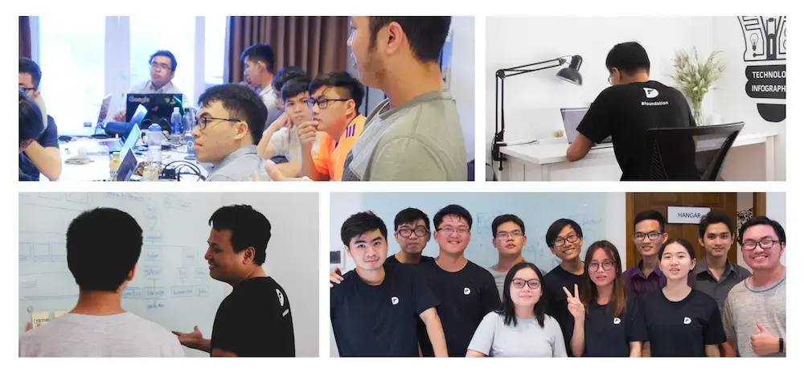

Dwarves Foundation is an innovation service firm. We have been building an organization with high standard software practices and business growth capabilities, helping tech startups, entrepreneurs and makers deliver their innovative software product since 2013.

We stand for the craftsmanship in software development. More than telling people how to do things, as a team, we take responsibility for collaboratively creating the product of innovation with the client. We value the long-term partnership, and we brought the economic impact through massive product distribution and brought to the market by the clients.

This repo is our playbook which contains our practices in software development and also how we collaborate to make them succeed.

## Product design

- [Design workshop](/)
- [Design sprint](/design/design-sprint.md)
- [AARRR framework](/design/AARRR.md)
- [Lean canvas](/design/lean-canvas.md)
- [Wireframe](/design/wireframe.md)
- [Prototype](/design/prototype.md)
- [UX research](/design/UX-research.md)
- [Information structure: IA design](/design/IA.md)
- [Low fidelity prototype: UI design](/design/UI.md)
- [High fidelity prototype: interative design](/design/IX.md)
- [The design system](/design/design-system.md)

## Developing

- [Software philosophy: engineering-driven, craftsmanship & minifesto](/engineering/README.md)
- [Workflow: agile & scrum framework](/engineering/workflow.md)
- [Technology stack: our POV on technology](/engineering/stack.md)

### Setup

- [Automate your development environment](/engineering/setup-laptop.md)
- [Using right editor for the job](/engineering/editor.md)
- [Keep your devices safe](/engineering/basic-security.md)

### Practices

- [Start a new project](/engineering/setup-project.md)
- [Repository setup](/engineering/setup-repository.md)
- [Write a good README file](/engineering/readme-how.md)
- [Environments](/engineering/environment.md)
- [Version control with Git](/engineering/git.md)
- [Working together: pair programming](/engineering/working-together.md)
- [README driven development](/engineering/rdd.md)
- [Agile requirement: user story](/engineering/user-story.md)
- [Document diagrams](/engineering/diagram.md)
- [Writing REST API](/engineering/restful.md)
- [Error convention](/engineering/error.md)
- [Writing test & materials](/engineering/testing/testing.md)
- [Code review](/engineering/code-review.md)
- [Definition of done](/engineering/definition-of-done.md)
- [Versioning](/engineering/versioning.md)
- [Write a useful changelog](/engineering/changelog.md)
- [CI/CD](/engineering/ci-cd.md)
- [The 12 factor app](/engineering/12-factor-app.md)
- [Development security rules](/engineering/security/dev-security.md)
- [Licenses](/engineering/license.md)
- [Release checklist](/engineering/release.md)
- [UAT checklist](/engineering/testing/UAT.md)
- [QA best practices](/engineering/testing/QA-best-practices.md)
- [Defect template](/engineering/testing/defect-template.md)

### Platforms

- [Android](/engineering/android.md)
- [iOS](/engineering/ios.md)
- [Frontend](/engineering/frontend/tech-ecosystem.md)
- [Backend](/engineering/backend.md)
  - [API Security Checklist](/engineering/security/api-security.md)

## Production

- [Logging](/engineering/log.md)
- [Monitoring](/engineering/monitoring.md)
- [Production checklist](/engineering/production.md)
- [Handover checklist](/engineering/handover.md)

## Business

- [Overall process](/business/README.md)
- [Fixed budget, scope controlled](/business/fbsc.md)
- [Collaboration guildeline](/collaboration-guideline.md)

## Contributing

We love pull requests. If you have something you want to add or remove, please open a new pull request. Please leave all PRs open for at least a week to get feedback from everyone.

## License

Creative Commons Attribution 4.0 International (CC BY 4.0)
@ [Dwarves Foundation](https://d.foundation)
