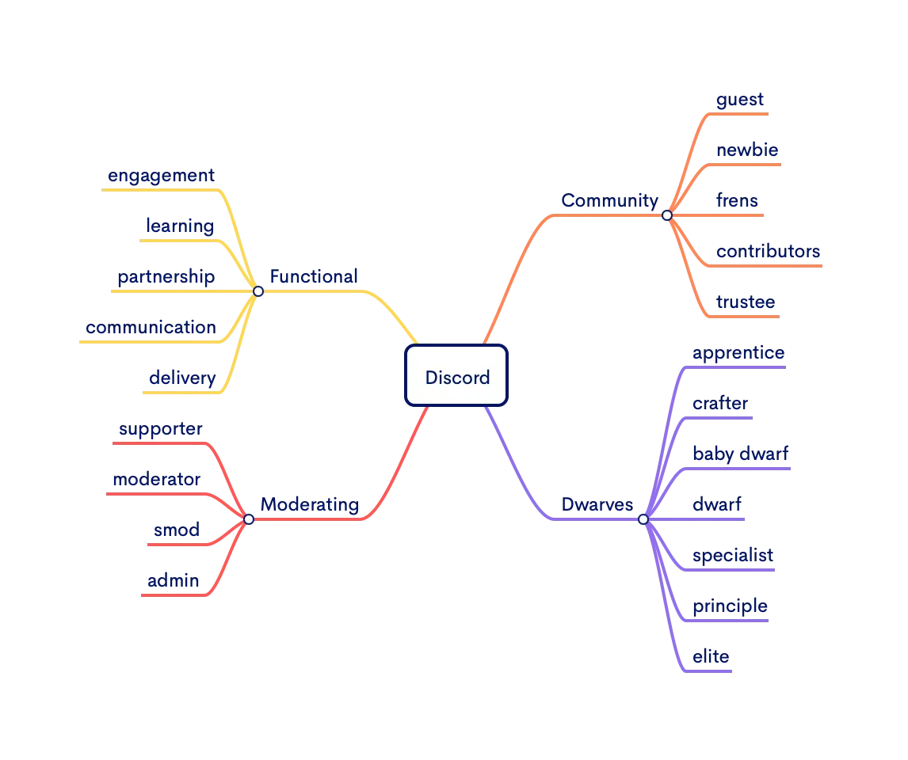

To organize our discord and make it fun to interact between community members, we setup those roles for specific purposes. They are ladder-based and function-based roles.

### Moderating
* supporter: help with day-to-day activity, welcome new folks.
* moderator: organize events, tech talks, ... .
* smod: run community & company-wide operational works.

### Community members
* guest: it is a default role, you will gain this role joined discord.
* newbie: did an introduction within our network.
* frens: folks who active discuss in our public channel.
* contributor: invite more frens into the network.
* trustee: trusted community member.

### Consulting staffs
* apprentice: newcomers, qualified to work with us.
* crafter: can ship qualified software.
* baby dwarf: purpose seeking
* dwarf: joined our r&d, learning activities.
* specialist: mastery in one specific vertical.
* principle: who maintain and heighten team-wide standard.
* elite: who set team-wide technically direction.

### Functional
* engagement: align vision and value across the team.
* learning: continuous improvements, team-wise and individually.
* partnership: bring food on the table.
* communication: transparent information internally and externally.
* delivery: ships high-quality deliverables.

### How to upgrade?
The Dwarves server operates primarily using $icy as its currency. 

Members earn rewards based on their activity output, and by upgrading their role through increased engagement as detailed next to each role. 

Upgraded roles also grant members a boosting NFT.