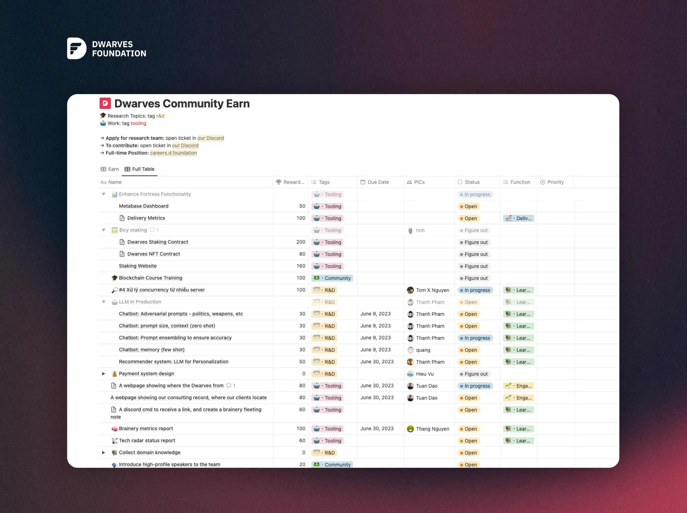

As you may know, Dwarves Discord network is where we connect with our friends, alumni, and like-minded people.

Bounties are rewards (in ICY - Dwarves’ token) given out to community members for work that encourages community developers to get more involved in the development outside of their core skills.

## **Who can join**
We offer a platform for those seeking development work and a dynamic environment to connect with skilled developers capable of building new tools, new features.

* It is open to anyone who has the required skills and knowledge.
* Bounties commonly require skills such as writing, design, research, development, and finance. 

## **How It Works **
After joining Dwarves Network’s Discord, introduce yourself in 😀**・arrival**, then don’t forget to:
1. Check the bounties board: [https://earn.d.foundation/](https://earn.d.foundation/). Choose the bounty which you want to work on.
2. Claim a bounty via **⁠🎫・support-ticket. **
3. Deliver bounty, get $ICY in return

## **Reward**
Each month, a pool of 1700 ICY (~2.5k USD) is reserved for the bounty system. You can use $ICY to exchange for Dwarves’ exclusive swag, or swap into USDC for your own use.

Please note that the bounties will only be reward after the Pull Request (PR) has been accepted and successfully merged into the Dwarves GitHub. We hope to provide a welcoming community for those who do. Bounties are here for that. 🔥

📍 Should you have any questions, feel free to reach us at: [discord.gg/dwarvesv](https://discord.gg/dwarvesv?fbclid=IwAR3wR35TreTn6PbTDSAVg4Kd2NMZzytlvqnoZj2xOxew73PoW0TSBYFklpA)
💰 More bounties are coming soon at: [https://earn.d.foundation/](https://earn.d.foundation/)
🤖 Give @smod or @hnh a ping if you want to take any todo

