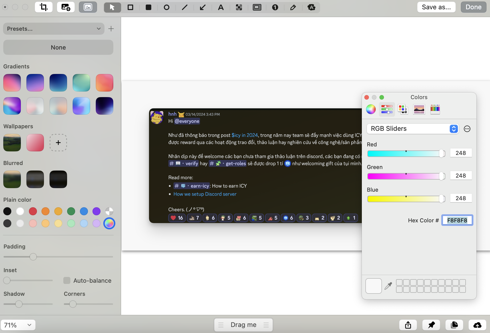
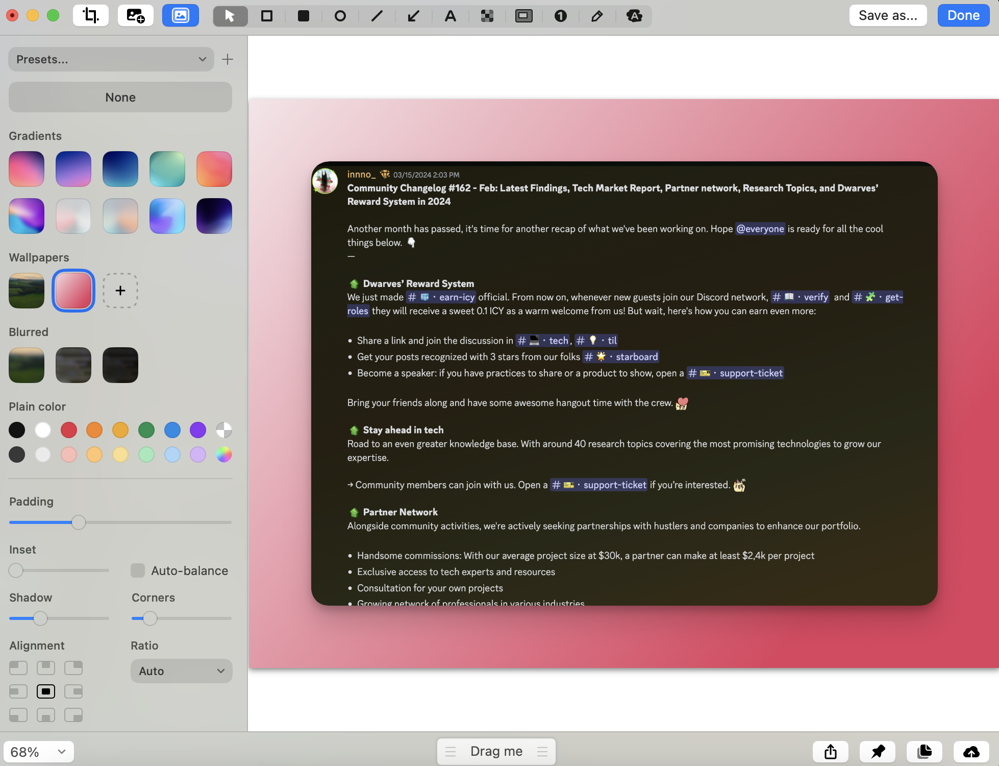

### How to make your screenshot look good
I frequently take screenshots. While macOS's built-in screenshot tool is generally sufficient, it's quite basic. One good screenshot is worth a thousand words. Whether you need to quickly capture your work, provide a visual reference, or point out errors, screenshots are crucial for efficiency.

Taking screenshots of them shouldn’t be that challenging. Learn how to take crisp and detail-rich screenshots in no time. In this article, I’ll take you through my screenshot workflow with a handful of simple tool and techniques and grab screenshots with negligible effort.

You will still be able to use the good old Print Screen key or a shortcut — but with better result.

### Basic rules for taking a clear screenshot
**Size**
For the clearest screenshots, fill your entire screen with the content you want to capture. Avoid cropping or zooming, as this can cause pixelation and loss of detail. Instead, use shortcuts like Command+Plus (Mac) or Ctrl+Plus (Windows) to enlarge content while maintaining clarity and quality.

**Device's display resolution:** To take a high-resolution screenshot, make sure your device's display resolution is set to its highest level and avoid zooming in when taking the screenshot.

**Capture Only Relevant Area:** Instead of capturing the entire screen, focus on the specific area you want to share. This eliminates unnecessary clutter and keeps the message clear.

**File Format:** Choose an appropriate file format depending on your needs. PNG is a good choice for most screenshots as it preserves image quality and transparency. 

**Avoid Zooming:** Resist the urge to zoom in before capturing the screenshot. Zooming often results in a pixelated image.

The specific approach might vary depending on the content you're capturing and the purpose of your screenshot.

### What app can you use to enhance a screenshot picture?
CleanShot X is one of my favorite Mac apps, and it’s the app that I personally use to record basically everything on my Mac. The app allow you to capture your screen in of ways fit for most purposes and provides tons of options to do it. You can grab the are a, fullscreen, window, or even a scrolling window. 

Its advanced features and intuitive interface make it easy to use for anyone who wants to enhance their screenshot quality. Let’s see how you can use CleanShot to have a more organized and efficient workflow.

### Getting start with CleanShot X
CleanShot X, or just CleanShot for short, basically steps in for the screenshot and video tools that come with your Mac. To set it up right, one of the things you need to do is head over to your System Preferences. There, you'll want to turn off all the default shortcuts like Cmd+Shift+3 and Cmd+Shift+5. This way, CleanShot can handle everything smoothly.

### Setting up CleanShot X
First things first, how do you take a screenshot with CleanShot X? You can simply click the app icon in your Mac’s menu bar and pick the screenshot you want to take from there.

But that’s not always the best option if you want to take your screenshot instantly, before whatever it is that you are capturing is gone. Use keyboard shortcuts for quicker screenshot taking.

To set them up, click Settings in the CleanShot X menu bar drop-down menu and go to Shortcuts.

Here, you can record your preferred shortcuts for various screenshot types or you can choose to use system default shortcuts for your CleanShot X screenshots — just click the Use System Default Shortcuts button at the bottom of the menu.

The app will prompt you to set it as the system default screenshot tool.

### Take the screenshot you need
With CleanShot X, you can take all the popular screenshot types — capturing a single window, your whole screen, an area on your screen, a scrolling capture, or a video capture.

To pick the type of screenshot you need, click the menu bar icon of the app and select the screenshot type.

When you take a screenshot, a smart overlay will pop up in the corner of your screen. 

### Remove background distractions
We’ve all been there — your desktop is as cluttered as it can be, filled to the brim with private files or sensitive information, or just looking like a mess, and that’s exactly when you need a nice clean screenshot of something you’ve been working on.

Before you waste your time trying to clean up your desktop in a time crunch, take a beat. CleanShot X can hide your desktop icons in a click. Go to the app’s menu in your Mac’s menu bar and click Hide Desktop Icons. And voila, your desktop is pristine!

### Add custom wallpaper
Clean up your screenshots with CleanShot X background tool. Set the scene with beautiful backgrounds and make your captures look stunning.

Pick a background while editing your screenshot — an image or a plain color — and instantly add it to your capture. 

Or you can add color scheme similar to Dwarves branding guidelines. 

Or adding Dwarves color scheme as a background.

### Overall
Taking screenshots with CleanShot X is easy and flexible, adapting to your preferences. You can start with basic functions like capturing part of your screen or recording a screencast. If you want to get fancier, you can blur sensitive info, add backgrounds, or create explanatory visuals. CleanShot X is versatile, so you can use it however you like.

I believe this guide will help you make great screenshots quickly with this tool. It does exactly what we need it to do, and we think you'll love it too. Keep practicing with these tools—they're like the cherry on top, adding that extra something to your work.