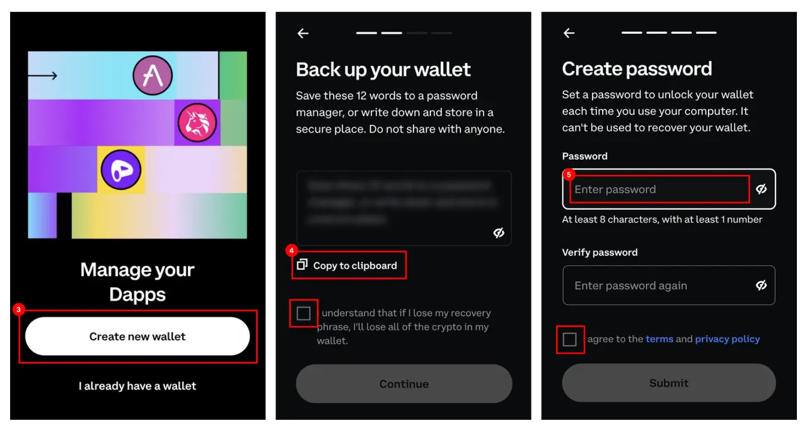
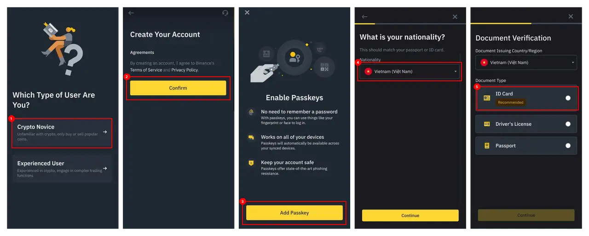

---
tags:
  - icy
  - web3
  - guideline
title: How to set up cryto wallet to withdraw ICY
date: 2024-03-13
description: 
authors:
  - minhcloud
menu: memo
toc: false
notice: 
type: 
hide_frontmatter: false
event_date: 
pinned: 
hide_title: false
---
To withdraw ICY to Vietnam Bank or other fiat, you need set up 2 types of wallet in advance. 
1. On-chain wallet (Non-custodial wallet, such as: Coinbase, Metamask): This kind of wallet is needed to receive ICY and swap ICY to USDT.
2. Custodial wallet (such as: Binance): This kind of wallet is used to convert USDT to VND. 
After setup these two wallet, please follow this [guidline](https://memo.d.foundation/playbook/community/how-to-withdraw-icy/) to withdraw ICY.

### Set up Coinbase wallet 
1. **Install extension**: Go to [this site](https://www.coinbase.com/wallet/downloads) to download Coinbase wallet. Then, add the wallet extension to the Chrome on Firefox Browser (DO NOT use Safari).
2. **Open wallet**: Click to Coinbase icon on the extension bar to use the wallet.
3. **Create wallet**: For those who haven’t had any wallet, please click “Create a new wallet”.
4. **Secure your wallet**: Reveal and copy the seed phrase, the save it at a safe place. It will be use to log in or import wallet when you don’t remember password, lose data on your computer, or reinstall the wallet on different platform or browser. **DO NOT SHARE WITH OTHERS** about the seed phrase. Then Confirm the seed phrase in the next step, you will have to re-enter the provided seed phrase.
5. **Set up password**: Enter the password for the wallet.

### Create a Binance account
Go to this link and install Binance on your mobile at [here](https://www.binance.com/en/download).
1. **User type selection**: After install, follow the guideline of “Crypto Novice” mode.
2. **Create account**: Confirm to create your account.
3. **Secure your wallet**: Add the passkey to log in without password.
4. **Fill your information**: Fill in your basic information which will be used for verification process. 
5. **Verify your identity**: Choose the document you want to use for verification and take a shot of that document. 

