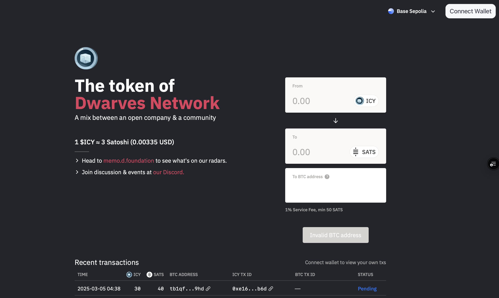

---
tags:
  - icy
  - btc
  - tutorial
  - tokenomics
title: How much is your ICY worth
date: 2025-03-06
description: ICY is shifting from a fixed USDC-backed value to a dynamic, Bitcoin-backed model. Learn how this change impacts holders, market liquidity, and value fluctuations.
authors:
  - hnh
toc: false
notice:
event_date:
---

The value of ICY has undergone a fundamental shift. Previously, its price was fixed in terms of $USDC providing stability over the market. Now, $icy is backed by Bitcoin (BTC), making its value more dynamic and market-driven. So, what does this mean for $icy holders? Let’s break it down.

## 1. The old model: Fixed value in USDC

For a long time, ICY was pegged at **1.5 USDC per 1 ICY**. Regardless of the market’s ups and downs, the value remained stable. This model had a few key benefits:

- Users always knew the exact value of their ICY.
- No need to monitor market conditions.
- Easy to trade or liquidate at a set price.

## 2. The new model: Bitcoin-backed ICY

Now, instead of USDC, ICY is backed by **Bitcoin (BTC)**. This means the price of ICY is no longer fixed—it moves with the market and the liquidity pool.

**How does it work?**

- ICY and BTC are managed within a **liquidity pool**.
- The conversion rate between ICY and BTC starts at a predetermined ratio.
- Over time, the value of ICY will fluctuate based on BTC’s price and liquidity dynamics.

This shift brings **new opportunities**:

- **Growth potential**: If Bitcoin appreciates, ICY holders could see an increase in value.
- **Decentralization**: Less reliance on stablecoins like USDC.
- **More flexibility**: The price of ICY now reflects market forces rather than being artificially fixed.

## 2.1 How does this affect users?

For ICY holders, this change means that ICY’s value is no longer **guaranteed at 1.5 USDC**. Instead, it will fluctuate based on:

1. **Bitcoin’s Market Price** – If BTC rises, ICY’s value could increase. If BTC drops, ICY’s value might decline.
2. **Liquidity Pool Adjustments** – The conversion rate of ICY can shift depending on liquidity changes.
3. **Market Demand** – If more users buy ICY, its value could go up, and vice versa.

### What you need to know?

- Converting ICY to USD or other assets now depends on BTC’s performance.
- Holders should monitor Bitcoin’s price trends.
- The value of ICY could be more volatile than before.

## 2.2 The math and liquidity pool dynamics

A key aspect of this new model is how **liquidity pools impact ICY’s price**. Here’s a simplified breakdown:

- We manage **two liquidity pools**: one for **ICY** and one for **BTC**.
- Initially, the conversion rate between ICY and BTC is fixed.
- However, **adding liquidity** to either pool affects the ICY-to-BTC conversion rate:
    - **Adding BTC liquidity → ICY becomes more valuable** (since there’s more BTC backing it).
    - **Adding ICY liquidity → ICY’s value decreases** (since there’s more ICY in circulation relative to BTC).
- This means **ICY’s price is not solely dependent on BTC’s price but also on liquidity decisions.**

### Example 1: The market impact

Let’s say at the beginning:

- 1 ICY = 0.00003 BTC (hypothetically)
- Bitcoin’s price is $50,000 → ICY is worth **$1.5**

Now, if BTC’s price rises to **$60,000**, ICY would be worth:

- 1 ICY = 0.00003 BTC → $60,000 × 0.00003 = **$1.8**

### Example 2: Liquidity adjustment impact

Let’s say initially:

- 1 ICY = **0.00003 BTC**
- Bitcoin price = **$50,000**
- ICY’s value = **$1.5** (0.00003 BTC × $50,000)

### Scenario 1: Adding BTC liquidity (ICY becomes more valuable)

Suppose we **add more BTC liquidity** to the pool while keeping the ICY supply unchanged.

- The ratio shifts, increasing ICY’s backing per BTC.
- Now, 1 ICY = **0.000035 BTC** instead of 0.00003 BTC.

New ICY value:

- **0.000035 BTC × $50,000 = $1.75 per ICY**
- **ICY price increased from $1.5 → $1.75** due to the added BTC liquidity.

### Scenario 2: Adding more ICY liquidity (ICY value decreases)

Now, instead of adding BTC, we **add more ICY liquidity** into the pool.

- The ratio shifts in favor of ICY, meaning each ICY is backed by less BTC.
- Now, 1 ICY = **0.000025 BTC** instead of 0.00003 BTC.

New ICY value:

- **0.000025 BTC × $50,000 = $1.25 per ICY**
- **ICY price dropped from $1.5 → $1.25** because of the increased ICY supply.

### When do we add liquidity for ICY and BTC ?

- For BTC, we add it monthly at the start of the month, we use at-that-time market price to determine with BTC value we add into the pool/
- For ICY, we mint it weekly to reward activities throughout our company.

## 3. Why are we doing this?

The USDC model was an efficient and low-maintenance solution, ensuring a predictable and straightforward valuation for ICY. However, from the outset, ICY was designed as an evolving blockchain experiment—an initiative aimed at keeping our team actively engaged with market trends while fostering greater participation. By offering incentives, we encouraged broader adoption and created an entry point for more users to explore the crypto ecosystem.

We believe it’s the right time to transition to the next phase. This evolution allows us to move beyond a static value proposition and embrace a **market-driven** model—one that better reflects real-world trading conditions, enables growth potential, and enhances liquidity flexibility.