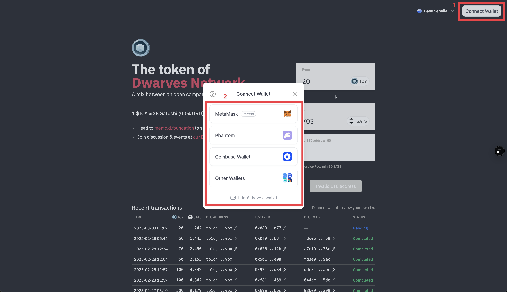
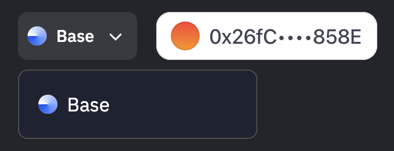
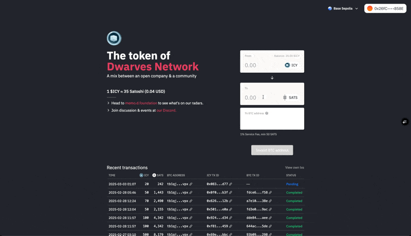
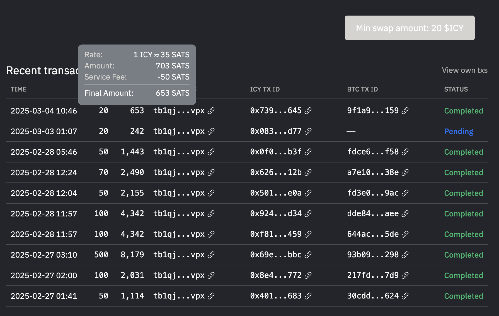

---
tags:
  - icy
  - btc
  - payment
  - tutorial
title: How to swap ICY to BTC
date: 2025-03-04
description: This guide show how to swap ICY to BTC.
authors:
  - quang
toc: false
notice:
event_date:
---

## Before You Begin
Make sure you have a Bitcoin (BTC) wallet ready to receive the BTC after the swap. If you don’t have one, you can set up a BTC wallet using services like Electrum, Trust Wallet, UniSat or any other trusted BTC wallet provider.

**Note:** You’ll need a small amount of Ethereum (ETH) on the Base network to cover gas fees for the swap. If you don’t have ETH, you would need to transfer it from another wallet. For help, feel free to open a ticket on the Dwarves Foundation Discord.

## Step 1: Access icy.so and Connect Your Wallet
1. Go to the website [icy.so](https://icy.so).
2. Click the **"Connect Wallet"** button and choose your cryptocurrency wallet (e.g., MetaMask, Coinbase Wallet) where your ICY tokens are stored.
3. Follow the on-screen instructions to connect your wallet to the site.

4. Ensure your wallet is switched to the **Base network**, since ICY operates on this network.

## Step 2: Swap ICY to BTC
1. After connecting your wallet, choose **ICY** as the token you want to swap from and **BTC** as the token you want to receive.
2. Enter the amount of ICY you wish to swap. The minimum amount is **20 ICY**.
3. Input your **BTC wallet address** where you want the BTC to be sent.
4. Click the **"Swap"** button and confirm the transaction in your wallet. You’ll need to pay gas fees in **ETH** for this step.

## Step 3: Wait for the Transaction to Process
1. Once confirmed, the transaction will appear in the **"Recent Transactions"** section on icy.so with a **"Pending"** status.
2. Hover over the transaction to see a breakdown, including the service fee.

4. Processing time depends on **network conditions** and the **gas fee paid**. If the network is busy or fees are high, the system will retry the transaction later.
5. Don’t worry if it takes time—**100% of transactions will be processed eventually**.

## Important Notes
- **Minimum Amount:** You must swap at least **20 ICY**.
- **Processing Time:** Transaction speed varies based on network fees. High fees may delay processing, but the system will retry later.
- **Service Fee:** A minimum fee of **3,000 units** applies to each transaction. Exact fees can be viewed in the **"Recent Transactions"** section.
- **Gas Fees:** Ensure you have enough **ETH** on the **Base network** in your wallet to pay for gas fees.

