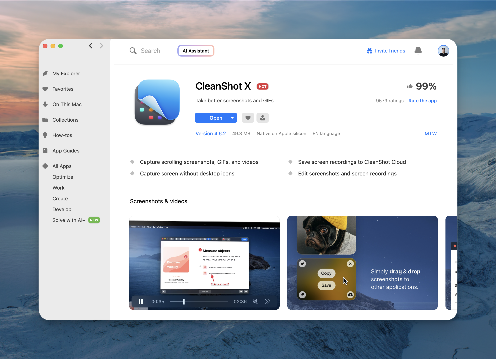
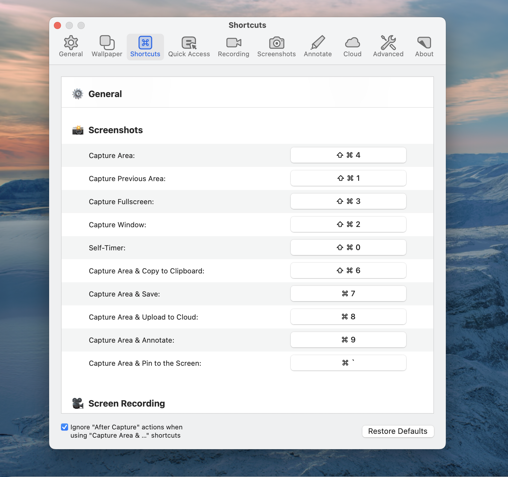
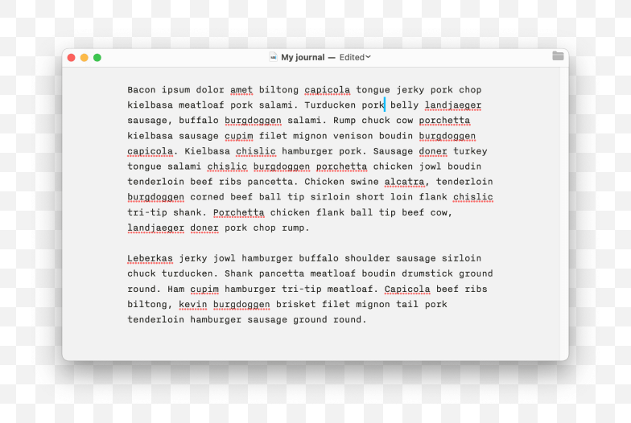
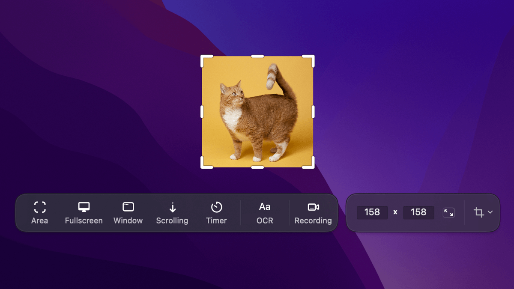
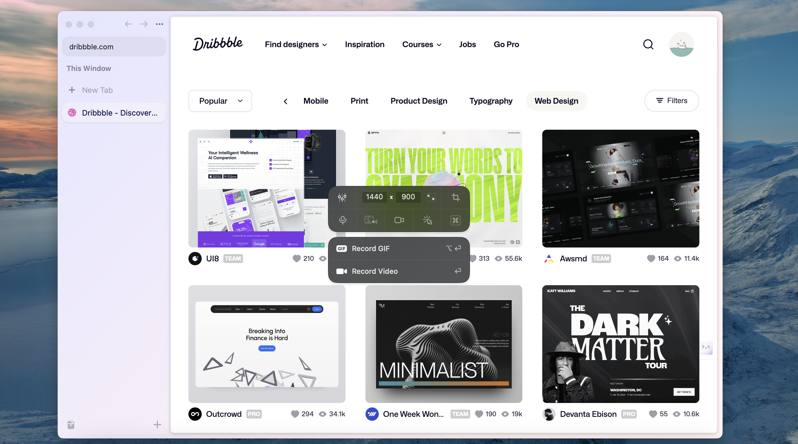

---
tags:
  - community
  - instructions
  - guideline
title: How To Take Better Screenshots On Mac
date: 2024-03-13
description: Taking screenshots of them shouldn’t be that challenging. In this article, I’ll take you through my screenshot workflow with a handful of simple tools and techniques and grab screenshots with negligible effort.
authors:
  - innno_
menu: memo
toc: false
notice: 
type: 
hide_frontmatter: false
event_date: 
pinned: 
hide_title: false
---
### How To Take Better Screenshots On Mac
I grab screenshots pretty often. Although, macOS’s native screenshot tool is decent for most cases, it’s still a very basic one. Here are the few tips how to take  great looking screenshots with a simple tool end in less time. 

### Installation and Setup
CleanShot X is actually and app that I’ve downloaded as a part of a Setapp subscription, and I use CleanShot every single day. The app offers a wide range of features from capturing screenshots, recording your screen, to annotating and quick editing.

1. Sign up subscription on Setapp
2. Download and install CleanShot X

3. Once installed, you will fine various commands under the CleanShot X Extension by clicking CleanShot shortcut the Control Center.

### Using CleanShot X
**Added keyboard shortcuts to Quick Access Overlay**
You can spend time figuring out what workflow and keyboards shortcuts is best for you. Open setting, .Here’s what I found works best for my setup.

- `Command Shift 4` capture area / a part of the screen
- `Command Shift 3` capture full screen
- `Command Shift 5`  capture  all-in-one
- `Command Shift 5`   capture window
- **⌘C** - Copy to clipboard
- **⌘S** - Save
- **⌘W** - Close
- **⌘U** - Upload to Cloud
- **⌘E** - Open annotation tool

CleanShot is highly customizable — you can adjust nearly every behavior and tweak settings for your needs.

**Annotation and Editing Tools**
- **Annotate**: Annotate your screenshots with various tools. Highlight or hide specific parts of your screenshots, crop, add necessary annotations.

- **Background Tool** in Annotate - easily create beautiful social media posts that stand out from others - add a background to your screenshot, adjust padding, alignment, aspect ratio. 

Or you can use Dwarves branding guidelines color scheme.

**Screen Capture Features** 
- **Capture Fullscreen/Area/Previous Area/Window**: Different modes for capturing your screen.

- **Scrolling Capture**: Capture content beyond the screen view.

<video controls src="assets/how-to-take-better-screenshots/Scrolling capture.mp4" title="scrolling"></video>

- **Capture Text (OCR)**: Use OCR to capture text from your screen. Simply select an area that contains the text and it will be copied to your clipboard.

<video controls src="assets/how-to-take-better-screenshots/CleanShot X All Features.mp4" title="capturetext"></video>

- **All-In-One mode**: With this mode, you can specify size and lock aspect ratio for your screenshots. It also saves your last selection, so it's easier to retake your last screenshot.

- **Recording Features**
-- **Record Screen**: Record your entire screen.
-- **Self Timer**: Set a timer for screen captures.
-- Choose between recording a video or a GIF, whether to capture a specific window, custom are dimensions, part of the screen, or fullscreen.

- **Open History**: Access your screenshots history. You can remove files from Capture History or restore recent captures if you ever need them again.

### Overall
I believe this guide will help you make great screenshots quickly with this tool. It does exactly what we need it to do, and we think you'll love it too. Keep practicing with these tools—they're like the cherry on top, adding that extra something to your work.