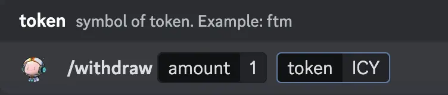
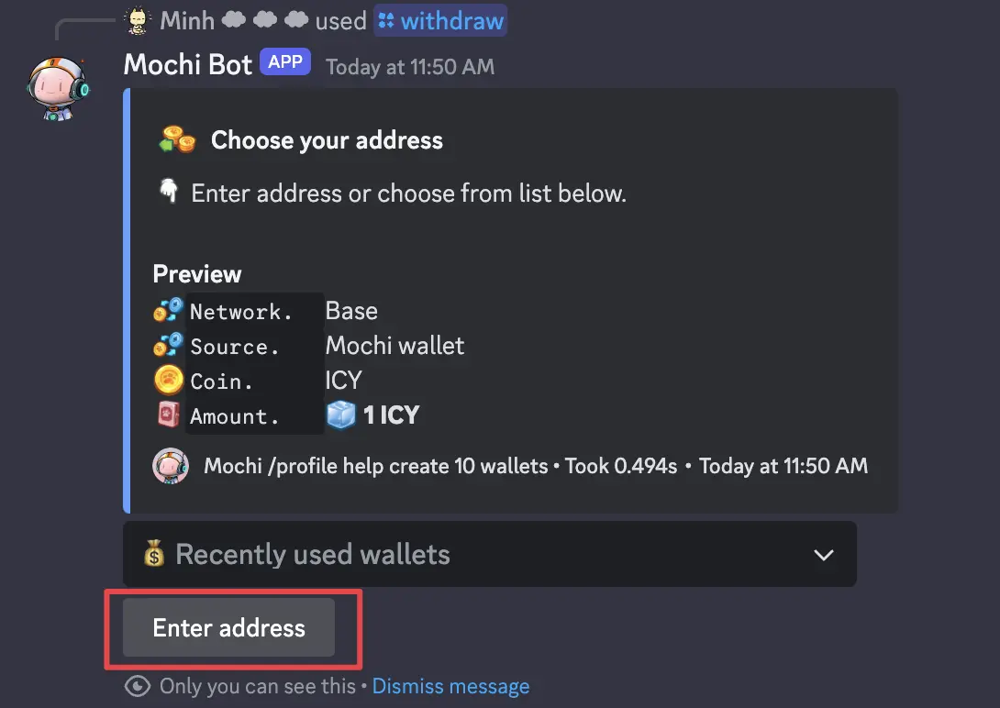
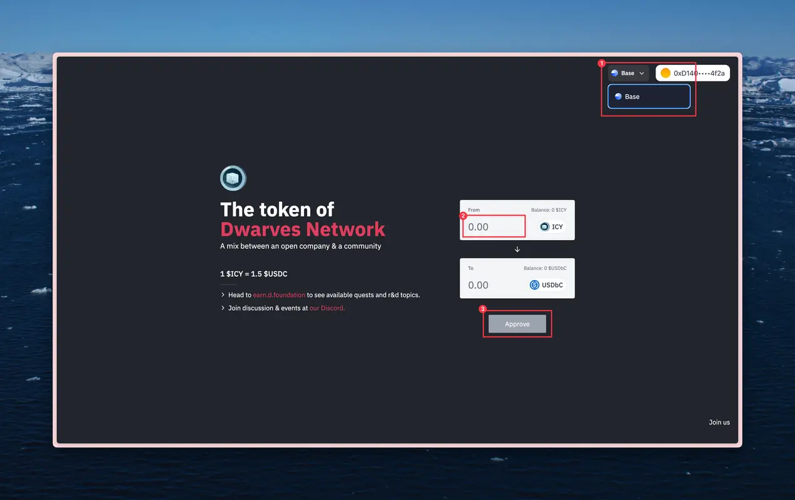
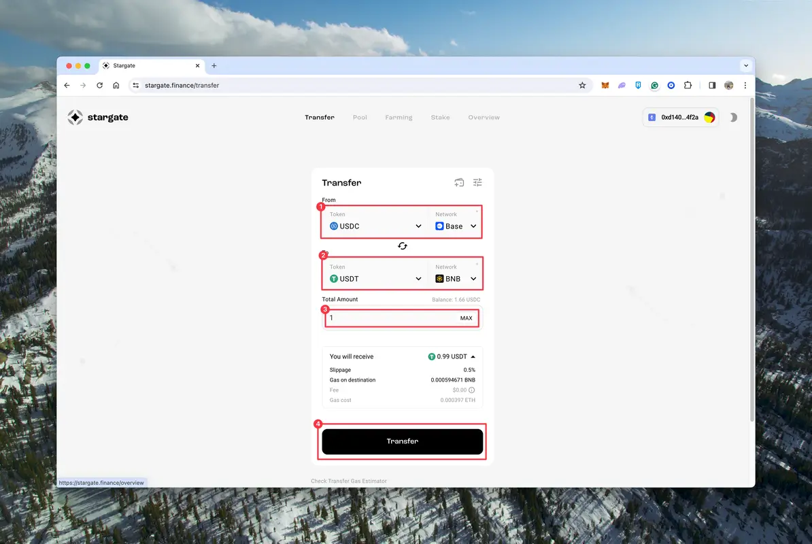
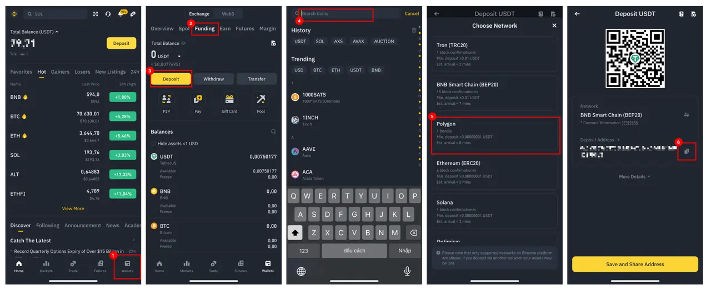
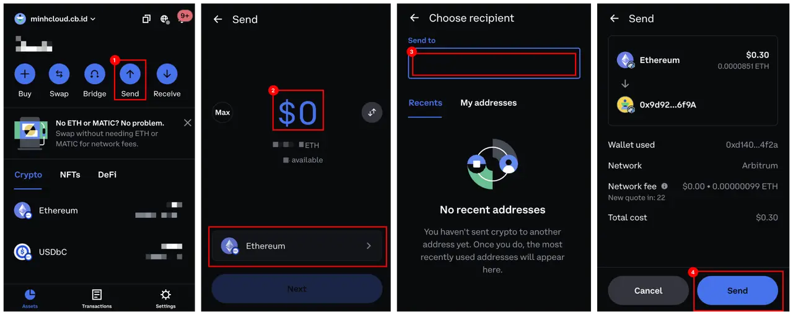

---
tags:
  - icy
  - dfg
  - payment
  - tutorial
title: How to withdraw ICY
date: 2024-03-13
description: This guide show how to swap ICY to fiat. 
authors:
  - minhcloud
menu: memo
toc: false
notice: 
type: 
hide_frontmatter: false
event_date: 
pinned: 
hide_title: false
---

Before you can withdraw ICY, please make sure that you have already had the crypto wallet and Binance wallet. If you don't have any, please follow this [guideline](https://memo.d.foundation/playbook/community/how-to-setup-crypto-wallet-to-withdraw-icy/). 

### Withdraw token from Mochi
1. **Use the command to withdraw token**: Withdraw to  Use the below command to withdraw token from Mochi to the crypto wallet.

2. **Enter address**: Click the button “Enter address” and paste the address of the crypto wallet you have created above.

Note:
- To swap ICY to USDT in the next step, you will need some Ethereum on Base Network.
- Therefore, buy, some Ethereum or withdraw it from your balance. If you need to faucet some Ethereum for gas fee, please open a ticket in [Dwarves Foundation Discord](https://discord.gg/dwarvesv).

### Convert ICY to USDT
Go to [icy.so](https://icy.so/) to swap ICY to USDT.
- Connect with the created wallet.
- Select the support network to Base and approve the request from Metamask to change.
- Input the ICY amount you want to swap.
- Click Approve and Swap and sign all transactions request of metamask.

### Bridge USDC from Base to another network
Go to [Stargate Finance](https://stargate.finance/transfer), choose tab "Transfer" and connect wallet. Then follow these steps:
1. Choose Base in the section "From network" and choose Binance Network (BNB) in the remaining section. 
2. Enter the amount of USD you want to bridge.
3. Click to the Transfer button and confirm all requests. 

### Take deposit address to Binance account 
After bridge, the token is stil on the Coinbase wallet which cost a high fee to withdraw to Vietnam bank or Visa card, therefore we suggest you to transfer to Binance account to save the withdrawal cost. Firstly, you need to take the deposit address of your Binance account:
1. Go to the tab Wallet.
2. Choose tab "Funding".
3. Choose "Deposit".
4. Search token USDT. 
5. Select Network BNB  
6. Copy the deposit address. 

### Transfer token from the crypto wallet to Binance account 
1. Open Coinbase wallet and choose button "Send".
2. Choose token and amount.
3. Paste the deposit address that you have copied from Binance earlier.
4. Review the transaction and send. 

### Withdraw to the bank
Go to P2P trading and choose the suitable service to withdraw to the bank account

![[How to withdraw ICY-20240313145106740.webp]]
