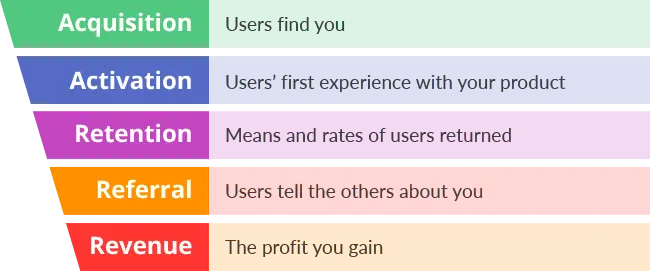

## AARRR framework

We use the AARRR framework to measure and optimize every phase of a product by optimizing it through the insane focus on one metric at a time.

## What is AARRR framework?

The AARRR framework consists of five phases a customer goes through in order to achieve growth and each phase has its own set of metrics to focus on. AARRR stands for Acquisition, Activation, Retention, Referral, and Revenue. Each of these can be tracked to see how well a product is doing and how stable its growth is in the long run.

## Why AARRR?

AARRR is widely accepted as the five most important metrics for a startup to focus on. That is because these metrics effectively measure a product’s growth while at the same time being simple and actionable.

## How we apply AARRR?

### Choose one phase of the AARRR

Define the stage that products are on and choose one phase to improve.

### Gather data

Gather data, both quantitative (user behavior from analytics) and qualitative (user feedback, app store reviews, etc.), to get the baseline (current reality) of that metric. This also gives us an idea of what the problem might be.

### Validate the problem

Validate the problem by conducting the user interview/usability test. This will give us an idea of whether it really is a problem, discover the new problem(s) and a chance to figure out why the problem occurs. In short, we’ll have the problem defined.

### Ideate on potential solutions

We might get the stakeholders involved in sketching bunch of ideas and more importantly, get their buy-in early on.
