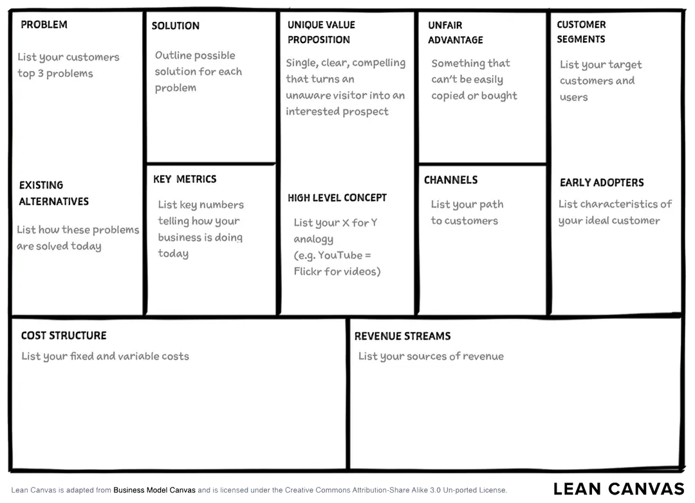

## Lean canvas

Lean canvas is an adaptation of Business Model Canvas by Alexander Osterwalder which Ash Maurya created in the Lean Startup spirit (Fast, Concise and Effective startup). Lean canvas promises an actionable and entrepreneur-focused business plan. It focuses on problems, solutions, key metrics, and competitive advantages.

### 1. Problem

What is the crucial problem faced by the product’s consumers? Capture their central frustration. The best way to describe the problem is in terms of the jobs customers need to do, what they are ultimately trying to achieve and what is the pain or frustration they currently feel. Possibly with a concise sentence.

#### Existing alternatives

How can these problems be solved today? These are the current competitors. Customers may be solving the problems through a single service, or through a combination of them, or even through basic and primitive techniques, and for some reason, all these services are failing them. By listing competitors, we will be able to compile a competitive analysis and differentiate your value proposition later in the process.

### 2. Customer segments

Now that we know which are the problems that we are willing to solve with our products’ ideas, let’s focus on who is actually having these pains. This is crucial, as customers are at the center of any new business or new product development that actually works.
Define 3-4 personas suffering because of the problems you are going to solve?

- Do these people have specific job titles or roles?
- Do they work in specific industries?
- Do they have particular demographics/salary range?

#### Early adopters

Identifying early adopters is extremely important because these are the ones that are going to be your first customers and the first version of the business is going to be crafted around them.

### 3. Unique value proposition

This message should explain what we do, how we are different, and why we are worth investing in. What is the promise to consumers?
How does the product fit into the bigger picture; where does it fall in the grand scheme of things?

**Describe the product to target customers in one just ONE sentence**

It usually combines:

- the target segment
- the key problem
- the key benefits customers are going to get after having used the product
- the special and unique way the product will be delivered.

**“We help (who?) achieve (what benefit?) by doing (the special and unique way the new business/new product is doing it)”.**

### 4. Solution

- Define what are solutions to consumers’ problems?
- Present the defining elements of the product: what makes it the top tool for addressing consumers’ needs?

### 5. Channels

How will we interact with consumers, inform them of the product? Print ads, social media platforms, promotional events, or even word of mouth, consider the most effective ways to reach users.

### 6. Revenue streams

How will you generate income? Present a pricing model for the product, and then highlight other sources of revenue, ad sales, subscription fees, or asset sales.

### 7. Cost structure

What will it cost to launch and maintain the product?

- Development
- Marketing
- Employees

### 8. Key metrics

How we track consumer engagement, excitement, and usage of the product. (SASS, AARRR, user, download, quote…)

### 9. Unfair advantage

How do we stand out from competitors? What puts we ahead of the pack? Why should consumers have confidence in our product above others?
It has to be something that you already have, and cannot be copied or bought, and would require a considerable amount of time for anyone else to build.
