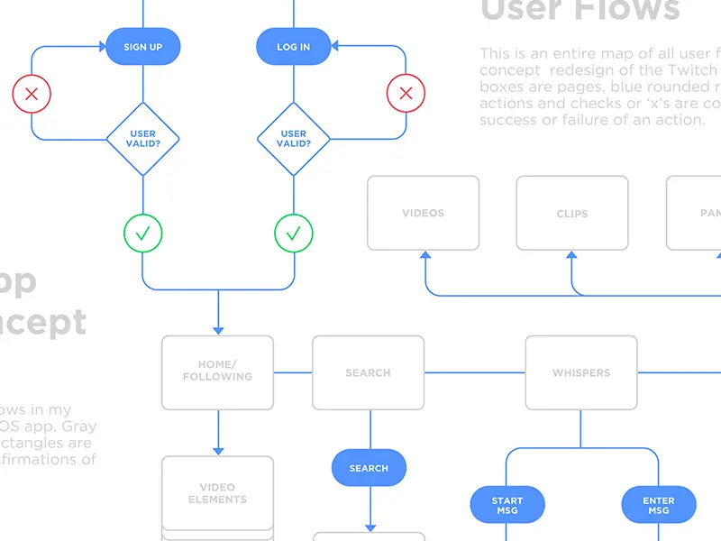

## UX research framework

### 1. gather data

In the first phase, we focus on gathering as much valuable data as humanly possible. It’s time for open-question asking, non-judgmental listening, and meticulous note-taking.

#### Stakeholder interview

In order to create successful products as a designer, it’s crucial to discover how the stakeholders think - what is the vision for the product (from each of the stakeholders' perspectives), and how can these be amalgamated?

- Basic Information
- Restrictions
- Value proposition
- Users
- Competition
- Context of use
- User goals

#### User interview

There is no better way to recognize the problems and pain points of the target audience than simply by talking to them. The result of the interview should answer these questions:

- What are the different lifestyles of potential product users?
- What motivates people to behave in certain ways?
- Which user/s should I focus on?
- What jargon do people use to talk about a domain?
- What is the user’s workflow?
- Is there a need for the product/feature?
- What are the right requirements for the product?

#### Competitor analysis

A competitive analysis is a way to collect and compare data about products (and companies) in the marketplace. This method is often used to highlight the strengths and weaknesses of products in order to make more informed decisions about your product strategy. A typical competitive analysis might include information, such as:

- An overview of the product landscape (products, companies, prices, market share, etc.)
- User demographics
- Lists of product features
- Social media presence (followers, posts, etc.)
- Evaluation of visual design language
- Voice, language, and content

### 2. Analyze data

Now we’ve gathered the data we need, it’s time to make sense of it. Here, we’ll take a closer look at our findings and aim to identify patterns.

#### Problems valuation

Look back over collected data and identify the problems we managed to draw from interviews.

- Not really
- Important
- Crucial

#### Solution definition

Take the most crucial problems and brainstorm solutions for them. Try to find as many possible solutions to this problem as possible. Then with your team vote for the best one.

- Problem
- Possible Solution

#### Personas

Different target groups have different needs, approaches, and opinions. Creating a persona for each group is a great way to streamline your research data, whilst representing the specific considerations for fundamentally different groups of people.

- Persona Name
- List of Users
- Profile
- Problems

#### User story

User stories are short, simple descriptions of a feature told from the perspective of the person who desires the new capability, usually a user or customer of the system. They typically follow a simple template:

- As a < type of user >, I want < some goal > so that < some reason >.

#### User journey mapping

User journey mapping visualizes how a user interacts with a product and allows designers to see a product from a user’s point of view.

- **Context**: What is going on in users’ day when they engage with our product? Are they in a rush? Worried? Planning an adventure?
- **Motivation**: What drives a user to interact with our product? What are they hoping to get out of it? Why are they using our product instead of a competitor’s - or nothing at all?
- **Mental models**: How does user conceive of the problem space that our product addresses? What concepts and connections come naturally to them, and what do they need to be taught?
- **Pain points**: What are the challenges users are facing? Is our product helping them solve these or aggravating them? Are there any obstacles they have to use our product?

Note the emotional state of users at each step of their journey.

#### Flows

Once you have the problem and the solutions it’s time to connect the dots. Draw a user flow that takes users from their entry point through a set of steps towards a successful outcome and final action, such as purchasing a product.
For each user flow, the questions you need to consider are:

- What is the user trying to accomplish?
- What is important to the user and what will give them the confidence to continue?
- What additional information will the user need to accomplish the task?
- What are the user’s hesitations or barriers to accomplishing the task?

