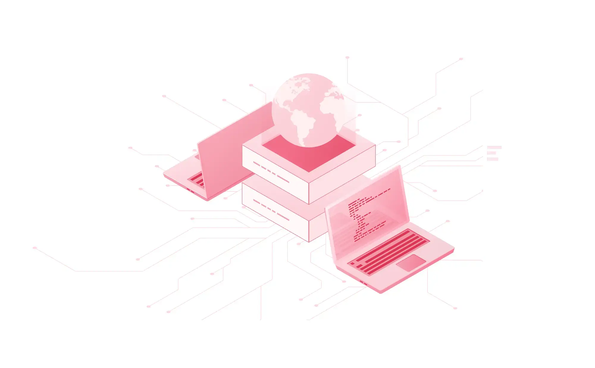

# The Dwarf Principles

Our definition of Engineering Philosophy, the guiding ideas that help to shape up the way we think and work, to ensure the core values and to deliver quality softwares.

The performance and survival of a large number of organizations now depend on their ability to integrate digital at the heart of their business strategy. This manifesto documents 15 principles that, our team believes, are the cornerstone to creating exceptional digital products that reach their objectives and stand the test of time.

- [Engineering Drive](#engineering-drive)
- [Craftsmanship](#the-craftsmanship)
- [Minifesto](#minifesto)

## Engineering Drive

_We build a company where software engineering discipline could shine, innovative and quality products are shipped and change the world for the better._

#### SYSTEMATIC DISCIPLINE

Software engineering is an engineering discipline that’s applied to the development of software in a systematic approach.

Not applying software engineering methods results in more expensive, less reliable software, and it can be detrimental on the long term, as the changes come in, the costs will dramatically increase.

#### ENGINEERS ARE NOT COMMODITIES

In every software, the engineering team is one of the most imporant factors to make it successful. Software is more of an artisanship, and software engineers aren't a replaceable cog.

People have an assembly line mindset left over from the industrial age. Don’t believe the one-size-fits-all interview process with whiteboarding problems. These serve to grind away the individuality and make us feel like an assembly line worker.

#### THE BEST IDEA WINS

If you have a great idea and the will to see it through, you can effect great change. Nothing is off limits, we’re constantly looking for improvements in our products, our processes, and our people.

All voices are equal here, we hire people to have an opinion and be creative. If your idea makes the most sense, that’s what we’re doing, regardless of your role or seniority.

We learned the practice from an A team, and it is beneficial by helping to strengthen the flat organizational structure.

## The Craftsmanship

#### WELL-CRAFTED SOFTWARE

We humbly demonstrate our expertise by delivering quality software. We work toward perfection in every single piece that we produce. We are proud of the well-crafted software that we develop together. We do not tolerate preventable defects.

#### QUALITY PAYS

Good things take time. Quality must be the top priority. In software work, quality problems overwhelm everything else. When quality isn't managed, entire software projects are unmanageable. Software development is intellectual work. Crafting a high quality software requires not just lots of efforts from a team but also the disciplines and proper methods.

#### MIND THE DETAILS

Details matter. We believe small details equate to big success. As such, creating a product that charms users involves adjusting, refining, and perfecting, over and over again. This attention to detail makes all the difference and creates memorable user experiences.

#### CHOOSING THE BORING SOLUTION

Software development is complex enough by nature. When in doubt, go with the boring solution. Using such a boring solution means that you're using simple vocabulary, which greatly increases the chances of everybody understanding you. This will make it a lot easier for everybody to follow along.

#### THINK LONG-TERM

We do not believe in rushing for project and working overtime. We believe in working sustainably and balanced so that we are a happy bunch of sane workers. Software requires good brains to create good codes and good processes. We do not burn out.

#### APPLICATIONS NEED SOLID FOUNDATIONS

Quality products always rely on a solid foundation. There will be a lot of works running on days, weeks, months, and maybe even years building that application. This constant, never-ending maintenance and extension of an application means that its foundation becomes crucial. Much like with a house, it's not a clever idea to save some money by building just a cheap foundation.

#### NOTHING IS PERMANENT

Software moves fast. New technology has enabled us to create new things. The technology you used yesterday maybe deprecated today. Make sure you understand both the old technology and the new one before buying into the next new thing. New technology needs to provide actual value over existing solutions.

## Minifesto

#### RUNNING LEAN

Lean philosophy regards everything not adding value to the customer as waste. In order to eliminate waste, one should be able to recognize it. Partially done work, extra processes like paperwork and features not often used by customers are waste. Rework or unnecessarily complex solutions are waste. Waiting for other activities, teams, processes is waste. Managerial overhead not producing real value is waste.

#### DELIVER AS FAST AS POSSIBLE

Make it work. Perfect is an enemy of good. Look for perfection, but not yet. First do it, then do it right, then do it better. Any sufficiently complex system cannot be built out of design, it has to be evolved. The shorter the iterations, the better the learning and communication within the team. The sooner the end product is delivered without major defects, the sooner feedback can be received, and incorporated into the next iteration.

#### AIM FOR SIMPLICITY

Simplicity is complicated. Simple is harder than complex. We have to write code for humans not machines. We want readability. Readable means Reliable. It's easier to understand. It's easier to work on. If it breaks, it's easier to fix.

#### EFFECTIVE > PRODUCTIVE

Being productive is about occupying your time, filling your schedule to the brim and getting as much done as you can. Being effective is about finding more of your time unoccupied and open for other things besides work. We don’t believe in busyness. We believe in effectiveness. Know your priority and do things that matter.

#### FAIL FAST, LEARN OFTEN

Don't be afraid of starting all over again. Evaluate your work constantly. Don't be afraid of throwing to the rubbish a project you've working on last months. When you start from scratch, innovation comes organically inspired by previous experiences. Evaluate your work constantly.
