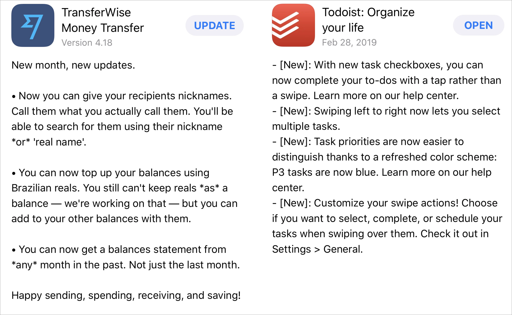
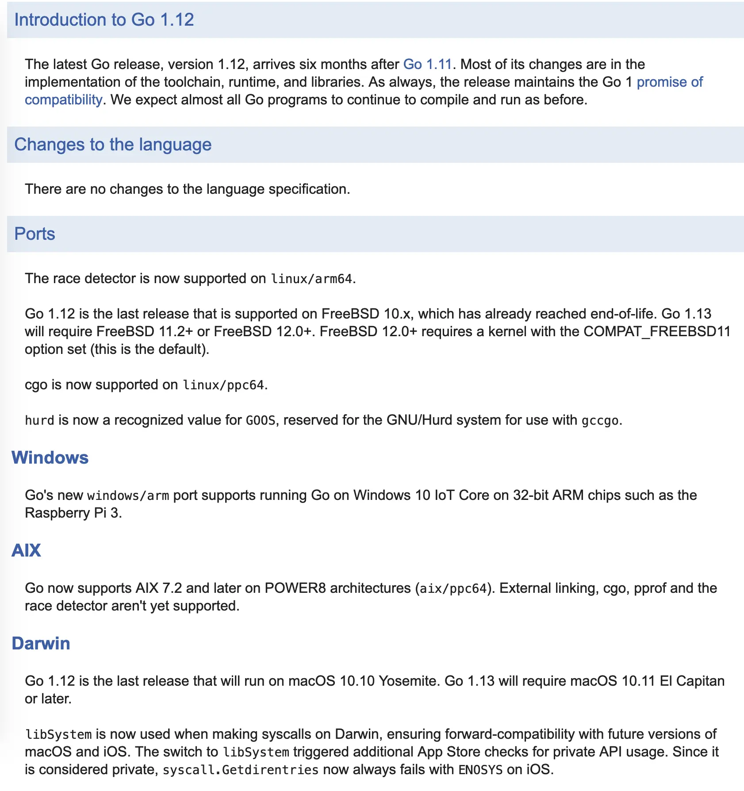

# Writing a useful changelog

Remember the last time you read over the changelog of your favorite app and found it sucks with useless information like they don't care about the product that they sell out. Something like below

> 2.11.4
>
> - Some bugs fixed
>
> or
>
> - Fix bugs and improve UI/UX

They are awkward, and the same thing happens for our end users. As a user, we care about what's news in the software that we use every day. The changelog is for humans, not machines. The changelog is a channel for us to communicate with our users. When you do a software project, big or small, it is a good idea to write a useful changelog.

Look at the release notes of those apps or the changelog of Go programming language: <https://tip.golang.org/doc/go1.12>.

They are not the standard but should capture what we want to deliver.

#### What makes a good change log?

- [ ] Changelogs are for humans, not machines.
- [ ] Write all dates in YYYY-MM-DD format.
- [ ] Follow [Semantic Version](playbook/engineering/versioning).
- [ ] The same types of changes should be grouped
  - `Added` for new features.
  - `Changed` for changes in existing functionality.
  - `Deprecated` for soon-to-be removed features.
  - `Removed` for now removed features.
  - `Fixed` for any bug fixes.
  - `Security` in case of vulnerabilities.

## The template
>
> **1.0.1**
>
> 2018-12-28
>
> #### Added
>
> -
> -
>
> #### Removed
>
> -
> -
