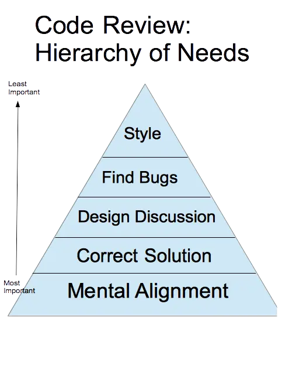

# Code Review

How we do code review.

Every project member must have another team member or team leader to review his/her code, and every changes to the code must be achieved via a Pull request to the main development branch. On larger project (10 developers+) we may requires 2 reviewers. All of this is to ensure correctness, quality of the code and learning opportunities for both assignee (who develop) and reviewer.

We review everything on the Pull request - code, tests, documents, config files, .etc.

## Code Review Flow

- Feature/bug assignee finished coding on a new branch based off `develop` branch
- Assignee self-review the code he/her wrote one last time before assigning it to reviewer
- Assignee open a Pull request on project repository and assign the PR to a reviewer, removes any [WIP] prefix in PR title to let reviewer knows this PR is ready for review
- Assignee write down brief information about this PR (we have a PR template for this)
- Reviewer read and review PR's information, make sure to understand why do we have this PR
- Reviewer review/refactor the code with assignee
- **Reviewer signs off** on the pull request with a 👍 or “Ready to merge” comment
- **Developer** merges PR and clean up remote branch

## Principles

- Technical facts and data overrule opinions and personal preferences.
- On matters of style, the style guide is the absolute authority. Any purely style point (whitespace, etc.) that is not in the style guide is a matter of personal preference. The style should be consistent with what is there. If there is no previous style, accept the author’s.
- Aspects of software design are almost never a pure style issue or just a personal preference. They are based on underlying principles and should be weighed on those principles, not simply by personal opinion. Sometimes there are a few valid options. If the author can demonstrate (either through data or based on solid engineering principles) that several approaches are equally valid, then the reviewer should accept the preference of the author. Otherwise the choice is dictated by standard principles of software design.
- If no other rule applies, then the reviewer may ask the author to be consistent with what is in the current codebase, as long as that doesn’t worsen the overall code health of the system.

## Code Review Standard

At minimal:

- The code must work and tests must pass
- No typos
- No debugging code .ie `console.log`/`fmt.Print`/.etc unless you have a good reason for it
- Never commit environment files to source control (.ie `.env` files for example), unless you have a good reason for it

### About testing

We don't follow TDD, we don't need to have tests for everything but we must have test to cover critical parts of the application. Test cases ensure that our app is working and without bugs whenever we introduce new features into it. Test cases also gives us the affordance to refactor and improve our code quality. With refactoring, we learn better coding practices and improve ourselves as a coder.

### Naming convention

This topic varies depends what programming language we use as each language have their own best practices, but a general rule is to make it clear about our intention - ie. if you have no idea what a particular variable is for while reviewing a helper function, then that variable needs more comments or a new name to better reflects it's intention.

## Reviewer Guides

- Review the code, don't review the coder
- Check for correctness of code, not how you would do it
- Discuss possibilities & trade-offs, not what's right & what's wrong
- Try not to go into lengthy discussion and keep code review to less than 30 minutes

### Mentoring

Code review can have an important function of teaching developers something new about a language, a framework, or general software design principles. It’s always fine to leave comments that help a developer learn something new. Sharing knowledge is part of improving the code health of a system over time. Just keep in mind that if your comment is purely educational, but not critical to meeting the standards described in this document, prefix it with **“Nit: “**

Reviewers should always feel free to leave comments expressing that something could be better, but if it’s not very important, prefix it with something like **“Nit: “** to let the author know that it’s just a point of polish that they could choose to ignore

### Comments & Feedbacks

#### Courtesy

In general, it is important to be courteous and respectful while also being very clear and helpful to the developer whose code you are reviewing. **One way to do this is to be sure that you are always making comments about the code and never making comments about the developer**. You don't always have to follow this practice, but you should definitely use it when saying something that might otherwise be upsetting or contentious. For example:

**Bad**: "Why did you use threads here when there's obviously no benefit to be gained from concurrency?"

**Good**: "The concurrency model here is adding complexity to the system without any actual performance benefit that I can see. Because there's no performance benefit, it's best for this code to be single-threaded instead of using multiple threads."

#### Explain WHY

Explain your reason helps the developer understand why you are making your comment. You don't always need to include this information in your review comments, but sometimes it's appropriate to give a bit more explanation around your intent, the best practice you're following, or how your suggestion improves code health

#### Giving Guidance

You should strike an appropriate balance between pointing out problems and providing direct guidance. Pointing out problems and letting the developer make a decision often helps the developer learn, and makes it easier to do code reviews. It also can result in a better solution, because the developer is closer to the code than the reviewer is.

However, sometimes direct instructions, suggestions, or even code are more helpful. The primary goal of code review is to get the best code/solution possible. A secondary goal is improving the skills of developers so that they require less and less review over time

#### Accepting Explanations

If you ask a developer to explain a piece of code that you don't understand, that should usually result in them rewriting the code more clearly. Explanations written only in the code review tool are not helpful to future code readers

Encourage developers to simplify code or add code comments instead of just explaining the complexity to you

