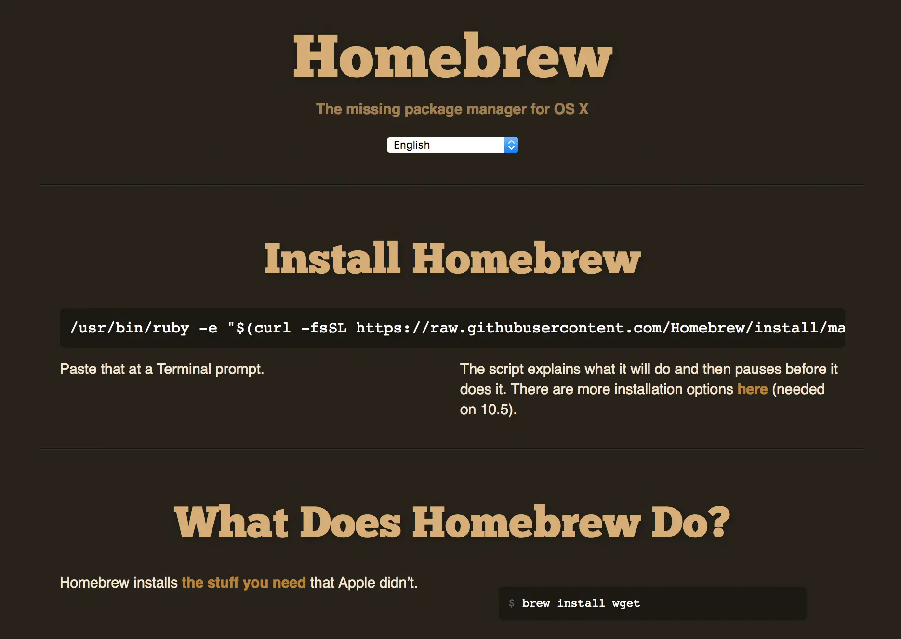
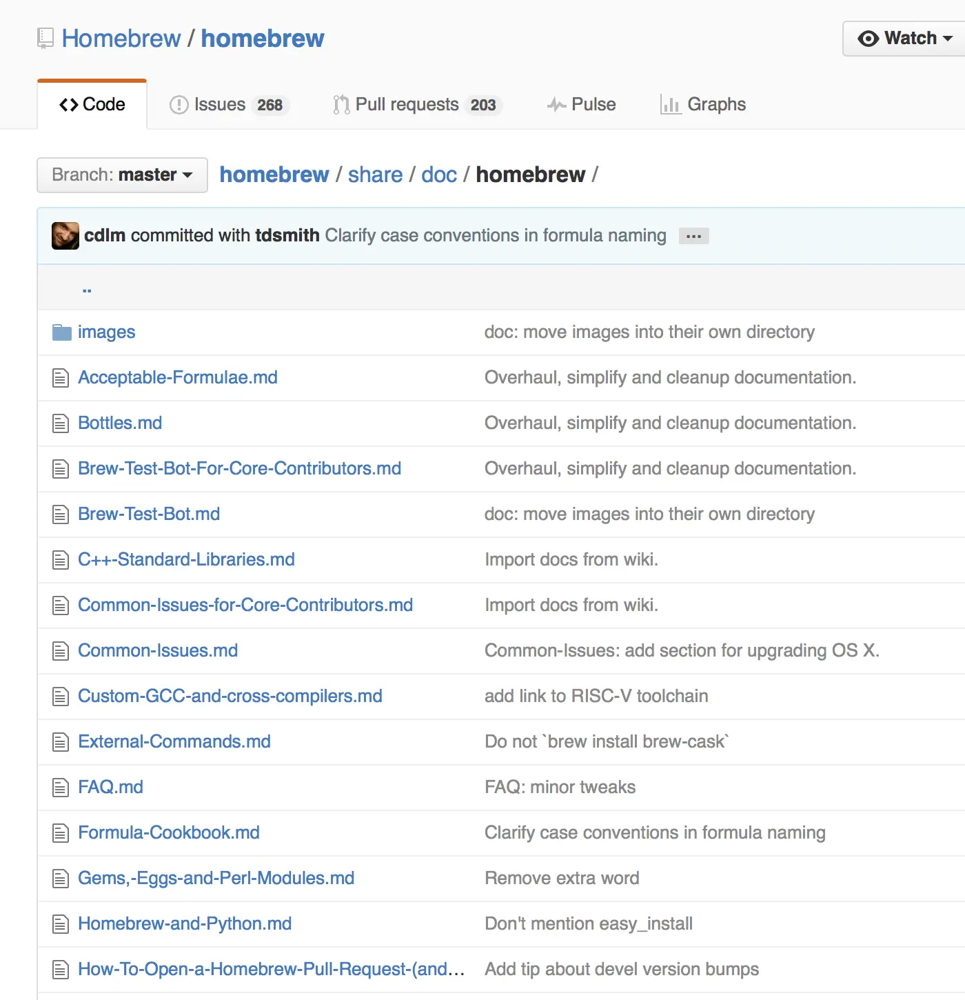
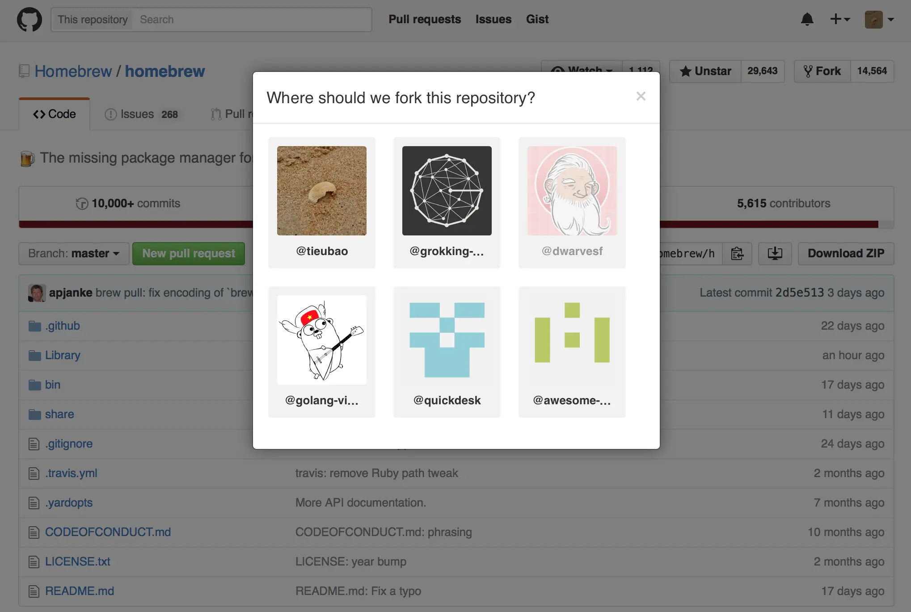
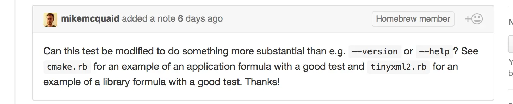
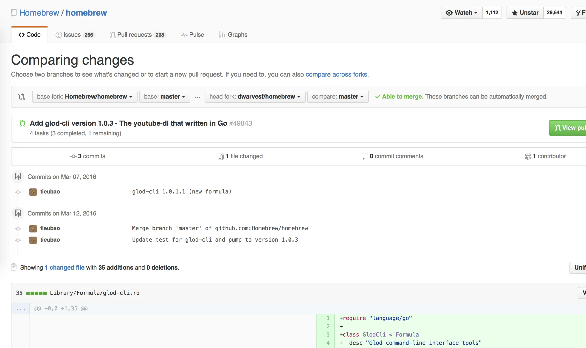
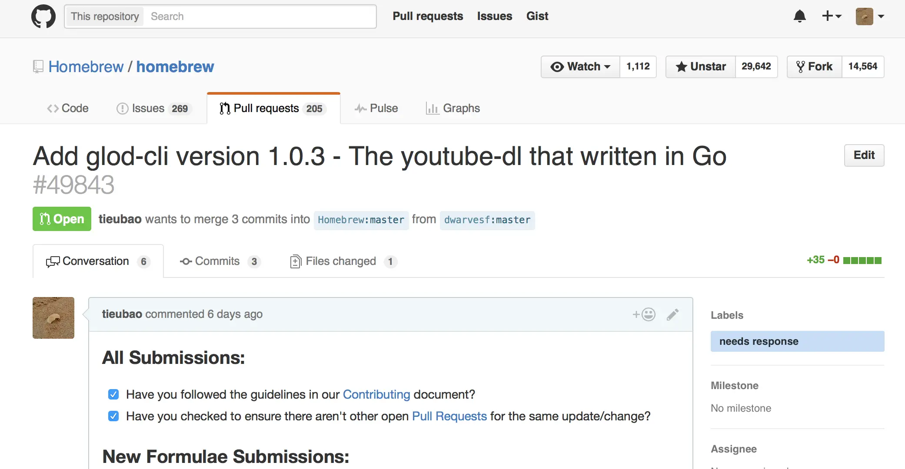

## Homebrew

Homebrew (or brew) is one of the biggest repo on Github with more than 29k stars, 14k forks and 1k watches. It was started by Max Howell in 2009 to build the missing package manager for OS X. Back to before 2009, in Mac OSX, if we wanted to install something, we had to install it via pkg files or bin files. We didn’t have anything fancy like `apt-get` in Ubuntu or `yum` in Fedora. MacPort was an only option but it was not too good. Check the very old article about it: [Homebrew, the perfect gift for command line lovers](https://www.engadget.com/2009/12/25/homebrew-the-perfect-gift-for-command-line-lovers/)

For now, you can access homebrew via

- Homepage: <http://brew.sh>
- Github: <https://github.com/Homebrew/homebrew>



To install homebrew, you just need to run the `brew` and you will get brew command ready in couple of minutes.

```javascript
/usr/bin/ruby -e "$(curl -fsSL https://raw.githubusercontent.com/Homebrew/install/master/install)"
```

Homebrew is developed in Ruby and its program will be defined as a formula which is simple Ruby script. Most of tools can be found in Homebrew such as: docker, ruby, python, ansible, todo.txt, … At this time they have over 3k5 formulas that was contributed by community.

```javascript
class Wget < Formula
  homepage "https://www.gnu.org/software/wget/"
  url "https://ftp.gnu.org/gnu/wget/wget-1.15.tar.gz"
  sha256 "52126be8cf1bddd7536886e74c053ad7d0ed2aa89b4b630f76785bac21695fcd"

  def install
    system "./configure", "--prefix=#{prefix}"
    system "make", "install"
  end
end
```

Brew makes it really easy to update and upgrade. Because everything is based on Git, you just need to run those below commands then everything will be done automatically.

```javascript
brew update
brew upgrade
```

## Contributing to Homebrew

Note: In this post, we just cover the command line or tool part of Homebrew. The example is taken from our **[glod-cli](https://github.com/dwarvesf/glod-cli)\*\***.\*\*

When you look into the repo of Homebrew, you can easily find the doc directory in `homebrew/share/doc/homebrew/` which contains all the information. The most important file for this tutorial is the `Formula-Cookbook.md.`



Basically, when you use homebrew, it will create a separate folder on your machine. Everything usually will be installed in `/usr/local/Cellar` and all formulas was stored at `/usr/local/Library/Formula.`

So in short, if you want to contribute a new one, you need to create a new formula in your local and submit a pull request to `https://github.com/Homebrew/homebrew.`

### Fork from Homebrew



For us, we will have a repo called `dwarvesf/homebrew` which we can clone and start from there.

### Create new formula

Make sure you have installed `brew` on your machine (you have to!) and your new formula must meets all their Acceptable Formulae requirements.

Then we can start from create a new branch (like git workflow) or not. For us we skip it and use the master branch (plot twist: we forgot to do this step)

We move to the step of create new formula by run the command

```javascript
brew create <URL.tar.gz>
```

Example for us, we use the archive url of our github repo [https://github.com/dwarvesf/glod-cli/archive/1.0.3.2.tar.gz](https://github.com/dwarvesf/glod-cli/archive/1.0.3.2.tar.gz). You can get it by combining

```javascript
https://github.com/<YOUR REPO>/archive/<COMMIT SHA | TAG>.tar.g
```

This command will help to create a local formula in `/usr/local/Library/Formula` and open with your default $EDITOR. You have to write a small Ruby script to `install` and `test` the formula. You can refer to other formulas to make it easier. Check out the main repo `https://github.com/Homebrew/homebrew/tree/master/Library/Formula` or the forked one. If you have Go formula like us, you can easily search for more than 100 existed Go formulas. It’s a great source for references.

Our formula looks like this:

```javascript
require "language/go"

class GlodCli < Formula
  desc "Glod command-line interface tools"
  homepage "https://github.com/dwarvesf/glod-cli"
  url "https://github.com/dwarvesf/glod-cli/archive/1.0.3.2.tar.gz"
  sha256 "1826e8b5398f10a12d5f315a9f5a670f05ac3e0f6ead7c4edddf621c2260ae6c"

  depends_on "go" => :build
  depends_on "godep" => :build

  go_resource "github.com/kr/fs" do
    url "https://github.com/kr/fs.git", :revision => "2788f0dbd16903de03cb8186e5c7d97b69ad387b"
  end

  def install
    ENV["GOPATH"] = buildpath
    ENV["GO15VENDOREXPERIMENT"] = "0"
    mkdir_p buildpath/"src/github.com/dwarvesf/"
    ln_s buildpath, buildpath/"src/github.com/dwarvesf/glod-cli"
    Language::Go.stage_deps resources, buildpath/"src"

    system "godep", "go", "build", "-o", "glod-cli", "."
    bin.install "glod-cli"
  end

  test do
    output = shell_output(bin/"glod-cli --version")
    assert_match "glod-cli version #{version}\n", output

    system bin/"glod-cli", "http://mp3.zing.vn/bai-hat/Hello-Vietnam-Pham-Quynh-Anh/ZWZ9C8EB.html"
    sleep 2
    assert File.exist?("Hello Vietnam.mp3")
  end
end
```

### Install/ debug local formula

```javascript
brew install --verbose --debug $FORMULA
```

This command will help to install your formula at /usr/local/Library/Formula. Happy debugging until you can install it smoothly.

Sometimes you will need to uninstall the formula, you can use this command

```javascript
brew unlink $FORMULA
brew cleanup
```

### Test the formula

One note for the test block, there are still a lot of formula that try to cheat by printing out the help or version. As a good contributor, you should write good tests for your formulas or your pull request will be rejected (like us)



```javascript
brew test $FORMULA
brew audit --strict --online $FORMULA
```

Those tests should be passed to make sure your formula is qualified. The second command is provided to check if your formula have

- More than 50 stars
- More than 20 fork
- More than 20 watchers
- And initialized more than 30 days

### Submit pull request

Bravo! It’s really great if you can get here, your formula is qualified. Let’s copy the local formula to your git repo. Example

```javascript
cp -f /usr/local/Library/Formula/glod-cli.rb ~/Workspace/dwarvesf/homebrew/Library/Formula
```

Commit and push your changes to **YOUR** Github. Then we open the Github Repo (still yours), click on button `New pull request` and we get






We did it! You only still need the feedback from Homebrew team. You can leave your keyboard and take a cup of coffee. If everything goes well, well done boss! you have just contribute to one of the famous repo in the internet. Congratulations!

## Acknowledgement

- Our pull request: [https://github.com/Homebrew/homebrew/pull/49843](https://github.com/Homebrew/homebrew/pull/49843)
- [glod-cli](https://github.com/dwarvesf/glod-cli): A small cli written in Go to help download music/video from multiple resources: Youtube, Vimeo, Facebook, Soundcloud … [https://github.com/dwarvesf/glod-cli](https://github.com/dwarvesf/glod-cli)
- Formula Cookbook
