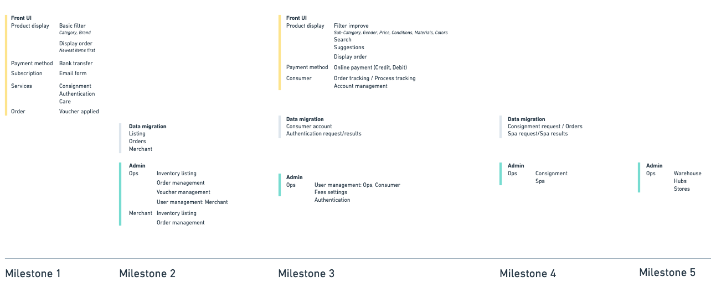
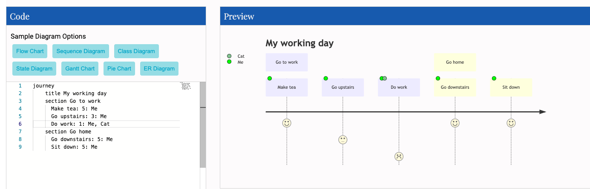
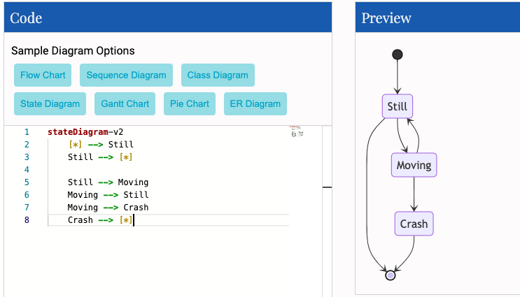
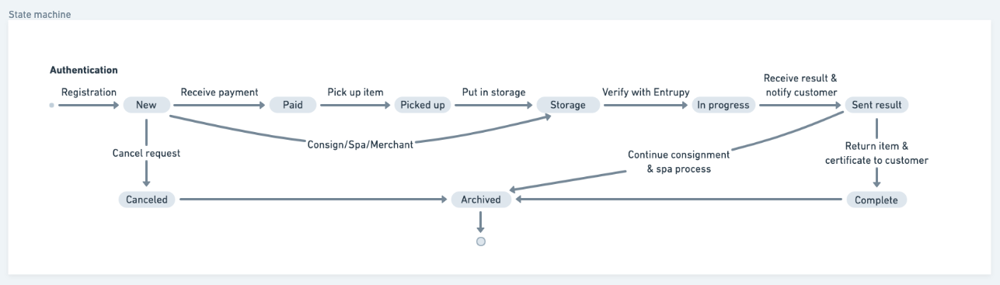
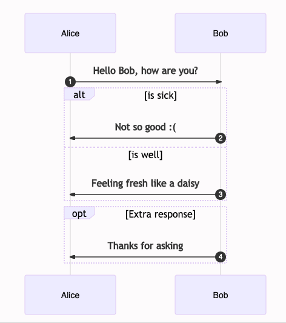

# Diagram and Project Document Structure

We have talk about [SDLC](https://dwarves.foundation/memo/software-development-life-cycle-101-yedyrmilyi) before and have learned that with a lot of constraints, the project is easy to fail. We could have plenty of reasons why a software project fails: team politics, overdue payment,... but three of them could be prevented easily with proper methodology, framework

- Unclear/misleading project requirements
- Wrongly defined tech stacks
- The wrong approach, develop practices

There is one secret sauce of a successful project: **Artifacts**. 
- Which artifacts should be produced? 
- Which tool should we use at Dwarves?
- Where should we store those diagrams?

Having the answer for those question give us the ability to solve at least three mentioned constraints. Avoid reinventing the wheel by following these practice which we apply here in Dwarves.

## **Artifacts**
- [BPMN](#bpmn) (hold)
- [Product Roadmap](#product-roadmap)
- [User Journey Mapping](#user-journey-mapping)
- [State Machine](#state-machine)
- [Usecase Diagram](#usecase-diagram)
- [Sequence Diagram](#sequence-diagram)
- [Activity Diagram](#activity-diagram)
- [Class Diagram](#class-diagram)
- [Stack Component Diagram](#stack-component-diagram)
- [ERD](#erd)
- [Data Flow](#data-flow)

## **Well-Alignment a.k.a Reusability**
- [Project Drive](#project-drive)
- [Message Board](#message-board)

---

### **BPMN**
---
### **Product Roadmap**
In SDLC after the requirement analysis phase complete, we need a plan, a map to identify where should we go. **Product Roamap** is the map we need.
> “What do we want in the matter of time?” 

Answer this question by determining the feasibility of the project and how we can implement the project successfully with the lowest risk in mind.

Take a look at this **Product Roadmap** 

It contains main elements:
- Timeline
- Milestone
- Deliverables 

Product Manager usually produce this artifact after discussion with Product Owners. This artifact will change periodically. We will review this one after each milestone to make sure the project is still on track.
Product Roadmap, Milestone is the goal for every developed features of a succesfull project.

#### **Tooling**
Consider using [Whimsical](https://whimsical.com/) if you are used to drawing tool. 

---
### **User Journey Mapping**
#### **Definition**
User journey mapping visualizes how a user interacts with a product and allows designers to see a product from a user’s point of view.
Note the emotional state of users at each step of their journey.

This technique shows the current (as-is) user workflow, and reveals areas of improvement for the to-be workflow. 
#### **Tooling**
We use [Mermaid](https://mm.daf.ug/) to quickly establish this kind of diagram.


Start with `journey` and the title. Each user journey is split into sections, these describe the part of the task the user is trying to complete.
``` 
journey
    title My working day
    section Go to work
      Make tea: 5: Me
      Go upstairs: 3: Me
      Do work: 1: Me, Cat
    section Go home
      Go downstairs: 5: Me
      Sit down: 5: Me
```

Tasks syntax is 
``` 
Task name: <score>: <comma separated list of actors>
```
---
### **State Machine**
#### **Definition**
A state machine is any device storing the status of something at a given time. The status changes based on inputs, providing the resulting output for the implemented changes.

#### **Tooling**
We use [Mermaid](https://mm.daf.ug/) to quickly establish this kind of diagram. It's not a nice render btw. 


The [syntax](https://mermaid-js.github.io/mermaid/diagrams-and-syntax-and-examples/stateDiagram.html) is quite easy to catchup.
```
stateDiagram-v2
    [*] --> Still
    Still --> [*]

    Still --> Moving
    Moving --> Still
    Moving --> Crash
    Crash --> [*]
```

Consider using [Whimsical](https://whimsical.com/) if you want a neat diagram. Or just simply sketch on paper and take a picture of it.



---
### **Usecase Diagram**

---
### **Sequence Diagram**
#### **Definition**
A sequence diagram shows object interactions arranged in time sequence. It depicts the objects involved in the scenario and the sequence of messages exchanged between the objects needed to carry out the functionality of the scenario. Sequence diagrams are typically associated with use case realizations in the Logical View of the system under development.
#### **Tooling**
We use [Mermaid](https://mm.daf.ug/) to quickly establish this kind of diagram and It's pretty neat.


[Syntax](https://mermaid-js.github.io/mermaid/diagrams-and-syntax-and-examples/sequenceDiagram.html#syntax) is defined quite clearly here. Below is how to draw the above Diagram
```
sequenceDiagram
    Alice->>Bob: Hello Bob, how are you?
    alt is sick
        Bob->>Alice: Not so good :(
    else is well
        Bob->>Alice: Feeling fresh like a daisy
    end
    opt Extra response
        Bob->>Alice: Thanks for asking
    end
```
Mainly it's have some main elements
- Participants
- Aliases
- Messages
- Arrows types
- Activations
- Loops
- Alt
- Parallel

---
### **Activity Diagram**

---
### **Class Diagram**

---
### **Stack Component Diagram**

---
### **ERD**
#### **Definition**
An entity–relationship model (or ER model) describes interrelated things of interest in a specific domain of knowledge. A basic ER model is composed of entity types (which classify the things of interest) and specifies relationships that can exist between entities (instances of those entity types).
#### **Tooling**
Let's take a look at this diagram rendering by [Mermaid](https://mm.daf.ug/)

The [syntax]([Mermaid](https://mm.daf.ug/)) mostly focus on Entities, relationship and identification.
```
<first-entity> <relationship> <second-entity> : <relationship-label>
```

For the above diagram
```
    erDiagram
          CUSTOMER }|..|{ DELIVERY-ADDRESS : has
          CUSTOMER ||--o{ ORDER : places
          CUSTOMER ||--o{ INVOICE : "liable for"
          DELIVERY-ADDRESS ||--o{ ORDER : receives
          INVOICE ||--|{ ORDER : covers
          ORDER ||--|{ ORDER-ITEM : includes
          PRODUCT-CATEGORY ||--|{ PRODUCT : contains
          PRODUCT ||--o{ ORDER-ITEM : "ordered in"
```

---
### **Data Flow**

---
### **Project Drive**

---
### **Message Board**

