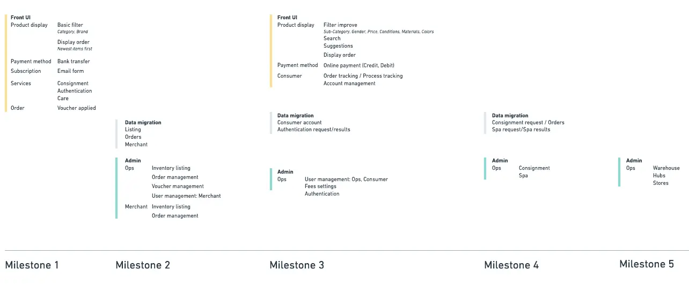
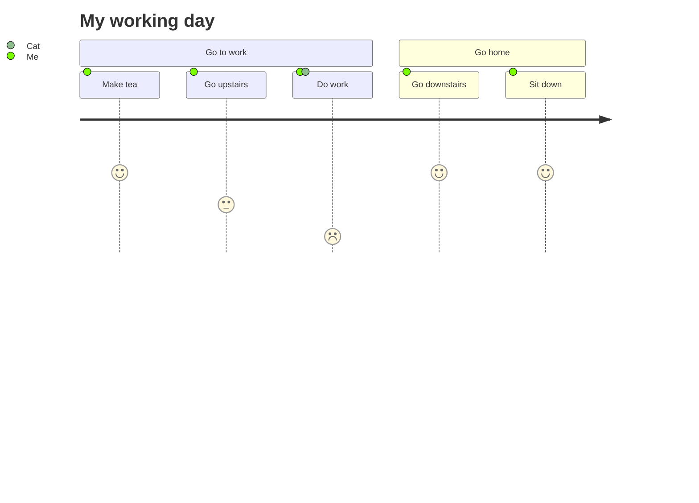
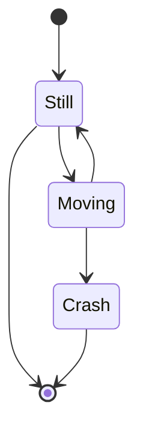
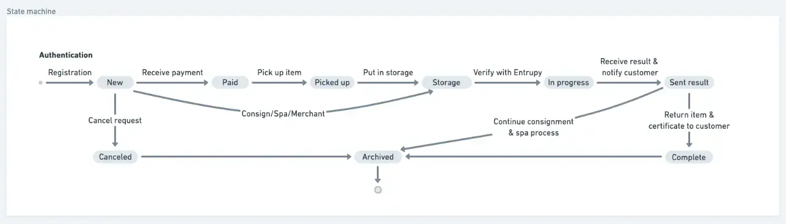
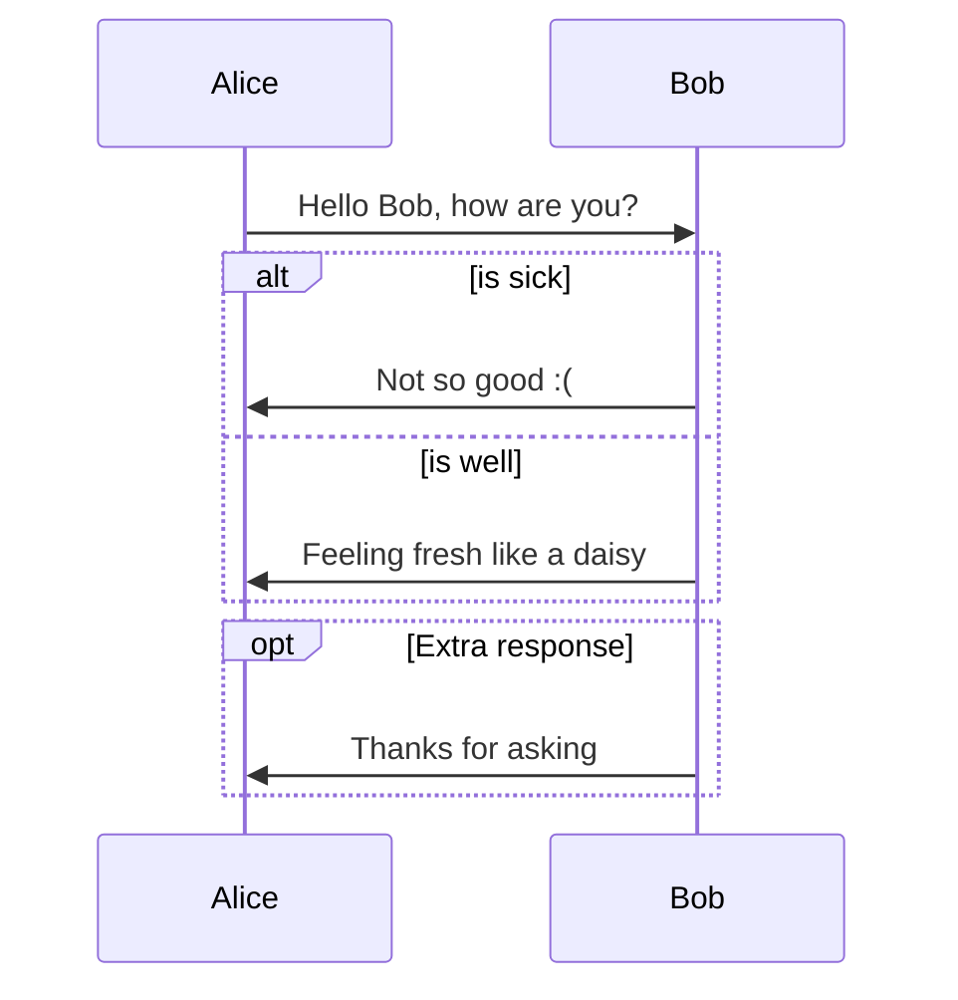
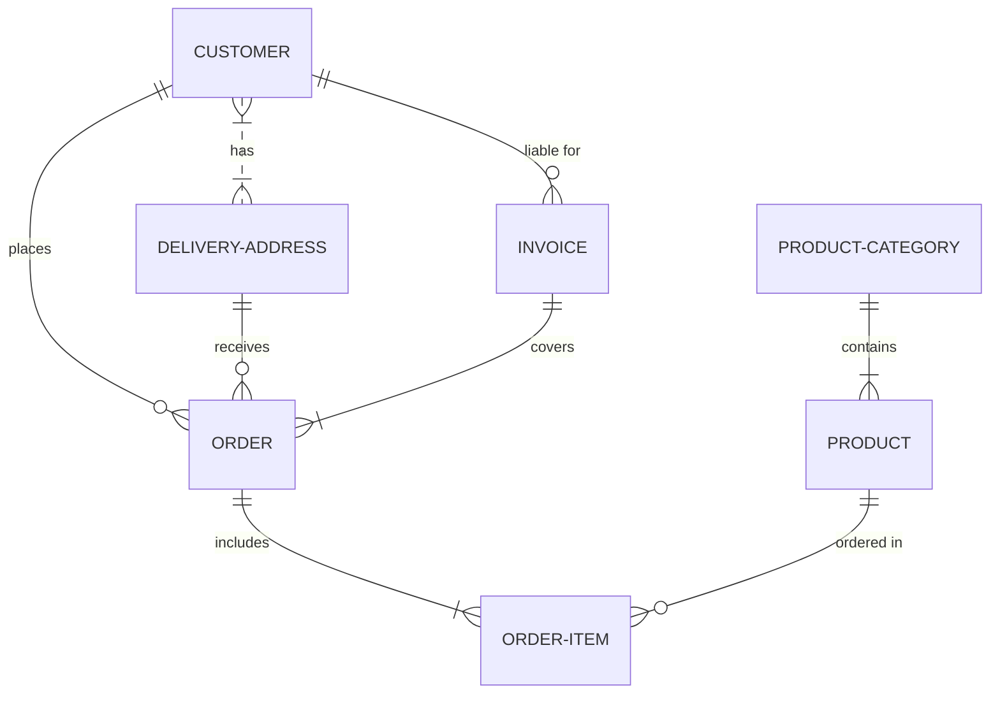
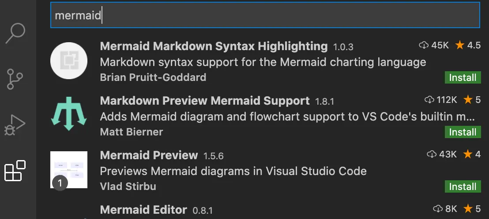

# Diagram and project document structure

We have talked about [SDLC](https://dwarves.foundation/memo/software-development-life-cycle-101-yedyrmilyi) before and have learned that with a lot of constraints, the project is easy to fail. We could have plenty of reasons why a software project fails: team politics, overdue payment,... but three of them could be prevented easily with proper methodology, framework

- Unclear/misleading project requirements
- Wrongly defined tech stacks
- The wrong approach, develop practices

There is one secret sauce of a successful project: **Artifacts**.

- Which artifacts should be produced?
- Which tool should we use at Dwarves?
- Where should we store those diagrams?

Having the answer for those question give us the ability to solve at least three mentioned constraints. Avoid reinventing the wheel by following these practice which we apply here in Dwarves.

## Artifacts

- [BPMN](#bpmn)
- [Product roadmap](#product-roadmap)
- [User journey mapping](#user-journey-mapping)
- [State machine](#state-machine)
- [Sequence diagram](#sequence-diagram)
- [Stack component diagram](#stack-component-diagram)
- [Entity relation diagram](#erd)
- [Data flow](#data-flow)

## Well-alignment a.k.a reusability

- [Project drive](#project-drive)
- [Message board](#message-board)

## Mermaid 101

- [What is Mermaid](#what-is-mermaid)
- [VSCode plugins](#vscode-plugins)

### Product roadmap

In SDLC after the requirement analysis phase complete, we need a plan, a map to identify where should we go. **Product Roamap** is the map we need.

> “What do we want in the matter of time?”

Answer this question by determining the feasibility of the project and how we can implement the project successfully with the lowest risk in mind.

Take a look at this **Product roadmap**

It contains main elements:

- Timeline
- Milestone
- Deliverables

Product Manager usually produce this artifact after discussion with Product Owners. This artifact will change periodically. We will review this one after each milestone to make sure the project is still on track.
Product roadmap, Milestone is the goal for every developed features of a succesfull project.

Consider using [Whimsical](https://whimsical.com/) if you are used to drawing tool.

### User journey mapping

User journey mapping visualizes how a user interacts with a product and allows designers to see a product from a user’s point of view.
Note the emotional state of users at each step of their journey.

This technique shows the current (as-is) user workflow, and reveals areas of improvement for the to-be workflow.



Start with `journey` and the title. Each user journey is split into sections, these describe the part of the task the user is trying to complete.

```
journey
    title My working day
    section Go to work
      Make tea: 5: Me
      Go upstairs: 3: Me
      Do work: 1: Me, Cat
    section Go home
      Go downstairs: 5: Me
      Sit down: 5: Me
```

Tasks syntax is

```
Task name: <score>: <comma separated list of actors>
```

### State machine

A state machine is any device storing the status of something at a given time. The status changes based on inputs, providing the resulting output for the implemented changes.



The [syntax](https://mermaid-js.github.io/mermaid/diagrams-and-syntax-and-examples/stateDiagram.html) is quite easy to catchup.

```
stateDiagram-v2
    [*] --> Still
    Still --> [*]

    Still --> Moving
    Moving --> Still
    Moving --> Crash
    Crash --> [*]
```

Consider using [Whimsical](https://whimsical.com/) if you want a neat diagram. Or just simply sketch on paper and take a picture of it.



### Sequence diagram

A sequence diagram shows object interactions arranged in time sequence. It depicts the objects involved in the scenario and the sequence of messages exchanged between the objects needed to carry out the functionality of the scenario. Sequence diagrams are typically associated with use case realizations in the Logical View of the system under development.



[Syntax](https://mermaid-js.github.io/mermaid/diagrams-and-syntax-and-examples/sequenceDiagram.html#syntax) is defined quite clearly here. Below is how to draw the above Diagram

```
sequenceDiagram
    Alice->>Bob: Hello Bob, how are you?
    alt is sick
        Bob->>Alice: Not so good :(
    else is well
        Bob->>Alice: Feeling fresh like a daisy
    end
    opt Extra response
        Bob->>Alice: Thanks for asking
    end
```

Mainly it's have some main elements

- Participants
- Aliases
- Messages
- Arrows types
- Activations
- Loops
- Alt
- Parallel

### ERD

An entity–relationship model (or ER model) describes interrelated things of interest in a specific domain of knowledge. A basic ER model is composed of entity types (which classify the things of interest) and specifies relationships that can exist between entities (instances of those entity types).



The [syntax](https://mm.daf.ug/) mostly focus on Entities, relationship and identification.

```
<first-entity> <relationship> <second-entity> : <relationship-label>
```

For the above diagram

```
    erDiagram
        CUSTOMER }|..|{ DELIVERY-ADDRESS : has
        CUSTOMER ||--o{ ORDER : places
        CUSTOMER ||--o{ INVOICE : "liable for"
        DELIVERY-ADDRESS ||--o{ ORDER : receives
        INVOICE ||--|{ ORDER : covers
        ORDER ||--|{ ORDER-ITEM : includes
        PRODUCT-CATEGORY ||--|{ PRODUCT : contains
        PRODUCT ||--o{ ORDER-ITEM : "ordered in"
```

<!--

### Data flow

### Stack component diagram
 -->

### Project drive

Each project will have its own GDrive folder located on Company GDrive.
All the project artifact should be export to PNG/JPG/PDF/SVG... and save to corresponding folder within project gdrive.
You can find your project gdrive follow this pattern.

> Dwarves Foundation/Works/[Project Name]

Usually we will Link the Project Gdrive into Docs & File within Basecamp project. You could find the link to the gdrive from there.

### Message board

Think about this situation:

> We’ve got the elements of a solution now, and we’ve de-risked our concept to the point that we’re confident it’s a good option to give a team. But the concept is still in our heads or in some hard-to-decipher drawings on the whiteboard or our notebook. Now we need to put the concept into a form that other people will be able to understand, digest, and respond to.

This is where we say “Okay, this is ready to write up as a pitch.”
We post [pitches](https://basecamp.com/shapeup/1.5-chapter-06_) as Messages in Basecamp.
Message board is the central place for all discussion about project artifacts. In Message board, we can create a Message Category called Pitch/FYI... so we can easily find them later on.

### What is Mermaid

We use [Mermaid](https://mm.daf.ug/) to quickly define the diagram during project development lifecycle.
Mermaid is a markdown-based diagram render. Right now we support the following charts/diagrams:

- Flow chart
- Sequence diagram
- Class Diagram
- State Diagram
- Gantt Chart
- Pie Chart
- ER Diagram

### VSCode plugin



Install the above plugin, put your mermaid code directly with VSCode (Go with the most-rated plugin) and observe the magic.
