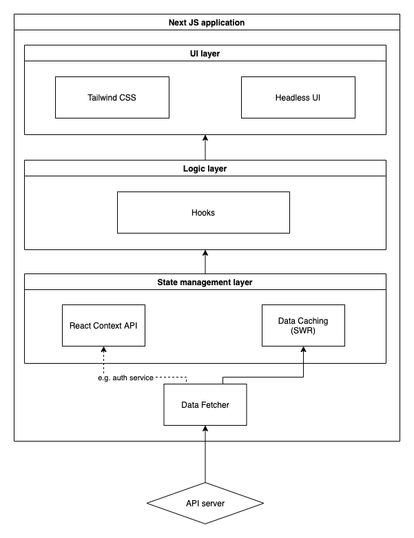

# Tech ecosystem

This document is intended to give you a taste of how we build frontend applications at Dwarves, and more importantly, why we choose the technology. It still assumes basic knowledge of React and [Next.js](https://nextjs.org/docs/getting-started). **If you're completely new to React, please refer to <https://github.com/petehunt/react-howto> instead!**

## Tech stack

### Core

- [x] [React](https://reactjs.org/)
- [x] [Next.js](https://nextjs.org/)
- [x] [SWR](https://swr.vercel.app/)
- [x] [React Hook Form](https://github.com/react-hook-form/react-hook-form)
- [x] [Dwarves React Toolkit](https://github.com/dwarvesf/react-toolkit)

### UI & styling

- [x] [TailwindCSS](https://github.com/tailwindcss/tailwindcss)
- [x] [Headless UI](https://github.com/tailwindlabs/headlessui)

### Static type checking & linting

- [x] [TypeScript](https://www.typescriptlang.org)
- [x] [ESLint](http://eslint.org/)
- [x] [Prettier](https://prettier.io/)

### Testing

- [x] [Jest](http://facebook.github.io/jest/)
- [x] [react-testing-library](https://github.com/kentcdodds/react-testing-library)
- [x] [Cypress](https://github.com/cypress-io/cypress)

## Core Building Blocks

### React

When we choose a technology, the first question always is "**did that technology achieve a certain level of stability and maturity?**". Quick wins are great, but products, teams, and infrastructure evolving into new things can only be created with years of effort. React has been proven to be the answer when the question comes to selecting our frontend backbone. Not many frameworks evolving over a decade can still maintain the right balance of stability, performance, and usability like React.

### Next.js

Production grade React applications that scale, we list [Next.js](https://nextjs.org/) to be the first candidate when we decide to setup a React app. The opinionated framework gives you the best developer experience with all the features you need for production: hybrid static & server rendering, TypeScript support, smart bundling, route pre-fetching.

### React Context

We don't advocate for any state management library at the moment. One of the reasons libraries like Redux were so successful is because they solved the problem of [prop drilling](https://kentcdodds.com/blog/prop-drilling). However, the born of [Context API](https://reactjs.org/docs/context.html) made it easy to pass data through the component tree without having to pass props down manually at every level. More importantly, we think most applications don't need a complicated global state, and Context API is more than enough to solve that uncomplex problem. Our philosophy in React state management is simple: try to keep state as local as possible and use React context when prop drilling becomes a worry.

### TypeScript

We are adopting TypeScript to our codebase. Forcing to write strongly-typed syntax while you are familiar with dynamic/multi-paradigm scripting language like JavaScript is sometimes annoying, even for experienced developers. However, the drawback can be outweighed by the following benefits when coming to write a medium to large sized applications:

- [x] Catching your bugs at compile-time as you type them.
- [x] Coding confidently with autocompletion, definition jumping and source documentation.
- [x] Syncing API Interfaces between backend and frontend via Swagger json doc.
- [x] Relieve the pain of refactoring/renaming.

### SWR

We use [SWR](https://swr.vercel.app/) as the caching layer for the backend data to ensure the UI will be always fast and reactive. The strategy is to first return the data from cache (stale), then send the fetch request (revalidate), and finally, come with the up-to-date data. The data can be dynamic and self-updated overtime. It features:

- [x] Transport and protocol agnostic data fetching
- [x] Fast page navigation
- [x] Revalidation on focus
- [x] Interval polling
- [x] Request deduplication
- [x] Local mutation

### React Hook Forms

If you are going to use a package for your forms, we recommend [react-hook-forms](https://github.com/react-hook-form/react-hook-form). It is a great balance of good performance and good developer experience.

### TailwindCSS

We are using `tailwind` to do styling and it scales pretty well when combining headless components and hooks to build the presentation layer. The choice was made because it helps avoid common CSS frustrations to keep a neat codebase and moving quickly, regardless of experience levels:

- [x] **Consistency**: utility classes help you work within the constraints of a system instead of littering your stylesheets with arbitrary values.
- [x] **Naming is hard**: you don't even need to use complicated namespacing techniques like BEM.
- [x] **Tiny production build**: automatically removes all unused CSS when building for production, which means your final CSS bundle is the smallest it could possibly be.
- [x] **Mobile-first**: throw a screen size in front of literally any utility class and watch it magically apply at a specific breakpoint.
- [x] **Customization**: although Tailwind includes an expertly crafted set of defaults out-of-the-box, but literally everything can be customized via JIT or `tailwind.config.js`.

## Architecture

Most of the frontend applications consist of four layers: Service connector, State management, Logic and UI. We opinionate about the technology for each layer with a guarantee of production readiness.

    

## Linting

Any project should include a complete static code analysis setup. The standard is composed of [ESLint](http://eslint.org/) and [Prettier](https://prettier.io/).

We recommend that you install the relevant IDE extensions for each one of these tools. Once you do, every time you'll press save, all your code will be formatted and reviewed for quality automatically.

Furthermore, there should be a git hook to automatically analyze and fix linting errors before your code is committed. [lint-staged](https://github.com/okonet/lint-staged) and [husky](https://github.com/typicode/husky) is often the standard pair to setup the automation.

---

For all of those recommendations, we created [nextjs-boilerplate](https://github.com/dwarvesf/nextjs-boilerplate) to demontrate how those decisions work together.

## Read on

- [Code style](code-style.md)
- [Writting test](writing-test.md)
- [UI checklist](ui-checklist.md)
- [Logging and monitoring](logging-monitoring.md)

