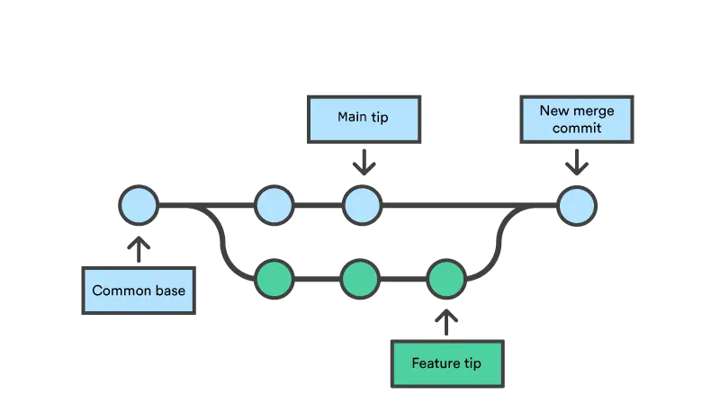

# Source Version Control

It's like a time machine. We can save and reload anytime we want to, like in the old day of Game Boy Advance. We can work in parallel universes of our source code, experimenting without fear of losing work, and rolling back if something goes wrong.

[We use git](https://egghead.io/courses/how-to-contribute-to-an-open-source-project-on-github). Git is one of the most popular distributed source version control. We use [Github](github.com/dwarvesf/) to open source our works, playbook, and practices. We also have a [self-host Gitlab](git.d.foundation) to store all of our source code.

## Commit Message Guidelines

Hour commit conventions are based on [Conventional Commits](https://www.conventionalcommits.org/en/v1.0.0/#specification)

Commit message should be structured as follows

```
# A - inline command
git commit -m "<type>(optional scope): <commit message>"

# B - in a commit editor
<type>(optional scope): <description>

[optional body]

[optional footer(s)]
```

**Types:**

Must be one of the following:

- build: Changes that affect the build system or external dependencies
- ci: Changes to our CI configuration files and scripts (example scopes: Github Action, Travis, Circle, Jenkins)
- docs: Documentation only changes
- feat: A new feature
- fix: A bug fix
- perf: A code change that improves performance
- refactor: A code change that neither fixes a bug nor adds a feature
- style: Changes that do not affect the meaning of the code (white-space, formatting, missing semi-colons, etc)
- test: Adding missing tests or correcting existing tests
- revert: Indicate that we revert a previous commit, followed by the header of the reverted commit. In the body, it should say: This reverts commit <hash>., where the hash is the SHA of the commit being reverted.

**Scope**

The scope is optional and it should be the name of the package or module in your app/monorepo

Example: marketplace, ui, libs, utils, crawler, api

**`Type` and `Versioning`**

We follow [SenVer](versioning.md) to release our app/package.

- feat, fix, refactor anything cause breaking change → bump `MAJOR` version
- feat, perf → bump `MINOR` version
- fix, refactor → bump `PATCH`
- chore, refactor, test, style, docs, ci, build → no version bump

**Toolings**
We use automation tools that are useful to force and check commit message convection

- [changeset](https://github.com/changesets/changesets) - manage your versioning and changelogs
- [semantic release](https://github.com/semantic-release/github) - plugin to publish a GitHub release and comment on released Pull Requests/Issues
- [commitlint](https://github.com/conventional-changelog/commitlint) - lint your commit message
- [commitlint Github Action](https://github.com/marketplace/actions/commit-linter) - check your commit with Github Action
- commit hooks:
  - create your own with bash script
  - nodejs tool: husky and lint-staged

## Branching

**Naming convention**

Same as commit convention we shared type for branching prefix
The new branch name should be structured as follows

```bash
git checkout -b <type>/your-branch-name

# example
git checkout -b feat/marketplace-home-page
git branch docs/add-how-to-use-git
```

**Preserved Names**

- master/main - the base branch, can be used as production branch
- develop - the development branch, base branch for feature, fix, chore...
- release/production, stag/qa/qc - optional branches for your other deployment environments

**Branching strategy**

There is only one eternal branch – you can call it master, develop, current, next – whatever. We prefer to use **“master”**

All other branches (feature, release, fix, and whatever else you need) are temporary and only used as a convenience to share code with other developers and as a backup measure. They are always removed once the changes present in them land on master.

- Github flow
  - Create a new branch from the base branch (normally is develop or master/main)
  - Make changes and add commits
  - Open a Pull Request
  - Review
  - Deploy (optional) - branch deployment
  - Merge
  - Delete your branch

**How to collaborate/contribute to open source repo**

- To be able to contribute to an open source repo you first have to `fork` the repo to your account
- Clone your forked repo `git clone forked-git-repo`
- Adding new remote using `git remote add upstream original-git-repo`
  - Please note that we now have 2 remotes to work with
    - the `origin` alias is pointing to the forked repo which you have full permission to create/delete branches
  - the `upstream` alias is pointing to the original repo that you forked from which you have limited permission
- Create a new branch and make changes to your local repo
- Commit and push your work to `forked repo` `git push origin your-work`
- Go to github original repo to create a new PR with the target branch is you created from the forked repo
- To update the base branch synced with the original repo using

```bash
# base branch is `master`
git checkout master
git fetch upstream

# O1. pull and merge
git pull upstream/master

# O2. rebase
git rebase upstream/master

# 03. reset
git reset --hard upstream/master

# after the local base branch is updated push to origin to update your forked repo
git push origin master
```

## Practices

- **Amend commit**: edit the latest commit

> `git commit --amend` will allow you to change the last commit message or add new files to it
>
> Notice: the commit sha will be changed after you alter the commit

Example

```bash
# The current tree: git log --oneline --decorate --graph
# * c format qa defect template (#49)
# * b rename /Testing to /qa
# * a add documents for QA (#47)
# You wanted to update the last commit message
git commit --amend

# The tree changed
# The current tree: git log --oneline --decorate --graph
# * d update git practice with commit sha changed
# * b rename /Testing to /qa
# * a add documents for QA (#47)
```

- **Merge**

> The `git merge` command lets you take the independent lines of development created by `git branch` and integrate them into a single branch.
>
> Ref: <https://www.atlassian.com/git/tutorials/using-branches/git-merge>



Usage

```bash
# you're your feature branch
# fetch for updates
git fetch

# sample 1
git merge origin/master # to update with master on the origin
# sample 2
git merge feat/feature-2 # merge feature-2 into the current branch
```

- **Rebase**

> Rebasing is the process of moving or combining a sequence of commits to a new base commit
>
> Ref: <https://www.atlassian.com/git/tutorials/rewriting-history/git-rebase>


Usage

```bash
# you're your feature branch
# fetch for updates
git fetch
# brings all of your commits to the head of the master branch
git rebase origin/master

```

- **Advanced rebase: rebase interactive**

  > With `git rebase -i [base-branch or commit-id]` allows you to changing older or multiple commits
  > You can:
  >
  > - reorder by changing the order of the commit list in the rebase interactive editor
  > - update older commits: Commit marked with `rework | r` will allow you to modify that commit
  > - drop commit. Commits marked with `drop | d` will be dropped from history when rebasing
  > - squash/fix. Commits marked with `squash | s` or `fix | f` will be merged into previous commits

- **Cherry pick**

> `git cherry-pick commitSha` is a powerful command that enables arbitrary Git commits to be picked by reference and appended to the current working HEAD. Cherry picking is the act of picking a commit from a branch and applying it to another.

Example

```bash
# Current tree
# a - b - c - d   Main
#      \
#        e - f - g Feature
#
# You want to pick the commit `f` and bring it to master
git cherry-pick f

# Result tree
# a - b - c - d   Main
#      \
#        e - f - g Feature
```

- **Reflog:**

> `git reflog` is the safety net that allows you to go back to commits even though they are not referenced by any branch or tag. After rewriting history, the reflog contains information about the old state of branches and allows you to go back to that state if necessary
>
> Ref: <https://www.atlassian.com/git/tutorials/rewriting-history/git-reflog>

Example

```bash
# Scenario: you found out that you should not amend the latest commit and
# you wanted to reset to the commit before you amend
# get ref logs
git reflog show head
# Out put
# b675a11 head@{0}: commit (amend): fix layout
# 8c76ad1 head@{1}: commit (amend): fix something
# 873abad head@{2}: rebase (continue) (finish): returning to refs/heads/branch-name
# 873abad head@{3}: rebase (continue): meaningful commit message
git reset --hard 8c76ad1
```

- **Remote Reflog:**

> Same as reflog this will help you recovering a commit from Github’s Reflog
>
> Ref: the [original blog](https://objectpartners.com/2014/02/11/recovering-a-commit-from-githubs-reflog/)

- Retrieve the commit SHA

  ```bash
  curl https://api.github.com/repos/{owner}/{repo}/events
  ```

- You can find the commit you lost in the repo event response. Use the commit SHA and github refs API to create new branch from that commit

  ```bash
  $ curl -i \
    -X POST \
    -H "Accept: application/json" \
    -H "Content-Type: application/json" \
    -d '{"ref":"refs/heads/D-commit", "sha":"your-commit-sha"}' \
    https://api.github.com/repos/{owner}/{repo}/git/refs
  ```
