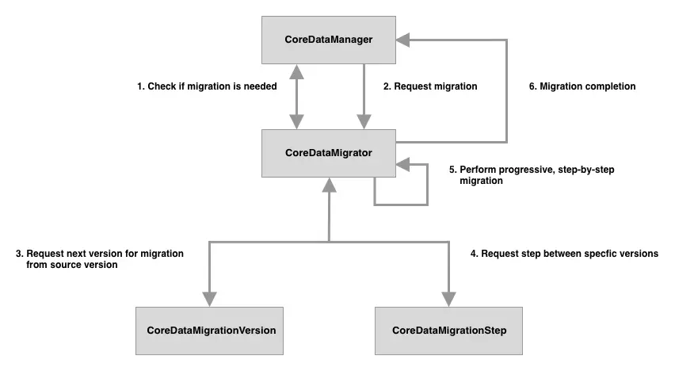

# Database migration in iOS development

Database migration is one of the most important aspects of software development in general and of iOS development in specific. If we do not handle it correctly, it would cause some bad user experiences, such as data loss, app crashing, etc. And finally, lead to the bad reputation for the company. So, we **MUST** handle it correctly. And this post is a lighthouse which lead you to the right path.

## Summary

- [We use the Core Data as a database framework.](#the-tool)
- [You can skip the migration if you just use the storage as an offline cache.](#when-not)
- [We follow the **Progressive migration** method to model the migration steps.](#progressive-migration)

## The tool

There are many database frameworks out there (Realm, Couchbase, or YapDatabase). But we want to stick to Apple's eco-system so Core Data is our only choice here. And Core Data is also a very powerful tool, as it gives us an inferred migration mechanism for free. You can choose any underlying persistent store type, such as SQLite, Atomic (binary store) or In-Memory for using with Core Data. It's up to you, as long as you think it's suitable for the application.

## When NOT

There are some cases in which you can avoid a migration. If an app is using Core Data merely as an offline cache, when you update the app, you can simply delete and rebuild the data store. This is only possible if the source of truth for your user’s data isn’t in the data store. In all other cases, you’ll need to safeguard your user’s data.

## Techniques

Migrations in Core Data can be handled using one of two techniques:

- [Lightweight Migration](#lightweight-migration) - when Core Data can automatically infer how the migration should happen and creates the mapping model on the fly.

- [Standard Migration](https://developer.apple.com/library/archive/documentation/Cocoa/Conceptual/CoreDataVersioning/Articles/vmMappingOverview.html###//apple_ref/doc/uid/TP40004399-CH5-SW1) - when Core Data cannot infer how the migration should happen and so we must write a custom migration by providing a mapping model (`xcmappingmodel`) and/or a migration policy (`NSEntityMigrationPolicy`).

## The default migration process

By default, Core Data will attempt to perform a migration automatically when it detects a mismatch between the model used in the persistent store and the bundle's current model. When this happens, Core Data will first attempt to perform a Standard migration by searching in the app's bundle for a mapping model that maps from the persistent store model to the current bundle model. If a custom mapping model isn't found, Core Data will then attempt to perform a Lightweight migration. If neither form of migration is possible an exception is thrown.

Core Data will follow this migration process:

1. Core Data detects a mismatch between the model used in the persistent store and the bundle's **current** model

2. Attempt to perform a Standard migration by searching in the app's bundle for a **mapping model** that maps from the persistent store model to the current bundle model. If a custom mapping model isn't found, go to next step.

3. Core Data will then attempt to perform a Lightweight migration.

4. Throw exception if it cannot perform the migration.

### Problem

These automatic migrations are performed as one-step migrations; directly from the source to destination model. So if we support 4 model versions, mapping models would exist for 1 to 4, 2 to 4 and 3 to 4. While this is the most efficient migration approach from a device performance point-of-view, it can actually be quite wasteful from a development point-of-view. For example if we added a new model version (5) we would need to create 4 new mapping models from 1 to 5, 2 to 5, 3 to 5 and 4 to 5 which as you can see doesn't reuse any of the mapping models for migrating to version 4. With a one-step migration approach, each newly added model version requires n-1 mapping models (where n is the number of supported model versions) to be created.

## Progressive migration

It's possible to reduce the amount of work required to perform a Core Data migration by disabling automatic migrations and so break the requirement to perform migrations in one-step. With a manual migration approach, we can perform the full migration by chaining multiple smaller migrations together. As the full migration is split into smaller migrations when adding a new model version we only need to handle migrating to the new model version from its direct predecessor rather than all it's predecessors e.g. 4 to 5 because we can reuse the existing 1 to 2, 2 to 3 and 3 to 4 mapping models. Not only do manual migrations reduce the amount of work involved they also help to reduce the complexity of the migration as the conceptional distance between the source and destination version is reduced when compared to one-step migrations i.e. version 4 is much nearer to the structure of version 5 than version 1 is - this should make it easier spot any issues with the migration.

We follow the method called **Progressive Core Data Migration**. It gives us the clear way to structure the migration steps.

In order to support progressive migrations we'll need to answer a few questions:

1. [Which model version comes after version X?](#which-model-version-comes-after-version-x?)
2. [What is a migration step?](#what-is-a-migration-step?)
3. [How can we combine the migration steps into a migration path?](#how-can-we-combine-the-migration-steps-into-a-migration-path?)
4. [How do we trigger a migration?](#how-do-we-trigger-a-migration?)

These questions will be answered with the help of 4 separate types:

1. `CoreDataMigrationVersion`
2. `CoreDataMigrationStep`
3. `CoreDataMigrator`
4. `CoreDataManager`

These types will come together in the following class structure:



Directory structure:

```shell
CoreData
├── CoreDataManager.swift
├── Migration
│   ├── CoreDataMigrationStep.swift
│   ├── CoreDataMigrationVersion.swift
│   ├── CoreDataMigrator.swift
│   ├── Mappings
│   │   └── Migration2to3ModelMapping.xcmappingmodel
│   └── Policies
│       └── Post2ToPost3MigrationPolicy.swift
└── Model
    └── CoreDataMigration_Example.xcdatamodeld
        ├── CoreDataMigration_Example\ 2.xcdatamodel
        ├── CoreDataMigration_Example\ 3.xcdatamodel
        ├── CoreDataMigration_Example\ 4.xcdatamodel
        └── CoreDataMigration_Example.xcdatamodel
```

### Which model version comes after version X?

Each `CoreDataMigrationVersion` instance will represent a Core Data model version. As each Core Data model version is unique and known at compile time they can be perfectly represented as enum cases, with the raw value of each case being the Core Data model name:

```Swift
enum CoreDataMigrationVersion: String, CaseIterable {
    case version1 = "CoreDataMigration_Example"
    case version2 = "CoreDataMigration_Example 2"

    // MARK: - Current

    static var current: CoreDataMigrationVersion {
        guard let latest = allCases.last else {
            fatalError("no model versions found")
        }

        return latest
    }

    // MARK: - Migration

    func nextVersion() -> CoreDataMigrationVersion? {
        switch self {
        case .version1:
            return .version2
        case .version2:
            return nil
        }
    }
}

```

Even if you don't have any existing migrations, it's possible that at some point in the future a broken model version is released that corrupts your user's data upon migration. In order to minimise to the impact of this mistake, nextVersion could be configured to bypass that broken model version so that any currently unaffected user are never impacted:

```Swift
func nextVersion() -> CoreDataMigrationVersion? {
    switch self {
    case .version1:
        return .version2
    case .version2:
        return .version4 // skipping corrupted .version3
    case .version3:
        return .version4
    case .version4:
        return nil
    }
}
```

## What is a migration step?

A migration happens between 2 model versions by having a mapping from the entities, attributes and relationships of the source model and their counterpoints in the destination model. As such CoreDataMigrationStep needs to contain 3 properties:

1. Source version model.
2. Destination version model.
3. Mapping model.

```Swift
struct CoreDataMigrationStep {

    let sourceModel: NSManagedObjectModel
    let destinationModel: NSManagedObjectModel
    let mappingModel: NSMappingModel

    // MARK: Init

    init(sourceVersion: CoreDataMigrationVersion, destinationVersion: CoreDataMigrationVersion) {
        let sourceModel = NSManagedObjectModel.managedObjectModel(forResource: sourceVersion.rawValue)
        let destinationModel = NSManagedObjectModel.managedObjectModel(forResource: destinationVersion.rawValue)

        guard let mappingModel = CoreDataMigrationStep.mappingModel(fromSourceModel: sourceModel, toDestinationModel: destinationModel) else {
            fatalError("Expected modal mapping not present")
        }

        self.sourceModel = sourceModel
        self.destinationModel = destinationModel
        self.mappingModel = mappingModel
    }

    // MARK: - Mapping

    private static func mappingModel(fromSourceModel sourceModel: NSManagedObjectModel, toDestinationModel destinationModel: NSManagedObjectModel) -> NSMappingModel? {
        guard let customMapping = customMappingModel(fromSourceModel: sourceModel, toDestinationModel: destinationModel) else {
            return inferredMappingModel(fromSourceModel:sourceModel, toDestinationModel: destinationModel)
        }

        return customMapping
    }

    private static func inferredMappingModel(fromSourceModel sourceModel: NSManagedObjectModel, toDestinationModel destinationModel: NSManagedObjectModel) -> NSMappingModel? {
        return try? NSMappingModel.inferredMappingModel(forSourceModel: sourceModel, destinationModel: destinationModel)
    }

    private static func customMappingModel(fromSourceModel sourceModel: NSManagedObjectModel, toDestinationModel destinationModel: NSManagedObjectModel) -> NSMappingModel? {
        return NSMappingModel(from: [Bundle.main], forSourceModel: sourceModel, destinationModel: destinationModel)
    }
}
```

> _It's possible to have multiple mapping models between versions, (this can be especially useful when migrating large data sets) in this post in an attempt to keep things simple I assume only one mapping model._

### How can we combine the migration steps into a migration path?

CoreDataMigrator is at the heart of our migration solution and has 3 tasks:

1. Determining if there needs to be a migration.
2. Ensuring the persistent store is ready to be migrated.
3. Performing the migration.

As CoreDataManager holds a reference to CoreDataMigrator (we will see this later) we can make our lives easier by wrapping CoreDataMigrator in a protocol so that it's easier to mock when writing tests for CoreDataManager:

```Swift
protocol CoreDataMigratorProtocol {
    func requiresMigration(at storeURL: URL, toVersion version: CoreDataMigrationVersion) -> Bool
    func migrateStore(at storeURL: URL, toVersion version: CoreDataMigrationVersion)
}
```

Now that we have that protocol lets look at how CoreDataMigrator implements those protocol methods:

```Swift
class CoreDataMigrator: CoreDataMigratorProtocol {

    // MARK: - Check

    func requiresMigration(at storeURL: URL, toVersion version: CoreDataMigrationVersion) -> Bool {
        guard let metadata = NSPersistentStoreCoordinator.metadata(at: storeURL) else {
            return false
        }

        return (CoreDataMigrationVersion.compatibleVersionForStoreMetadata(metadata) != version)
    }

    // MARK: - Migration

    func migrateStore(at storeURL: URL, toVersion version: CoreDataMigrationVersion) {
        forceWALCheckpointingForStore(at: storeURL)

        var currentURL = storeURL
        let migrationSteps = self.migrationStepsForStore(at: storeURL, toVersion: version)

        for migrationStep in migrationSteps {
            let manager = NSMigrationManager(sourceModel: migrationStep.sourceModel, destinationModel: migrationStep.destinationModel)
            let destinationURL = URL(fileURLWithPath: NSTemporaryDirectory(), isDirectory: true).appendingPathComponent(UUID().uuidString)

            do {
                try manager.migrateStore(from: currentURL, sourceType: NSSQLiteStoreType, options: nil, with: migrationStep.mappingModel, toDestinationURL: destinationURL, destinationType: NSSQLiteStoreType, destinationOptions: nil)
            } catch let error {
                fatalError("failed attempting to migrate from \(migrationStep.sourceModel) to \(migrationStep.destinationModel), error: \(error)")
            }

            if currentURL != storeURL {
                //Destroy intermediate step's store
                NSPersistentStoreCoordinator.destroyStore(at: currentURL)
            }

            currentURL = destinationURL
        }

        NSPersistentStoreCoordinator.replaceStore(at: storeURL, withStoreAt: currentURL)

        if (currentURL != storeURL) {
            NSPersistentStoreCoordinator.destroyStore(at: currentURL)
        }
    }

    private func migrationStepsForStore(at storeURL: URL, toVersion destinationVersion: CoreDataMigrationVersion) -> [CoreDataMigrationStep] {
        guard let metadata = NSPersistentStoreCoordinator.metadata(at: storeURL), let sourceVersion = CoreDataMigrationVersion.compatibleVersionForStoreMetadata(metadata) else {
            fatalError("unknown store version at URL \(storeURL)")
        }

        return migrationSteps(fromSourceVersion: sourceVersion, toDestinationVersion: destinationVersion)
    }

    private func migrationSteps(fromSourceVersion sourceVersion: CoreDataMigrationVersion, toDestinationVersion destinationVersion: CoreDataMigrationVersion) -> [CoreDataMigrationStep] {
        var sourceVersion = sourceVersion
        var migrationSteps = [CoreDataMigrationStep]()

        while sourceVersion != destinationVersion, let nextVersion = sourceVersion.nextVersion() {
            let migrationStep = CoreDataMigrationStep(sourceVersion: sourceVersion, destinationVersion: nextVersion)
            migrationSteps.append(migrationStep)

            sourceVersion = nextVersion
        }

        return migrationSteps
    }

    // MARK: - WAL

    func forceWALCheckpointingForStore(at storeURL: URL) {
        guard let metadata = NSPersistentStoreCoordinator.metadata(at: storeURL), let currentModel = NSManagedObjectModel.compatibleModelForStoreMetadata(metadata) else {
            return
        }

        do {
            let persistentStoreCoordinator = NSPersistentStoreCoordinator(managedObjectModel: currentModel)

            let options = [NSSQLitePragmasOption: ["journal_mode": "DELETE"]]
            let store = persistentStoreCoordinator.addPersistentStore(at: storeURL, options: options)
            try persistentStoreCoordinator.remove(store)
        } catch let error {
            fatalError("failed to force WAL checkpointing, error: \(error)")
        }
    }
}

private extension CoreDataMigrationVersion {

    // MARK: - Compatible

    static func compatibleVersionForStoreMetadata(_ metadata: [String : Any]) -> CoreDataMigrationVersion? {
        let compatibleVersion = CoreDataMigrationVersion.allCases.first {
            let model = NSManagedObjectModel.managedObjectModel(forResource: $0.rawValue)

            return model.isConfiguration(withName: nil, compatibleWithStoreMetadata: metadata)
        }

        return compatibleVersion
    }
}
```

Some helper extensions:

```Swift
extension NSPersistentStoreCoordinator {

    // MARK: - Destroy

    static func destroyStore(at storeURL: URL) {
        do {
            let persistentStoreCoordinator = NSPersistentStoreCoordinator(managedObjectModel: NSManagedObjectModel())
            try persistentStoreCoordinator.destroyPersistentStore(at: storeURL, ofType: NSSQLiteStoreType, options: nil)
        } catch let error {
            fatalError("failed to destroy persistent store at \(storeURL), error: \(error)")
        }
    }

    // MARK: - Replace

    static func replaceStore(at targetURL: URL, withStoreAt sourceURL: URL) {
        do {
            let persistentStoreCoordinator = NSPersistentStoreCoordinator(managedObjectModel: NSManagedObjectModel())
            try persistentStoreCoordinator.replacePersistentStore(at: targetURL, destinationOptions: nil, withPersistentStoreFrom: sourceURL, sourceOptions: nil, ofType: NSSQLiteStoreType)
        } catch let error {
            fatalError("failed to replace persistent store at \(targetURL) with \(sourceURL), error: \(error)")
        }
    }

    // MARK: - Meta

    static func metadata(at storeURL: URL) -> [String : Any]?  {
        return try? NSPersistentStoreCoordinator.metadataForPersistentStore(ofType: NSSQLiteStoreType, at: storeURL, options: nil)
    }

    // MARK: - Add

    func addPersistentStore(at storeURL: URL, options: [AnyHashable : Any]) -> NSPersistentStore {
        do {
            return try addPersistentStore(ofType: NSSQLiteStoreType, configurationName: nil, at: storeURL, options: options)
        } catch let error {
            fatalError("failed to add persistent store to coordinator, error: \(error)")
        }
    }
}

extension NSManagedObjectModel {

    // MARK: - Resource

    static func managedObjectModel(forResource resource: String) -> NSManagedObjectModel {
        let mainBundle = Bundle.main
        let subdirectory = "CoreDataMigration_Example.momd"
        let omoURL = mainBundle.url(forResource: resource, withExtension: "omo", subdirectory: subdirectory) // optimised model file
        let momURL = mainBundle.url(forResource: resource, withExtension: "mom", subdirectory: subdirectory)

        guard let url = omoURL ?? momURL else {
            fatalError("unable to find model in bundle")
        }

        guard let model = NSManagedObjectModel(contentsOf: url) else {
            fatalError("unable to load model in bundle")
        }

        return model
    }
}
```

### How do we trigger a migration?

CoreDataManager handles both setting up the Core Data stack and triggering a migration (if needed):

```Swift
class CoreDataManager {

    let migrator: CoreDataMigratorProtocol
    private let storeType: String

    lazy var persistentContainer: NSPersistentContainer = {
        let persistentContainer = NSPersistentContainer(name: "CoreDataMigration_Example")
        let description = persistentContainer.persistentStoreDescriptions.first
        description?.shouldInferMappingModelAutomatically = false //inferred mapping will be handled else where
        description?.shouldMigrateStoreAutomatically = false
        description?.type = storeType

        return persistentContainer
    }()

    lazy var backgroundContext: NSManagedObjectContext = {
        let context = self.persistentContainer.newBackgroundContext()
        context.mergePolicy = NSMergeByPropertyObjectTrumpMergePolicy

        return context
    }()

    lazy var mainContext: NSManagedObjectContext = {
        let context = self.persistentContainer.viewContext
        context.automaticallyMergesChangesFromParent = true

        return context
    }()

    // MARK: - Singleton

    static let shared = CoreDataManager()

    // MARK: - Init

    init(storeType: String = NSSQLiteStoreType, migrator: CoreDataMigratorProtocol = CoreDataMigrator()) {
        self.storeType = storeType
        self.migrator = migrator
    }

    // MARK: - SetUp

    func setup(completion: @escaping () -> Void) {
        loadPersistentStore {
            completion()
        }
    }

    // MARK: - Loading

    private func loadPersistentStore(completion: @escaping () -> Void) {
        migrateStoreIfNeeded {
            self.persistentContainer.loadPersistentStores { description, error in
                guard error == nil else {
                    fatalError("was unable to load store \(error!)")
                }

                completion()
            }
        }
    }

    private func migrateStoreIfNeeded(completion: @escaping () -> Void) {
        guard let storeURL = persistentContainer.persistentStoreDescriptions.first?.url else {
            fatalError("persistentContainer was not set up properly")
        }

        if migrator.requiresMigration(at: storeURL, toVersion: CoreDataMigrationVersion.current) {
            DispatchQueue.global(qos: .userInitiated).async {
                self.migrator.migrateStore(at: storeURL, toVersion: CoreDataMigrationVersion.current)

                DispatchQueue.main.async {
                    completion()
                }
            }
        } else {
            completion()
        }
    }
}
```

This setup method is called in the AppDelegate:

```Swift
func application(_ application: UIApplication, didFinishLaunchingWithOptions launchOptions: [UIApplication.LaunchOptionsKey: Any]?) -> Bool {
    CoreDataManager.shared.setup {
        self.presentMainUI()
    }

    return true
}
```

## Misc

### Lightweight migration

Core Data frees developers from error-prone, routine work and improves their performance by doing a lot of things under the hood. Out of the box, Core Data lets developers apply minor changes to the Model without creating a database from scratch.

For Attributes:

- Add, remove.
- Rename (by providing a Renaming ID).
- Mark an Attribute as optional.
- Mark an Attribute as required (by defining a default value).

For Relationships:

- Add, remove.
- Rename (by providing a Renaming ID).
- Change a Relationship from one-to-one to one-to-many, unordered to ordered, and vice versa

For Entities:

- Add, remove.
- Rename (by providing a Renaming ID).
- Change (add to or remove from) an inheritance hierarchy and pull or push properties

### Example project

- [Progressive Core Data migration example](https://github.com/dwarvesf/CoreDataMigrationRevised-Example)

### References

- [Few tips on Core Data migration](https://yalantis.com/blog/few-tips-on-coredata-migration/)
- [Progressive Core Data migration](https://williamboles.me/progressive-core-data-migration/)
- [Core Data programming guide](https://developer.apple.com/library/archive/documentation/Cocoa/Conceptual/CoreData/index.html#//apple_ref/doc/uid/TP40001075-CH2-SW1)
- [Using Lightweight migration](https://developer.apple.com/documentation/coredata/using_lightweight_migration)
- [Lightweight migration](https://developer.apple.com/library/archive/documentation/Cocoa/Conceptual/CoreDataVersioning/Articles/vmLightweightMigration.html)
- [Standard migration](https://developer.apple.com/library/archive/documentation/Cocoa/Conceptual/CoreDataVersioning/Articles/vmMappingOverview.html#%23%23//apple_ref/doc/uid/TP40004399-CH5-SW1)
- [Migration Policy](https://stackoverflow.com/questions/40647764/swift-coredata-migration-set-new-attribute-value-according-to-old-attribute/40662940#40662940)
