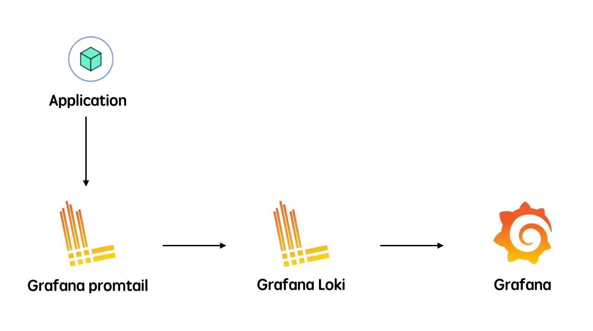

# Logging system

Logs are for auditing. There is a well-defined process for accessing and searching through logs. For every project that we worked with, a single server or multiple services, we always bring on our log stack to track what happens in the system.

We store the system log centralized and grant permission for each project member. We divide the log category into `System` and `Business`; with different levels for quick access.

They are:

- `Debug`: log message for debugging or in development mode.
- `Info`: for every computation that we make in the system.
- `Error`: usually for internal error.
- `Fatal`: for errors that cause a crash in the system.

The `System` log is usually about infras service behavior. Meanwhile, the `Business` log more focus on the business core domain of the application.

## Structure

Where appropriate, logging includes exceptions and stack traces. The log message structure:

The Internal service error

```js
{
    time="2020-09-29T18:40:00+07:00",
    level="fatal",
    env="local",
    service="example-be"
}

The Server is shutting down
- at pkg/handler/main.go:51 (Handler.runServer)
Trace: unable to connect postgres
         - at pkg/service/pg/repo.go:20 (Handler.InitDB:20)
```

The Error from 3rd-party service

```js
{
    time="2020-09-29T18:47:44+07:00",
    level="error",
    env="local",
    ip="::1",
    method="POST",
    path="/orders",
    service="example-be",
    traceId="BBk56KzbYdF7Uha2CJ5h",
    userAgent="insomnia/2020.4.1",
    statusCode="500"
}

Internal Server Error
- at pkg/handler/order.go:34 (Handler.CreateOrder)
Trace: call service is failed
         - at pkg/handler/order.go:51 (Handler.doCreateOrder)
        Caused by: product is invalid
         - at pkg/handler/order.go:60 (Handler.doValidateCreateOrder)
```

## Remote Logging Service

We use GLP stack as a remote logging service.

- Grafana Promtail: an agent that ships the logs from the local system to the Loki cluster.
- Grafana Loki: multi-tenant log aggregation system. It indexes only metadata and doesn't index the content of the log.
- Grafana: the visualization tool which consumes data from Loki data sources



## Remote Error Tracking Service

When an error occurs, we also send them to [Sentry](https://github.com/getsentry/sentry). Sentry is cross-platform application monitoring, with a focus on error reporting.

The developer will receive notification about the case with a detailed stack trace so they could jump in and quickly get it fixed.
