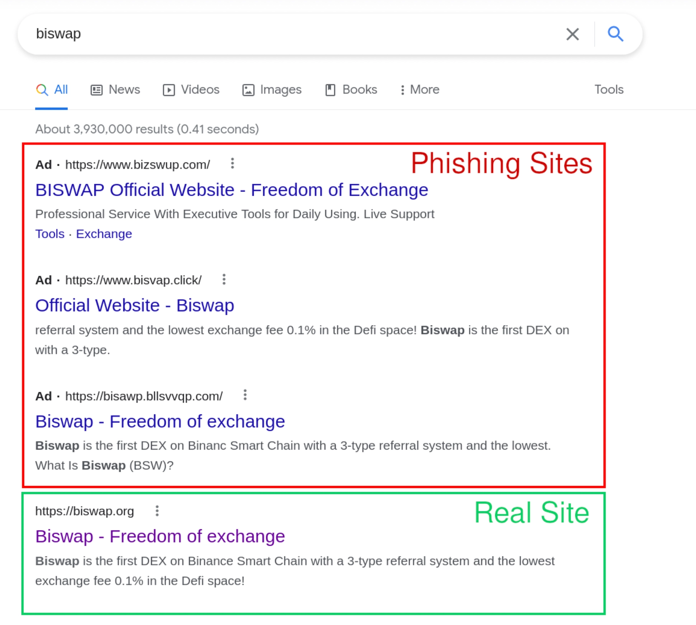
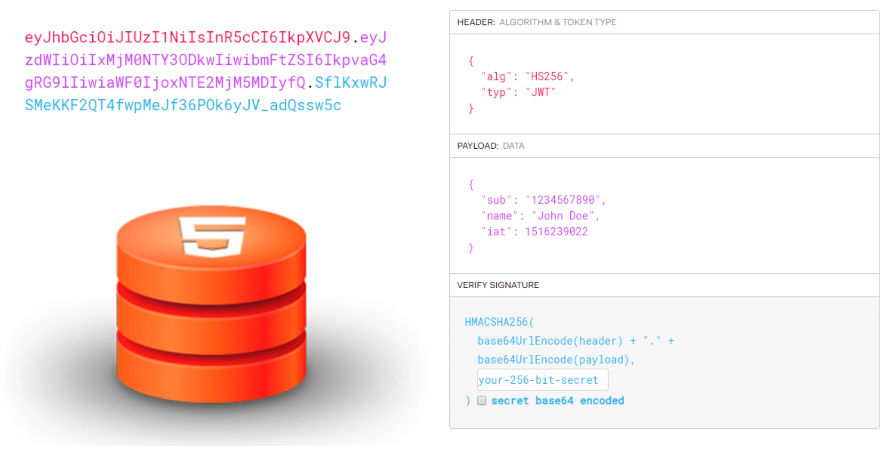
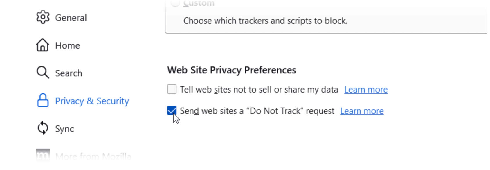

# Browsing Web

Browsing the web opens doors to a wealth of information but also exposes users to numerous security risks. Attackers target web browsing to exploit vulnerabilities, install malware, or steal sensitive data. Ensuring safe browsing practices is essential to protect both personal and company information from potential threats.

### Use a Secure and Privacy-focused Browser

Commonly used internet browsers are frequently designed to gather information regarding your online activities and browsing preferences. This data collection, while sometimes used to enhance user experience, can also be shared with third-party companies for purposes ranging from targeted advertising to analytics. The Accumulation of such detailed personal information poses a significant security risk, as it can become a target for cyber attackers. These attackers might exploit vulnerabilities within the browser or its data storage mechanisms to gain unauthorized access to your private information like site access tokens.

**Action**

Consider using [privacy-protected browsers](https://github.com/Lissy93/awesome-privacy#browsers) like [Mozilla Firefox](https://www.mozilla.org/en-US/firefox/new/) or [Brave](https://brave.com/). They offer extensive privacy controls and fewer data collection practices.

### Use a Private Search Engine

Most popular search engines retain records of your search activities, which can be associated with either your IP address or your user account, potentially affecting your privacy. These search engines typically offer [privacy policies](https://policies.google.com/privacy) to explain which of your data might be gathered and how it could be used. Although these documents aim to provide clarity, the reality is that many individuals do not review them, leaving them unaware of the extent to which their sensitive information, such as passwords and stored files, is captured through cookies and potentially recorded and stored by the search engine.

**Action**

Use search engines like [DuckDuckGo](https://duckduckgo.com/) or [Startpage](https://www.startpage.com/). They offer unbiased search results without tracking your search activity since mainstream browsers like Google implements some incredibly [invasive tracking policies](https://hackernoon.com/data-privacy-concerns-with-google-b946f2b7afea), and have a history of displaying [biased search results](https://www.businessinsider.com/evidence-that-google-search-results-are-biased-2014-10).

### Enable HTTPs

When data is transmitted over the Hypertext Transfer Protocol (HTTP), it lacks encryption, which renders it vulnerable to interception by unauthorized parties. This vulnerability makes it straightforward for attackers to eavesdrop on the communication between a user and the web service. Moreover, such attackers are not limited to merely observing the data; they possess the capability to alter the transmitted content en route. This type of cybersecurity threat, known as a [Man-in-the-middle attacks](https://www.strongdm.com/blog/man-in-the-middle-attack), poses significant risks as it enables the attacker to inject malicious content, steal sensitive information, or manipulate the data being exchanged to deceive the user or the web service. Consequently, it is critical for internet users and web services to employ secure communication protocols, such as HTTPS, which provide encryption to safeguard data during its transit across the network.

**Action**

Major browsers now offer native support for an HTTPS only mode. Find out how to turn it on [here](https://www.eff.org/https-everywhere/set-https-default-your-browser).

### Install an Ad-blocker

Aside from being extremely irritating and causing browsing slowdowns while interfering with desired content, advertisements can pose significant risks. When ads load on your browser, they compel it to load JavaScript snippets. Occasionally, this code may harbor malicious scripts that, once activated in your browser, can introduce malware to your device. If you've ever innocuously browsed familiar websites only to find your computer infected with spyware, this is likely the culprit. Moreover, advertisements have the capability to track browsing patterns, compromising privacy, and intrusive ads may redirect to phishing websites.


_Using an ad-blocker can potentially prevent phishing ads_

**Action**

Install [uBlock](https://github.com/gorhill/uBlock), an open-source browser extension for content-filtering, including ad-blocking. It's lightweight and efficient compared to other ad blockers.

### Regularly Clear Cookies and Cache

Cookies, small pieces of data stored by your web browser, can hold sensitive information such as session tokens. These tokens, if intercepted or stolen by malicious actors, could allow someone to impersonate a user, gaining unauthorized access to personal accounts and data. Additionally, cached data, which helps in speeding up the loading of frequently visited websites, might contain personal details or expose one's browsing history. This cached information can range from application tracking data to personal information, potentially revealing a user's interests, activities, and even confidential data to anyone who can access the device's cache.


_Having access tokens in cookies or localStorage poses a risk of data leakage._

**Actions**

- Establish a routine schedule to regularly clear cookies.
- Set browser settings to automatically clear cookies and cache at the end of sessions. [Here](https://support.google.com/chrome/community-guide/245444314/how-to-automatically-clear-browsing-data-when-closing-google-chrome-window-a-step-by-step-guide) is an example of instruction to setup for Google Chrome.

### Block 3rd Cookies and Trackers

Some tracking types include cookies and web beacons that store a modest amount of data specific to you and the site (such as login, personalization, movements on the site, etc.). Third-party tracking usually refers to those services that collect information to understand you and show targeted ads. Fingerprinting is a more advanced tactic that gathers information about your device to create a unique identifier, making it harder to clear your browsing data to prevent websites from still knowing you. Then there's also IP tracking and behavioral tracking.

**Actions**

- Most modern browsers allow you to block third-party cookies directly in their settings or as part of [phasing them out](https://blog.google/products/chrome/privacy-sandbox-tracking-protection/).
- Consider installing privacy tools like [Privacy Badger](https://privacybadger.org/) to automatically block trackers.

### Enable Do Not Track

Activating the "Do Not Track" (DNT) privacy option in your web browser triggers the inclusion of a DNT header in every online request you make. This header serves as a signal to websites and online services, indicating your preference to not be tracked during your internet sessions. However, it's important to understand that the effectiveness of the DNT feature is somewhat limited. This is because there is no mandatory requirement for websites and services to honor the DNT requests. Although a select group of websites might choose to respect these preferences, a considerable number tend to ignore them. Consequently, relying solely on the DNT feature may not provide complete protection against online tracking.


_Do Not Track is supported in most browsers and can be enabled in settings._

**Action**

Most browsers offer an option to send a Do Not Track request to websites. Find this option in your browser’s privacy settings and enable it.

### Disable JavaScript on Untrusted Site

There are numerous [vulnerabilities](<[Vulnerabilities](https://owasp.org/www-project-top-10-client-side-security-risks/)>) within JavaScript that can be exploited by malicious actors, even within the security measures implemented by major browsers. For instance, a cunning approach to security exploitation is embedded within this seemingly innocuous piece of HTML code. It employs an image element that intentionally points to a non-existent source. When the browser attempts to load this image and inevitably fails, the onerror event handler is triggered. Instead of a simple error notification, this handler executes a script that can capture the content of `document.cookie`.

```html

```

**Action**

Use browser extensions like [NoScript](https://noscript.net/) to control which sites can run JavaScript. Always keep JavaScript disabled by default for unknown or untrusted sites.
