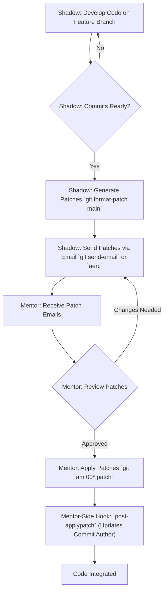

## Introduction: a standard for high-fidelity mentorship

The goal of shadowing is to transfer skills effectively, not to fight with tools or slow procedures, or create a security situation like sharing GitHub credentials. To make this work, we're experimenting a protocol that prioritizes direct and efficient collaboration.

We use a focused set of tools to create a fast feedback loop: **tailscale** provides a simple and secure peer-to-peer network, while **git** and the **aerc** email client enable a mail-driven workflow. This approach keeps the entire review process inside the terminal, close to where the actual engineering happens. This is a similar workflow you would see when **contributing to the Linux Kernel**.

### Workflow overview



## 1. The network fabric: establishing read-only git access with tailscale

The foundational layer of this protocol is a secure, zero-configuration peer-to-peer network. We use **tailscale** to create a private **tailnet**, placing the mentor's and the shadow's machines on the same virtual local area network. This allows the shadow to have read-only access to the mentor's git repository via the **git daemon**, eliminating complex firewall or public IP configurations.

The mentor first shares their machine with the shadow via **tailscale node sharing**. Once connected, the mentor starts the git daemon in the repository directory they wish to share.

```shell
# mentor: from within the project directory to be shared
git daemon --verbose --export-all --base-path=. --reuseaddr
```

The shadow can then verify connectivity by pinging the mentor's **tailscale magicdns name** or ip address.

```shell
# shadow: verify connection to mentor's machine
ping <mentor-tailscale-magicdns-name-or-ip>
```

With the connection verified and the **git daemon** running on the mentor's machine, the shadow can clone the repository using the mentor's **tailscale magicdns name** (e.g., `mentor-machine-name`) and the repository's directory name (which is `.` in the `base-path`, so it refers to the directory name itself).

```shell
# shadow: clone the repository
# replace <mentor-tailscale-magicdns-name> with the mentor's actual tailscale machine name
# replace <repository-folder-name> with the name of the directory the mentor is sharing
git clone git://<mentor-tailscale-magicdns-name>/<repository-folder-name>
```

This setup provides a simple, secure, and read-only channel for the shadow to access the codebase. The **node sharing** feature ensures the shadow only has network access to the mentor's designated machine.

## 2. The transport mechanism: asynchronous review with git and aerc

This protocol utilizes the time-tested, email-based workflow originally developed for large-scale distributed projects like the Linux kernel. This method decouples the code submission and review process from a centralized platform, enabling true asynchronicity.

The shadow serializes their git commits into a **patch series** using the **git format-patch** command. These patches are self-contained text files that represent a discrete unit of work. The patches are then transmitted via email, where they can be reviewed and applied by the mentor.

While `git send-email` is the standard tool for dispatching patches, using a terminal-based email client like **aerc** is highly recommended for  the mentor. For the mentor, **aerc** offers powerful features for viewing patches directly in the terminal and can simplify the process of piping email content directly to `git am`, further reducing context switching. However, the use of **aerc** is optional, and the core protocol functions effectively with any email client capable of handling plain text attachments or inline patches.

The primary commands for this stage are as follows:

```shell
# shadow: from within your feature branch, create patches for commits
# that are not yet in the 'main' branch.
git format-patch main

# this will create one or more .patch files in your current directory,
# for example: 0001-add-new-feature.patch
```

Once the patches are created, they are sent to the mentor for review.

```shell
# shadow: use git's built-in email tool to send the patch series.
# ensure your .gitconfig is set up for sending email.
git send-email --to="mentor.email@example.com" 00*.patch
```

This command dispatches each patch as a properly formatted email, ready for inspection and application.

## 3. The end-to-end operational workflow

The complete process provides a clear and efficient loop for submitting, reviewing, and integrating code.

1.  **Network setup.** The mentor shares a **tailscale node** with the shadow. The shadow accepts. The mentor starts `git daemon` in the project directory. The shadow verifies the connection and clones the repository. This step is typically only performed once at the beginning of the shadowing period, with the `git daemon` being run by the mentor as needed.
2.  **Task execution.** The shadow completes a task on a local feature branch, making one or more well-formed, atomic commits.
3.  **Patch generation.** The shadow generates the patch files from their commits.

    ```shell
    # shadow: create patches from your current branch against the main branch.
    git format-patch main
    # output:
    # 0001-refactor-the-authentication-module.patch
    # 0002-add-unit-tests-for-new-auth-flow.patch
    ```
4.  **Patch submission.** The shadow sends the generated files using **git send-email** or an integrated client like **aerc**.

    ```shell
    # shadow: send all generated .patch files.
    git send-email --to="mentor.email@example.com" 00*.patch
    ```
5.  **Review and application.** The mentor receives the patches as emails. They can review the code directly in their client. If the changes are approved, they use **git am** (apply mail) to apply the patches directly to their local repository. This command applies the commits exactly as the shadow created them, preserving authorship and commit history with perfect fidelity. If using **aerc**, the mentor can often pipe the email directly to `git am` for even faster application.

    ```shell
    # mentor: apply all patches from the received emails (saved as .mbox or .eml files).
    # assuming the patches were saved to files, or piped from an email client like aerc.
    # Example with saved files:
    git am 00*.patch
    # Example with aerc (conceptual, actual command might vary based on aerc setup):
    # <select email in aerc> | git am
    ```

## 4. Standardizing authorship upon application (mentor-side hook)

To ensure that the final commit author reflects the individual applying the patch (the mentor or representative), a **git hook** is utilized on the mentor's machine. The **post-applypatch** hook runs *after* `git am` creates a commit, allowing the commit to be amended.

This hook will automatically amend the last commit to update the author field to the mentor's configured git user name and email. The original author's information from the patch is initially used by `git am` to create the commit, and then this hook immediately changes it.

**Setup (mentor's machine):**

1.  Navigate to the git repository where patches will be applied.
2.  Create or edit the file `.git/hooks/post-applypatch`.
3.  Make the file executable: `chmod +x .git/hooks/post-applypatch`.
4.  Add the following script content to the `post-applypatch` file:

    ```shell
    #!/bin/sh
    #
    # post-applypatch hook
    #
    # This hook runs after 'git am' creates a commit.
    # We amend that commit to replace the author with the
    # currently configured git user.name and user.email.

    echo "--- Post-applypatch hook: Correcting commit author ---"

    # Get the mentor's configured git user name and email
    MENTOR_NAME=$(git config user.name)
    MENTOR_EMAIL=$(git config user.email)

    if [ -z "$MENTOR_NAME" ] || [ -z "$MENTOR_EMAIL" ]; then
      echo "Error: Git user.name and user.email are not configured for the mentor." >&2
      echo "Author not changed. Please configure them to use this post-applypatch hook." >&2
      exit 0 # Exit 0 so as not to block 'git am' if user isn't configured
    fi

    git commit --amend --no-edit --author="$MENTOR_NAME <$MENTOR_EMAIL>"

    echo "--- Author successfully changed to $MENTOR_NAME <$MENTOR_EMAIL> ---"

    exit 0
    ```

**How it works:**
When the mentor runs `git am 00*.patch`, after each patch is successfully applied and committed (using the original author from the patch), this `post-applypatch` hook will execute. It then immediately runs `git commit --amend` to change the author of the just-created commit to the mentor's configured `user.name` and `user.email`, without altering the commit message or the commit's content.

This ensures that the commit history in the repository accurately reflects who performed the final integration. The shadow's contribution is still evident from the patch content and the original commit message (which is preserved by `--no-edit`). For even clearer attribution, the mentor could still manually add a "Co-authored-by: Shadow Name <shadow.email@example.com>" line to the commit message if desired, or the hook could be extended to do this.

This protocol will hopefully ensure a robust and efficient standard for shadowing, minimizing logistical overhead and allowing both mentor and shadow to focus on the code
