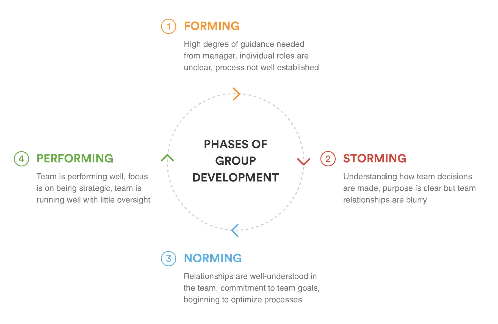
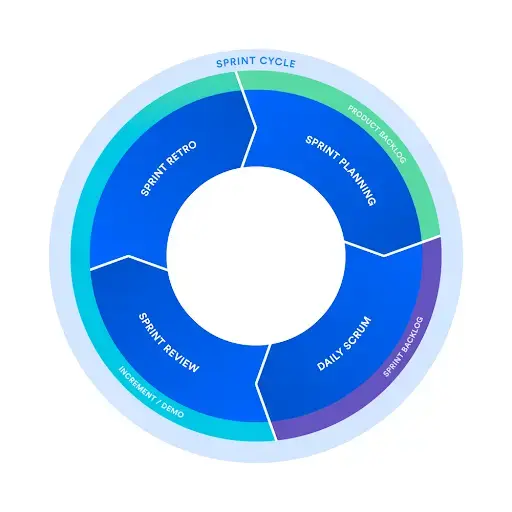

The workflow we chose to adopt is a team agreement on why we should be a team player and how we should act to benefit as a whole, not just an individual.

tl;dr; We apply agile philosophy. A few notes to take before working on a project.

- Agile is an adjective, not a fancy word. An agile team is about the team, not the tool.
- Get to know the team and their capability before making any assumption.
- Get to know the project and its vision.
- Try to break the whole applications workload into small feedback loops. Learn from failure.
- To maintain the sustainable pace, use the Agile point to keep track of the workload per loop.
- Project success is always measured by the triangle of Budget - Time - Quality.

Happy coding.

---

Besides the [loop of 8 weeks](https://github.com/dwarvesf/handbook/blob/master/how-we-work.md#cycles) that we frame our works fit into at company level, for every project, we build an agile team with the practice of Scrum.

## Agile

Back in the day when software development was very operation massive, with lots of documents and departments that they don't even know each other. Building the software is more like you make a ship. Parts and components should be completed and gathered to integrate. The process was adopted from factory and manufacturer, which is not appropriate.

In software development, things can be different. A group of people believes that we can have a better way of making software with more efficient collaboration by putting the team at the heart of the development process. And they came up with Agile methodology.

> **Agile team = Team + Agility**

Agile visionaries believed that teamwork is essential to delivering exceptional software and that great agile teams embody "we" rather than "I." Once the team is in place, it's important to remember that agile teams are like individuals: they take time to grow.

The way we see it is a collaboration between a team of multiple people with the right skillset, sufficient knowledge on the domain and clear understanding of the project vision that they can quickly adapt to the changes in the market. We adopt the Agile philosophy at this level.

Keeping agile teams intact takes some organizational discipline, but it pays to protect the team–within reason, of course. When change is introduced (new hire, employee departure, etc.), the team reverts back to the forming stage as it absorbs the change.

There are two other pillars of great agile teams: **continuous mentoring** and **shared skill sets**. When the team reaches the stage of Performing, they can work on the project at their full collaboration potential. All the obstacles will be removed, and risks will be minimized.

## Scrum

Scrum is an Agile framework that teaches us how to work together under Agile name. There are no specific roles in the team at the beginning.

- There is only the **team member** who has autonomy and responsibility to meet the goals of the sprint.
- And there is the **Scrum master** who is the team member turning into a coach. He works to remove any impediments that are obstructing the team from achieving its sprint goals. The role was supposed to be temporary. A mature team doesn't need a permanent coach.

Scrum encourages teams to learn through experiences, self-organize while working on a problem, and reflect on their wins and losses to continuously improve. Three pillars to make Scrum successful are Inspection, Transparency, Adaptation in the **feedback loop**.

There are

- Backlog: a list of things to get done. Depending on the scale of the project, the Product owner has different ways to keep the backlog healthy.
- Sprint: a small loop of 1, 2, or 4 weeks. It consists of planning at the beginning of the sprint, daily sync up, product review, and team retro at the end of the sprint.

To maintain the sustainable pace, the agile team should know each other and try to measure the capability using the agile point.

## FAQ

- Keywords to take away?

  - **Working software** over comprehensive documentation
  - **Individuals and team collaboration** over processes and tools
  - **Customer collaboration** over contract negotiation

- Does apply Agile means we can skip the documentation part?

Agile is more about the state of mind. It is a philosophy that introduces the team the mechanism of **communication and synchronization**. As long as we can maintain those pillar, we can do what we want.

- Is Agile methodology one process fit them all?

Agile methodology only suggests putting the team to the center of collaboration. It only works if the team can keep the sustainable pace and always be aligned. If the project requires a different kind of collaboration that can't satisfy the Agile requirement, the team should adopt another process or break into the smaller group.

- What to remember about Scrum?

The small feedback loops.
