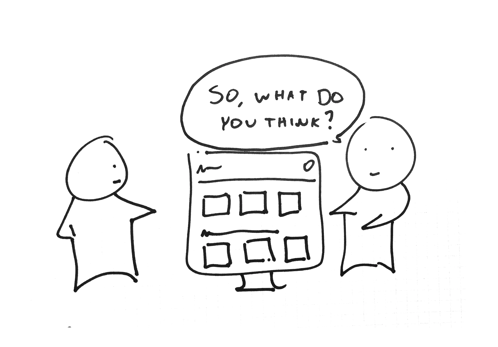

It's in human nature to instantly lose their mind when things get hard, and somehow they split nasty things that can't be undone. So, to reduce the ratio of unnecessary conflicts, let's make the feedback great again.

## Know the Time
Define the frame for listening and for questioning. Talk blocking isn't a good way to express how you feel. If you don't respect other's time of present, they have no reason to give a shit about what you think on *their* idea.

Address the mini and major problems. Choose the time. Turn an expression into a question. Raise it up with comprehension.

## Deliver Things that Matters
Feedback is an attempt to create the motivational vibe that transcends age & level. To ensure that, a feedback that works is way different from a feedback that wack.

* State the problem, concisely
* Propose the solution, humbly
* Vision the impact, feasibly 

## Understand the Surrounding
The people who are your best co-workers have two powerful things: the ability to tell your report is full of crap, and the effort to help you ameliorate it.

It's good to seek for comment from a friend, but it's even better to receive a straightforward one. That means they shorten the distance between the finished outcome and your current work.

## Constructive, not Destructive
Feedback can either become a judgement or encouragement. So whether it is giving or receiving feedback, have it conveyed in a useful way. Instead of "*please, I stopped reading it at the first line*", try "*I think the title hasn't been catchy enough. Maybe adding a hook sentence would be better*".
