Road to Discover Dwarves’ Voice: As you know, each individual at Dwarves represents craftsmanship and well-crafted products. I consider craftsmanship as one of the most fundamental aspects of our work, reflected in every piece of content we create.

Whatever version of these guidelines you read, rest assured it’s not the last. Keep them up to date. It takes many forms, and I always strive to improve my content.

## Writing for website

Dwarves’ website serves as the primary platform for visitors to discover who we are and what we offer. Given the diverse audience we attract, it's important to maintain a tone of expertise and authority in our writing.

- Use clear and concise language, avoid complex sentence structures and jargon.
- Active voice to make content easy to digest.
- Tell the audience what you want them to do next (CTAs).
- Speak our characteristics, whether it’s showing our expertise and skills or stating our value proposition.

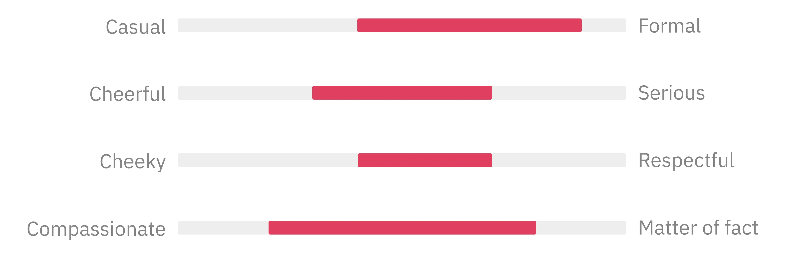

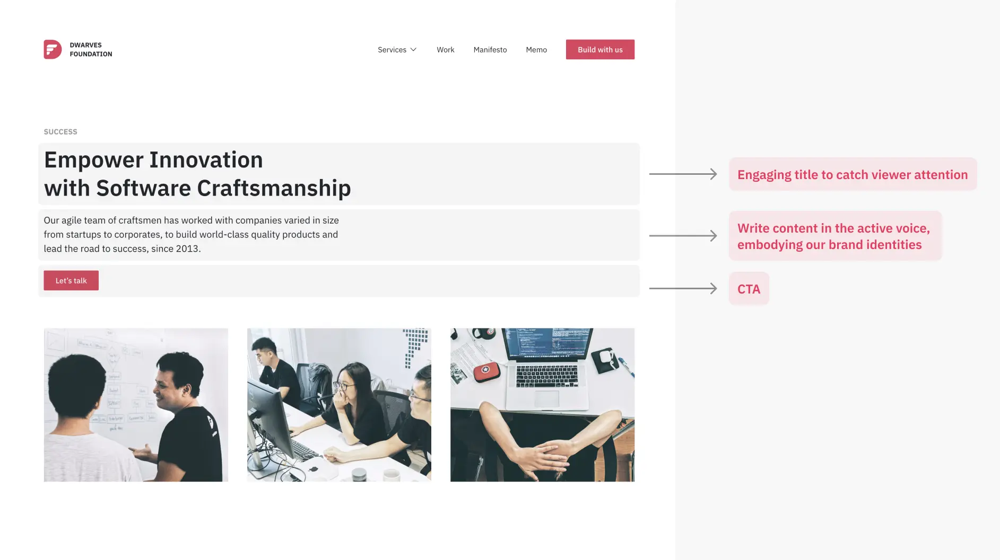

## Writing for social media

I use social media to build and maintain company relationships with our audience. It’s an open platform in which sharing and learning are welcomed and applauded.

Treating social media like a conversation, means I strive to be less serious, and more cheerful but at the same time, still polite and considerate of our audience.

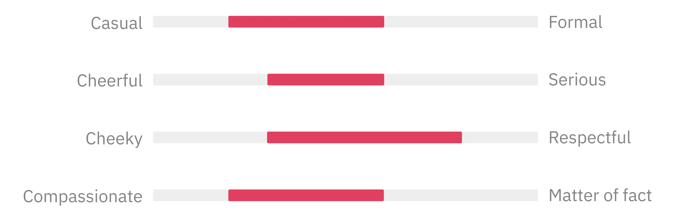

### Facebook

- Facebook content aims to strike a balance between being informative, engaging, and algorithm-friendly.
- The goal is to grab the viewer’s attention within seconds.
- Keep posts concise and impactful, using minimal text and a short form.
- Make posts actionable: try different tactics to grab your audience's attention.

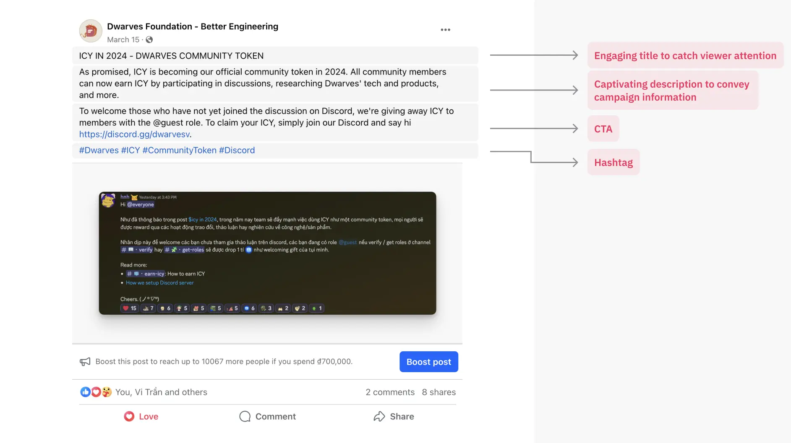

### LinkedIn

- Focus on sharing industry knowledge and insights.
- LinkedIn posts typically range from 100-150 words for regular posts, while longer articles can reach up to 1,300 characters.
- Showcase professional achievements and milestones to highlight accomplishments and learning experiences.

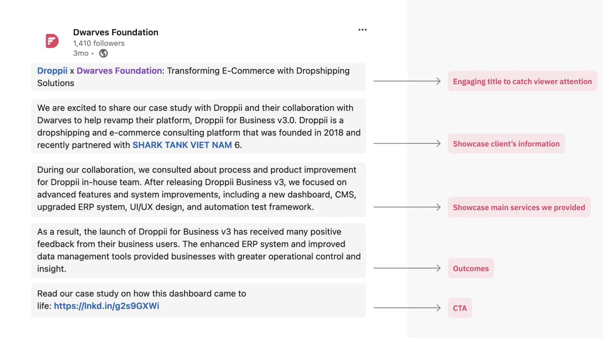

### X / Twitter

- Verified accounts can exceed the 280-character limit, and utilizing tweet threads is encouraged.
- Keep your tweets brief, focused, and include clear CTAs.
- Share links to relevant articles and blog posts to boost website traffic.
- Actively engage with retweets, replies, and mentions to foster audience interaction and appreciation.

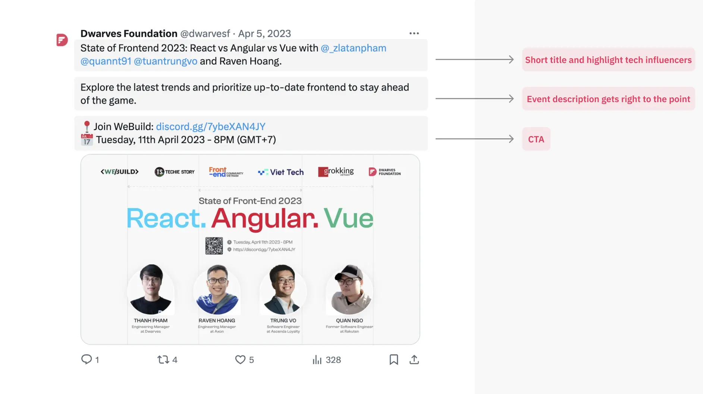

### Instagram

- Get right to the point right away, a few lines of a caption.
- Interactive features like stories, reels, polls, questions, and sliders to engage viewers.
- Use high-quality visuals, including images and videos, to captivate your audience.
- Embrace trends, relevant hashtags to increase visibility.

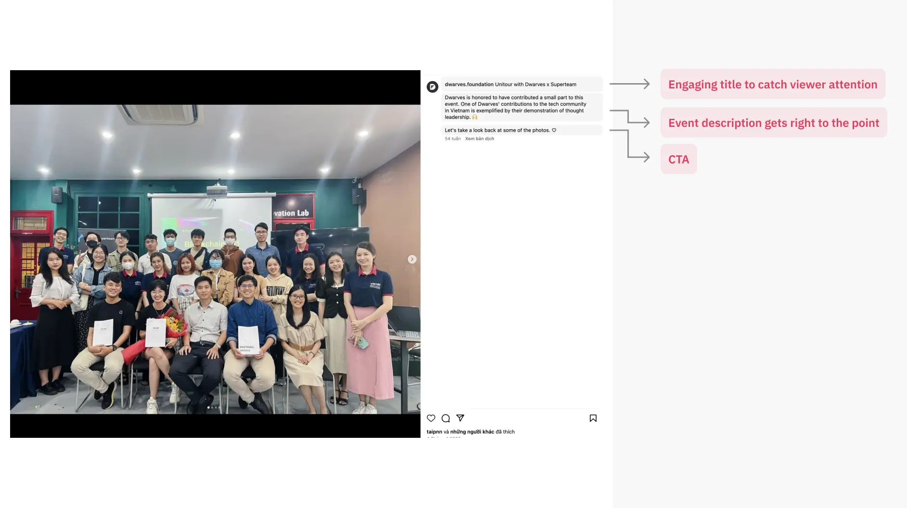

## Writing for blog posts

The blog post is a format to share knowledge and offer in-depth insights into the tech & design world. A blog post from Dwarves is usually a collaborative effort - a summary of workshops we worked on together, a research report done by a sub-unit, or a case study put together by everyone on the project. Here's a brief guideline to get started:

- Choose a topic.
- Conduct thorough research to find angles and keywords.
- Outline your goals, target audience, what you’d like to cover for each section.
- Fill in your outline with research and craft an engaging introduction.
- Write your headline title, sub-header, and meta description.
- Proofread your work for flow and errors.
- Full-length articles should still be professional.

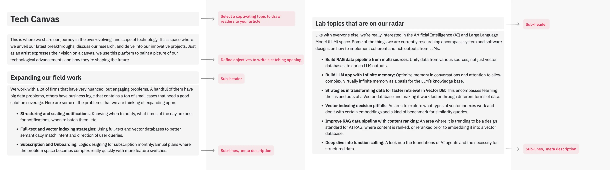

## Writing for newsletter

Dwarves’ newsletter serves as an additional fresh voice that aims to provide more engineering-related insights and thoughts throughout our work cycles.

When crafting newsletter:

- Determine its purpose (e.g., company updates, upcoming events).
- Consider what the audience needs to ensure inclusivity and intentionality.
- Maintain a consistent and appropriate tone of voice.
- Include links and CTAs, and use visuals and font choices to draw the eye.

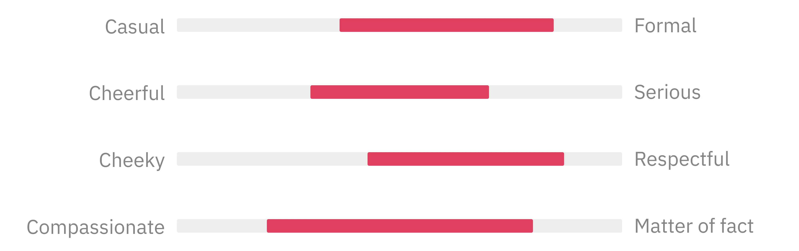

## Writing for the Discord community

Dwarves Discord network is where we discuss new tech, industry practices, hang out with friends, and spread positive vibes. If I want to use the platform reflected in what I do, then our copy needs to do just that.

To maintain consistency with our platform's culture:

- Keep our posts original, relatable, and reliable content that resonates with the audience.
- Add a bit of joy, making memorable moments around Discord.
- Set a fun warm-up or icebreaker tone of voice, sparking conversations among members.

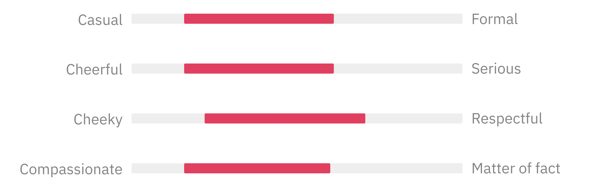

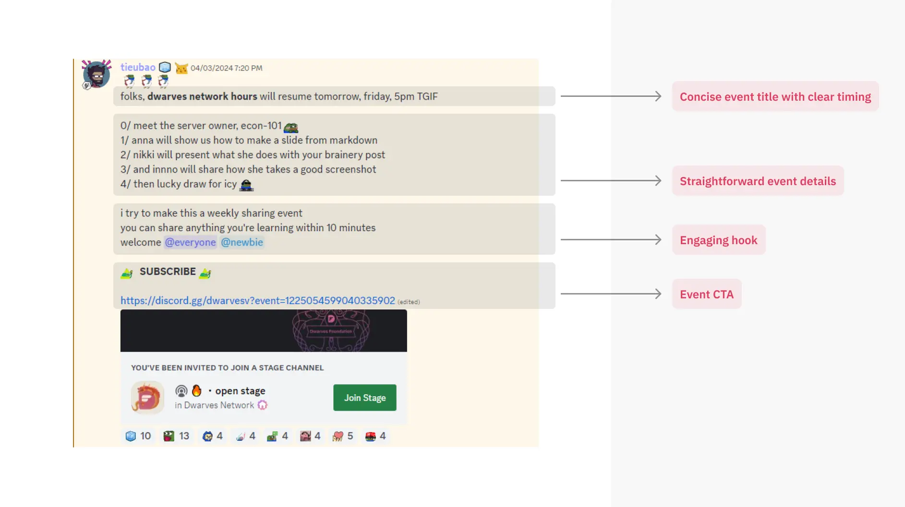

## Best practices

### Stay focused

Keep content centered on the main topic to maintain reader engagement and understanding. Create a pattern/structure to guide our audience through the articles by making use of titles and headings.

### Make it understandable

Write in a casual tone, using conversational language that is easy to grasp. Add humor when appropriate but avoid overdoing it.

### References

Include external links to back my points up and enhance credibility.

### Use different formats

Break up the content using headings, bullet points, images, videos, and other formats to highlight key points and improve readability.

### Keep it short, smart, and quirky

Craft the posts across various platforms to be short, informative, and infused with a touch of personality. Use simple language for quick reading and a bigger impact.

### Mind your hashtags

Research the nature of each social media platform to choose relevant hashtags. Avoid overloading your posts with hashtags if they aren't necessary.

### Trending news

Be aware of trending news and topics in design-related industries. It could be a great
opportunity to put in a word of celebrating achievements or expressing our point of view on the matter.

### Final thoughts

If you're newish to posting - just post. Don't run around chasing algorithms or trends. It'll exhaust you in no time.

## Reference

Adapted from ["Write content for multimedia guidelines"](write-content-for-multimedia-guidelines.md)
