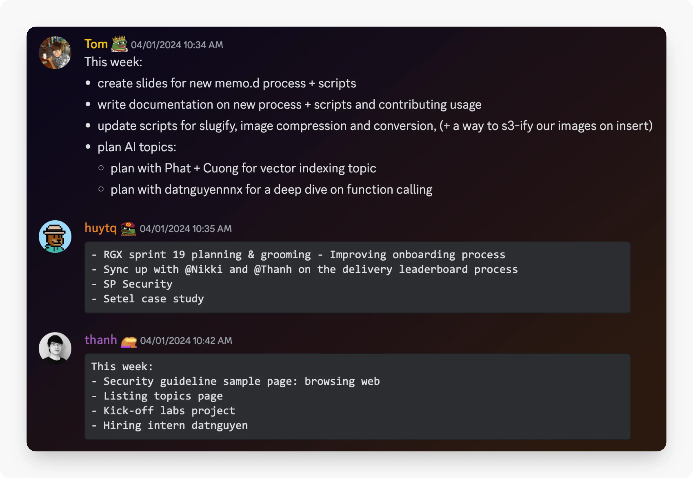
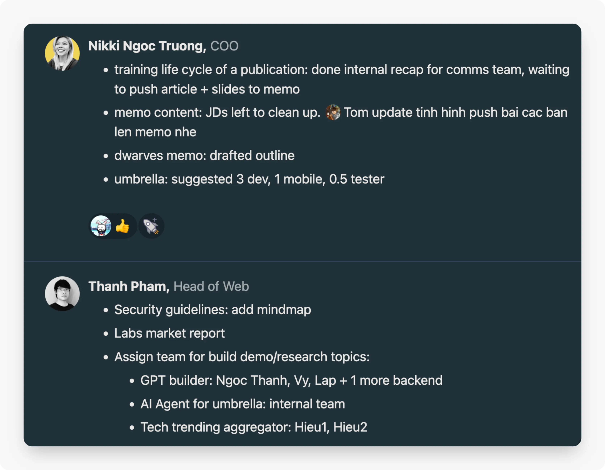
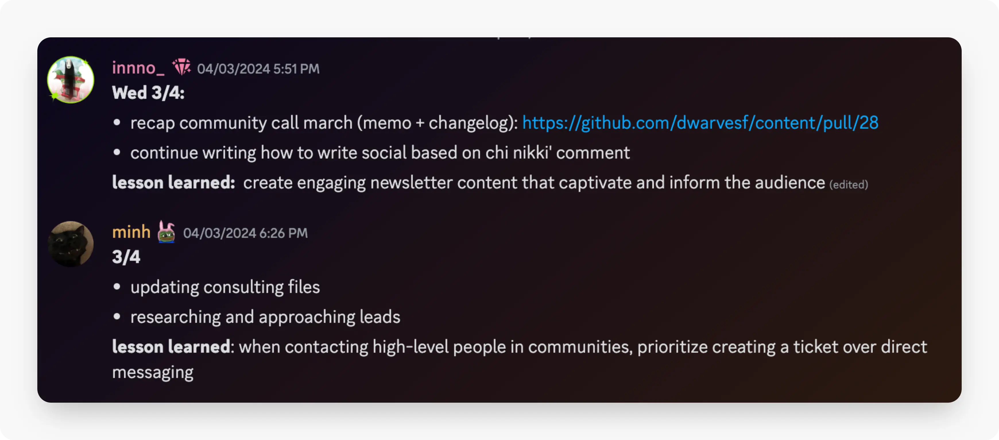

We are now a borderless company with team members working remotely everywhere they want. Clear communication, at least in weekly planning and reporting is required for everyone.

This protocol establishes a structured workflow for efficient weekly work allocation, ensuring we function in-sync, complete tasks in a timely manner and collaborate effectively among team members.

### Weekly planning & retro

Weekly planning is for setting priorities, aligning team members, and ensuring progress towards our monthly goals. The following is how we do weekly planning:

### Set an agenda

Teams can make adjustments in the agenda to fit their work nature.

- Outline the agenda, announce it to all team members, and follow this agenda for all planning sessions
- Include key items such as updates, task prioritization, blockers/issues, lessons learned,and goals for the week

### Conduct the planning session

To minimize the time spent for meetings, we tend to combine retrospective of the week before and planning of the following week.

- Participant: all team members must join
- Time: Friday afternoon / Monday morning
- Format: Discord voice channel

All team members must submit a written list of what they plan to do for the week before the meeting.

### Weekly reporting

Weekly reports should show progress, communicate achievements, and address any challenges within the team Similar to how we do planning, all team members must submit their written report before the meeting.

Reporting happens at the start of all planning sessions. Since we already have a written report, here we focus mostly on:

- Quality of completed tasks
- Discuss challenges / issues encountered, and lesson learned
- Celebrate successes or contributions from team members

### Daily checkin

Daily checkin is required at the end of each working day, 6PM being the latest. We may choose to have standups and/or written checkin, depending on the team's functions. But overall, make sure we keep it brief and to the point.

A daily checkin needs to show:

- What did we plan to do today?
- What did we get done today?
- Are there any obstacles blocking our progress?
- Do we need support from any other members?
- Do we have any takeaways, lessons learned or new things we learned to share with the team?

### Summary

A working week at Dwarves must follow, at the bare minimum, planning and report:

- Weekly planning: written plan as bullet point list & meeting at week start / week end
- Weekly report: written report as bullet point list, focusing on progress, challenges/issues, lessons learned
- Daily checkin: written checkin at day end
