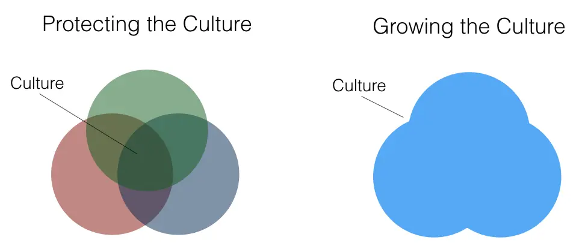

## Philosophy

- Hire people who tell us what to do, not the other way around.
- Company culture is who you Hire, Fire & Promote.
- Short term vs. long term evaluation
- Values fit & culture fit

## Principles

1. Hiring means we failed to execute and need help
2. Startup employee effectiveness follows a power law
3. False Positives are ok, False Negatives are not
4. Culture is defined by who we hire
5. The best thing you can do for employees , a perk better than foosball or free sushi , is hire only “A” players to work alongside them. Excellent colleagues trump everything else

## Heuristics

- Hire for Strength vs Lack of Weakness
- Hire for Trajectory vs Experience
- Hire Doers vs Tellers
- Hire Learners vs Experts
- Hire Different vs Similar
- Always pass on ego

**Hire for Attitude Rather than Skill**
Teaching skills is a snap compared with doing attitude transplants. When looking to hire the right candidate), among the qualities you'll want most is a fierce sense of optimism.

**Look for Renegades**
One of the best interview strategies is to ask when the person has been in trouble. The obedient employee will be of limited use to you in this change-up environment.

**Hold out for Results**
Never hire someone with good potential but questionable habits, thinking you can change him or her. As in choosing mates, what you see now is what you get forever.

**Go for a Sense of Humor**
The potential hire who can't laugh easily, particularly at themself, is going to be a very dull and probably rigid employee.

**Fill in the Blanks**
Look carefully at the aggregate strengths and skill gaps of your teams in various work units, and go for the qualities and styles that are missing.

**Stock the Bullpen**
Keep an eye out for prospects before the need arises. Don't wait until a vacancy occurs. Keep a pool of potential employees under the watchful eye of somebody who's responsible for hiring. Evaluate your recruiting team in terms of how well they keep the bullpen ready. And tell them never to turn away an interesting candidate with the line, "We don't have any positions open right now."

**Look for intellectual horsepower and curiosity**
Is a candidate capable of getting the big picture? Are they a good communicator? Do they have cross-functional skills and interests?

These are some of the best markers of intellectual horsepower and potential, going beyond her current skillset and become a leader in your organization. You should be hiring for growth.

Don't just evaluate where candidates are, but where they’re going (and how fast)
Well, human interaction is the best way to grade potential, so the interview is a great setting to evaluate curiosity and communication skills.

**Push Harder for Diversity**
Make certain you're spreading your net wide enough to find those high-potential, but different, fish who generally don't swim in the streams near you. Ask your HR group what contacts and periodicals they're using to interest potential hires. "We don't know where to find people different from us" is a costly excuse.

## Protecting vs. growing culture

For many companies, hiring means selecting people who fit the existing culture and keeping out those who don’t. Hiring is gatekeeping.

Our culture is dynamic. It should expand like our business. We welcome its change. Just like we want people to contribute new skills and ideas, we want people to contribute new culture. Hiring culture-fitters does not make our culture better.
Hire culture-contributors who will make our culture better.

## Culture add, not culture fit

Culture fit is a variable that has become increasingly important in the hiring process. Companies aren't just looking for candidates with the right skills - they want someone that matches their company DNA.

It's easy to fall into the trap of hiring people like everyone else in your company as a default. Adding people like you can create a "me-too" culture, not typically an environment where ideas and innovation flourish.

Instead, look for people that add to your culture. Hiring candidates that bring something different to the table gives you a diverse workforce that can approach business problems from different directions instead of focusing on what a candidate lacks

**Listen**
Rule one with how to interview: Most interviewers talk way too much. When a candidate finally gets to you, listen for the "story line" of his or her life, at home and at work. It's been said that being a leader is like practicing psychiatry without a license. That may be more true in hiring than in any other part of the job.

**Don't get desperate**
In certain situations, this can lead to hiring decisions being made around urgency, not quality. A hiring manager just needs _someone_, they don't care who. Building a great team means not compromising on your hiring bar.

Align you around the goal of hiring the right person, not just hiring quickly. Think about the long-term impact of hiring the wrong person. We're building a company for the long term, we need the best people.

**Always be recruiting**
Candidates came from everywhere, from professional conferences, from the sidelines of a kids’ soccer game, from conversations on airplanes. But certain fundamentals were strictly enforced. The interview and hiring process gives a powerful first impression about how your company operates, for good or bad

## Offering

- If a candidate is the right fit, move quickly
- Before you make an offer, make sure you know exactly what the offer package will look like and don’t be vague about it
- If the candidate turns you down, remain friendly and maintain a relationship. They might change their minds in the future.
