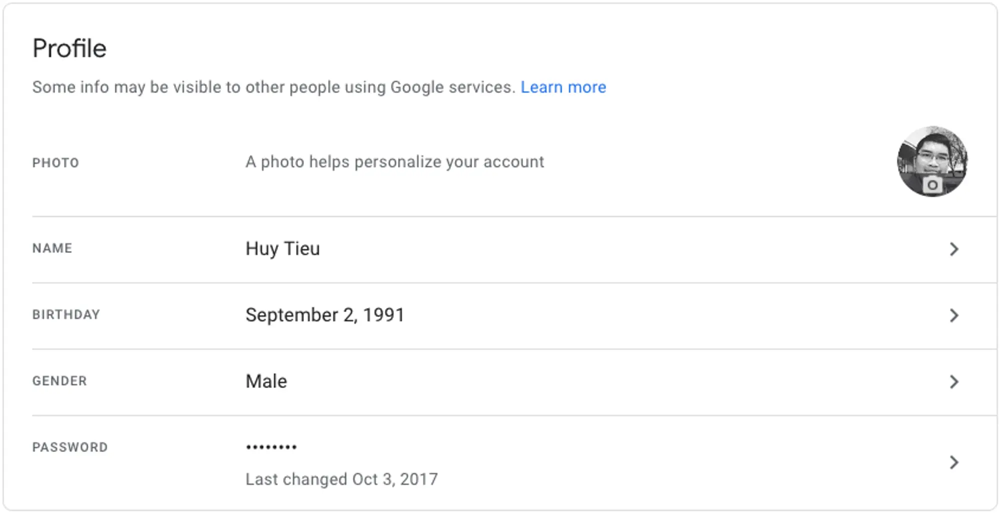
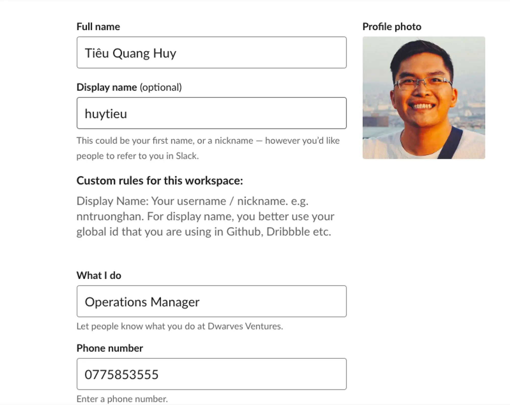

## Email
- Email convention: <first_name><last_name_alias>@d.foundation
- - Example: huytq@d.foundation
-- Exception: Operations members with frequent communication will use <first_name>@d.foundation instead. Example: *han@d.foundation*
- Google Profile need to be filled with github id OR name: <first_name> <last_name>

## Basecamp
- Photo with your face picture
- Name: <first_name> <last_name>
- Title: Title at Dwarves Foundation

## Slack
- Avatar: Prefer that you put your face picture on
- Fullname: Your full Vietnamese name. Example: Tiêu Quang Huy
- Display name: Suggest to put your github id if you are a developer. Otherwise you can use <first_name> <last_name>
- What I do: Your role @ dwarves foundation

## Trello/Jira and other project tools
- Advised to set avatar as your face picture.
- Name/Nickname should be set as your github name. Otherwise please use <first_name> <last_name>