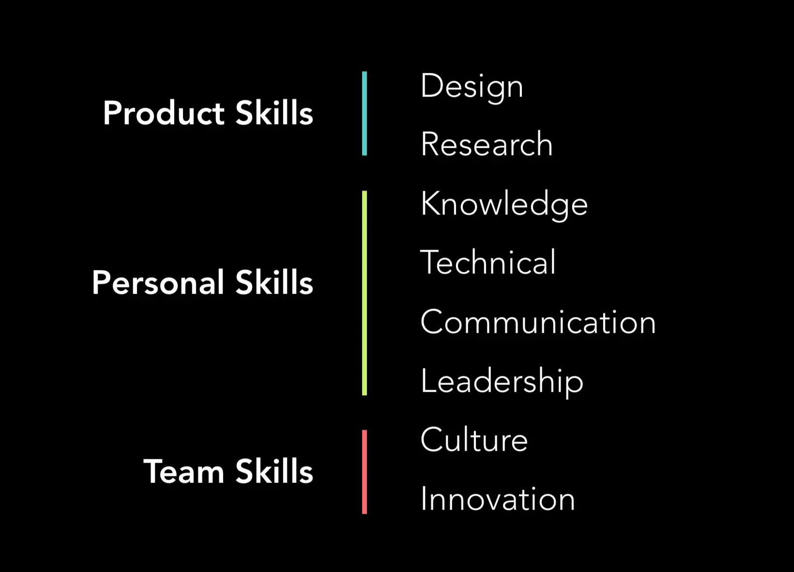
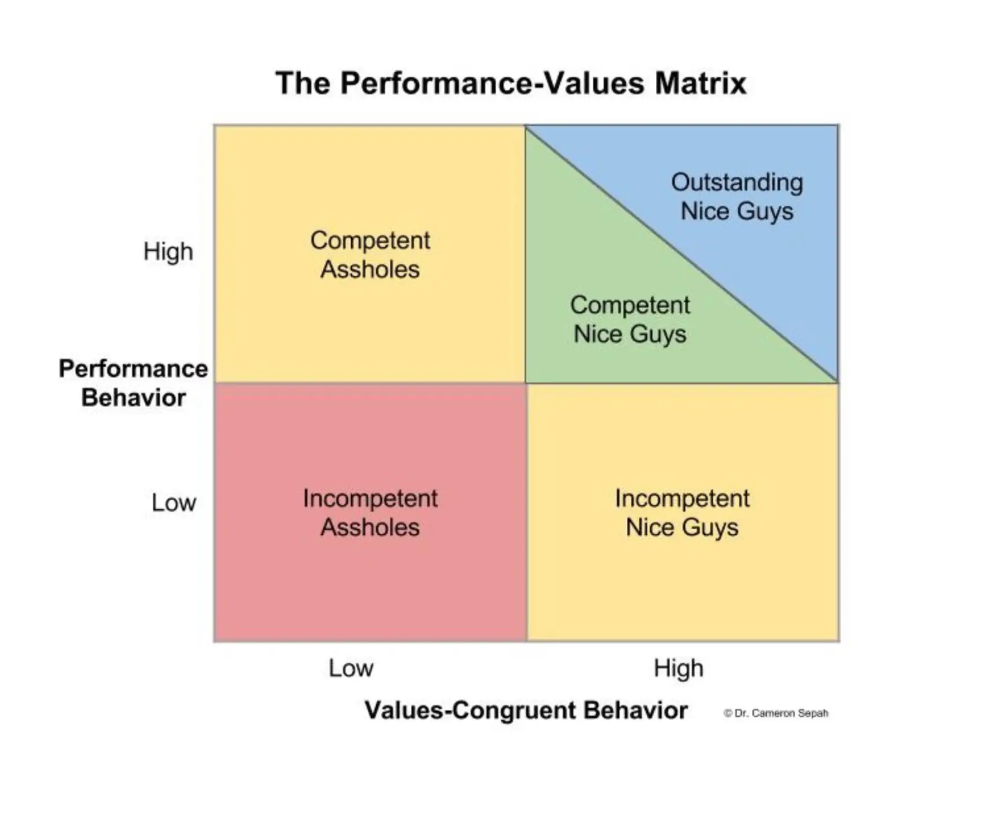

***P = f(r, t, c, r)***

## Performance - P
Performance is a final value that will be calculated from other metrics. This value will help to indicate how good all the activities we've done to make the company could grow.

Metrics will be marked from the scale from 1 to 5:
* 1 is bad
* 3 is normal
* 5 is outstanding

```plain_text
 1 ---- 2 ---- 3 ---- 4 ---- 5
bad           good        outstand
```

**Context of example**
* Han is Director
* Project: Find Friends
* Han is PM
* Thanh and **Hieu** is peer dev
* Project: Pie
* An is PM
* Huy and **Hieu** is peer dev
* Hieu joins project Pie (70%) and Find Friends (30%)

## Result - R
Result is the metric that help to indicate how good the output when employees get things done.
* What is the output of your assigned works?
* Who would mark: Project manager or team leader

### Metrics
* Punctuality (Efficiency): Team members need to be able to complete their work on time. They should have a good handle on the limitations provided by the time and resources available and should be able to prioritize to get things done as efficiently as possible. This metric will be calculated by the logged hours or total points that you have earned by getting things done.
* Workload: how much effort you put into the project.
* Quality: The quality of work your team members put out is perhaps the most important metric, but it is also the most difficult to define. Team members who care about what they do and are engaged at work will likely perform better, and it’s a good idea to recognize resulting achievements.

*Example*:
FindFriends: Han marks
* Punctuality = 3
* Workload = 3
* Quality = 3

Pie: An marks
* Punctuality = 4
* Workload = 3
* Quality = 3
With coefficient equal to 1

 ***R = 0.3 \times (\frac{3 + 3 + 3}{3}) + 0.7 \times (\frac{4 + 3 + 3}{3}) = 3.23***

## Teamwork - T
How do you treat others? How is your teamwork skill? You don't have to follow the crowd, but cooperation is key to success.
* Be proactive.
* None could be blocked by you.
* Make sure you can be reached during agreed working hours.
* Helping and sharing.

<!-- child_page 656deb24-6315-44fe-b5b5-1c3b546f3ffd -->

## Fire quickly
* False positives: people who you thought fit your values, but don’t once they’re hired
* False negatives: people who you thought would not fit your values, but would have if you had hired them

If you get some false positives anyway, the solution is to fire quickly. To follow the "No Asshole Rule", we need to strictly apply this despite the common excuses: 
* for that one bad trait, he has four good traits going for him.
* [data scientists/engineers/product managers] are hard to replace, so we’ll make do.
* We’ve decided that we’re not going to fire him because he’s a high performer.

Other excuses we made:
* For ineffective employee

We rationalize this behavior with “lies we tell ourselves.” Here are a few lies people use to keep an ineffective employee:
* He is trying really hard.
* She deserves another chance.
* People really like her.
* I feel bad for him.
* He’s good at other things.
* He has stuff going on in his personal life
* She is in the wrong role.
* For [10x employee](https://www.notion.so/dwarvesv/10x-05358eacebaf4dde8def342d8c22b791)

Conversely, we should dramatically expand the responsibility of 20x performers. Most don’t and rationalize limiting their most effective employees by saying:
* She’s great but not ready for a promotion
* He’s good but I’m not blown away
* She doesn’t have the right background
* He’s never done this job before
* If we promote and she doesn’t work out, what then?

## Evaluating
Using Performance-Values Matrix. All the sample metrics are included in

[📎 Careers_by_design_short.pdf]()


* Core
* Team
* Personal



## Incompetent Assholes (Fire fast)
Low-performers and their behavior is incongruent with company values. Fire fast.

## Competent Assholes (Remediate or Separate)
High-performers but exhibit behavioral tendencies that are incongruent with your company values. The only reason to keep them is because they are seen as critical to the company or difficult to replace.

Exceptions shouldn’t be made, otherwise it shows your values are merely aspirational. It should be made clear that value-incongruent behavior is not tolerated and they will need to remediate their behavior in a measurable way within a limited time.

<!-- child_page b99ef74d-4ade-4609-9fc5-be8af4c27c55 -->

## Incompetent Nice Guys (Manage or Move)
Low-performers but is the exemplars of your culture and are well-liked by almost everyone. 

Incompetent nice guys and gals should be put on a traditional performance improvement plan (PIP), and skillfully managed in order to give them the training and feedback to improve their abilities.

Of course, if that is not possible or does not work out, they should also be separated from the company.

<!-- child_page 59afd2f7-27c8-414b-888c-3d2b61a51cd8 -->

## Competent and Outstanding Nice Guys (Praise and Raise)
Competent nice guys and gals earn up to 75% of the maximum **employee evaluation score**, and should be praised and given the opportunity for advancement.

By building this designation directly into the evaluation matrix, outstanding nice guys and gals should be formally recognized and rewarded with raises and promotions.

10x engineer can't be an asshole. They will decrease the performance of the people around them.

## The Dark Triad
[📎 dark-triad.pdf]()

The key to understanding the Dark Triad is that while all three share a callousness toward others that encourages manipulativeness, they do so for distinct reasons. Psychopaths are driven by short-term tangible rewards, and engage in reckless, antisocial behavior to get it. Machiavellians are fueled by long-term tangible rewards and will strategize schemes to get them. Narcissists are motivated by whatever boosts their ego, whether tangible rewards or simple praise that validates their idealized self-image.

I am currently working on a tech startup. Our team have 8 people including product guys and biz guys. As you’ve known, there are many factors to make a success business and teamwork is one of them. I think this is the most important.

Startup, in common sense, is found to solve people problems, real problems; is found to provide works for society, and also, to make money. That is a thing that people called the vision, team vision, company vision. As the team member, you should understand it clearly, love it or hate it and follow it, make it your life, your working purpose. Small team does not need employees but contributors.

The team still need heroes and there should be an i in the team but the only way to make the boat go fast is perfect coordination, it also means perfect teamwork and synchronization. Skill set is important but it is not important as vision and coordination. The i must be unselfish and think about the team first. As a team member, it’s important to remember that no one is perfect; everyone has something that they could improve upon, including yourself. So, be supportive. Offer constructive criticism. Listen, listen, listen. People who always talk, but never listen will be stunted in growth. Remember that everyone knows something you don’t know.

We effectively have an environment in which competition and collaboration co-exist and feed off each other. Competition, synchronization or collaborating perfectly; make the boat go fast is always the main point. Remember, even if you work harder than anyone else, if you lose synchronization, you slow the boat down.

```plain_text
	*They told me there is no “I” in team.*
	I am an athlete.
	I am an individual.
	I am strong.
	I am weak.
	I have desires, hopes, and dreams.
	I have goals.
	I have fears.
	As a team my opponent will never see my weaknesses.
	Only my strength, never my fears, only my goals as they unfold before them.
	I am not afraid that my team will see my fears, my hopes, dreams, or desires.
	I trust them to an unlimited level.
	I am not afraid that my team will see my faults, because
	With them I can overcome my faults, with them I am
	fearless, with them I have hopes and dreams.
	With my team I am not weak, I do not have the strength
	of one athlete, but of many, combined, focused,
	And dangerous to my un-united opponent.
	I become my team and my team becomes me.
	I do not judge, and I am not judged.
	I have a goal, and the team has a goal.
	The team goal is my goal.
	All that matters is that the team reaches its goal.
	They always told me there is no “I” in “Team”.
	They were wrong.
	I am the team.
	I became the team.
	The team became me.
	The team becomes an entity unto itself.
	The team is strong, creative, compassionate, caring,
	Authoritative, disciplined.
	The team absorbs “I”, and then there is “I” in “Team”.
	The “I” becomes part of something much more powerful.
	They were right there is no “I” in “Team”,
	But there is “Team” in me.
```

Source: [It is hard to become a team member](http://tieubao.me/writing/2014/12/05/it-is-hard-to-become-a-team-member/)

## Metrics
Communication: 
* Daily: You’re transparent with your manager and teams.
* Presentation: you communicate effectively through keynote.
* Written: From emails to blogs...you are a clear, concise, compelling and convincing writer. 
* Meetings: You involve the right people at the right time. You clearly communicate action items and decisions.
* Resourcefulness: You leverage the company and network to remove blockers
* Leveraging Feedback/Reviews: You collect feedback and apply it to gain insights and build relationships
* Attendance (Commitment): Automating time and attendance is a great way to keep an eye on things. If a team member is consistently showing up late, leaving early, or taking an unusual number of sick days, they’re likely not showing their full potential.
* Helpfulness (Supporting): How helpful and accountable you are during your working routine. Helpfulness is important for fostering a culture of teamwork, allowing your team to perform better when tackling difficult tasks together.
* Leadership (Initiative): An employee that takes initiative is definitely a sign of team satisfaction and engagement. Looking at team members who take initiative is also important for growing businesses and for rapidly changing workplaces that require people who can adapt and be proactive.
* Mentoring: A different aspects of Helpfulness. You take time to help co-workers develop their skills.
* Motivator: You actively support your team members - both professionally and personally.
* Process: You know the process, how to use it and help your co-workers identify opportunities to improve.
* Decision making

[https://risepeople.com/blog/5-metrics-team-member-performance/](https://risepeople.com/blog/5-metrics-team-member-performance/)

**Examples**

Good:

* Your shared post in Slack is helpful to other team members. They upvoted and loved it.
* You help someone and they give commendation or kudos as appreciation

Bad:

* Someone has been blocked by you during working hours

## Contribution - C
How you contribute to the whole company rather than your team? (outside of your assigned work). It also includes your contributions in building company images, new library or community works, etc.

Metrics:
* Culture
* 10x: 
* Optimistic: You bring a positive, collaborative and engaging attitude to your work and the team
* Team Builder: You reach out and build relationships beyond your core team. You build relationships across disciplines.
* Innovation
* Futurist: You think beyond the current scope of your road map. You invent entirely new business opportunities.
* Technology: You are in touch with the latest gadgets, trends, technology, competitors, frameworks, etc.
* Patents: You actively identify opportunities to protect your intellectual property.
* Process: You recognize that invention goes far beyond products. You are constantly looking for new ways to practice.
* Fearless: You are fearless. You are dauntless in your next to deliver better experiences.

*Examples*:
* Have personal blog
* Writing blog post: personal blog; medium; hackernews ..
* Post has been featured
* Join a tech event, conference
* Be a speaker in a tech event, conference
* Open source a library, project and be useful for other people (no of stars? shares?)

## Ranking - R
How you grow up and develop your careers.