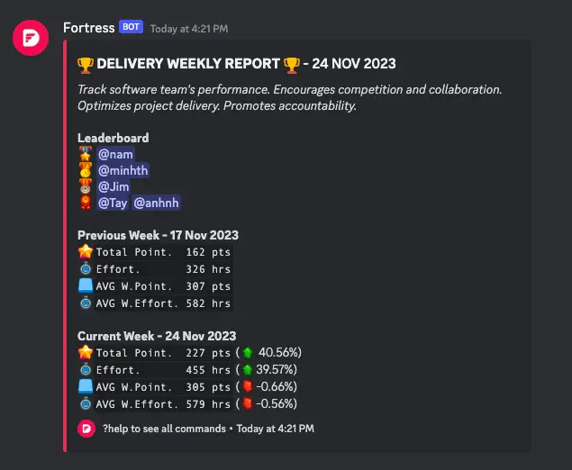
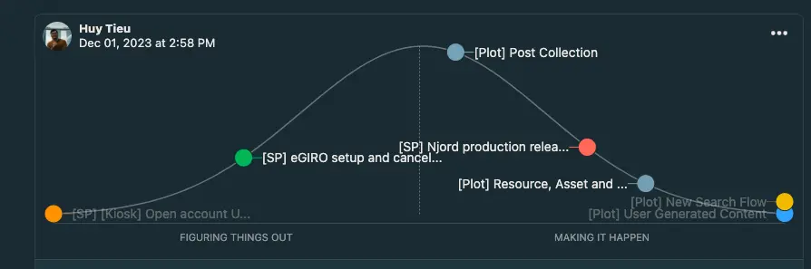
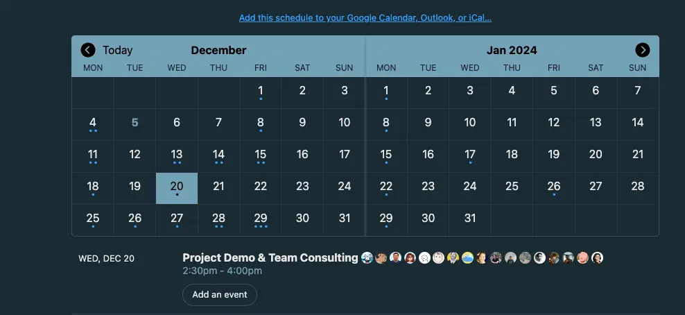
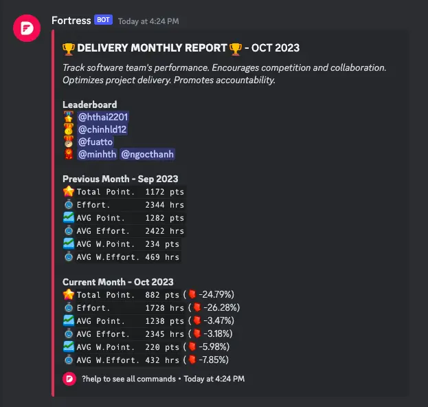
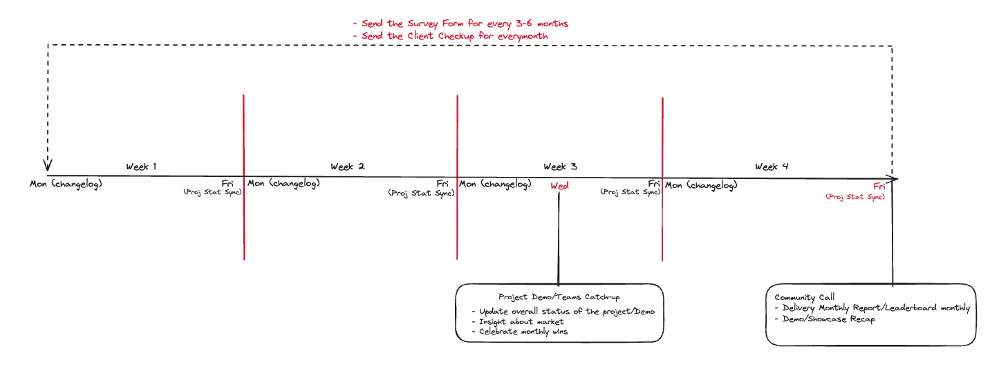

## Weekly activities

### Weekly points/effort report

**Every Friday**

- **Action**: Fill out the weekly points/effort report.
- **Link**: [Weekly Report Spreadsheet](https://docs.google.com/spreadsheets/d/1KXUVyDrC9199Dp6wpT6ovIkIvZRtf455eaqwZmvTAFU/edit#gid=0).
- **Deadline for data sync**: Data is sync by EOD next Tuesday.
- **Outcome**: Weekly leaderboard on delivery.

### Sync-up between project lead and delivery manager

**Every Friday at 2:30 PM**

- **Topics**:
  - Project Health: Wins, Losses, Future Plans.
  - Milestone Progress.
  - Changelog for the week (will be sent out the following Monday.)

## Bi-weekly and monthly activities

### Project demo/showcase

**Every 3rd Wednesday**

- **Audience**: Consulting and Labs team.
- **Goals**:
  - Update on current projects.
  - Insights about the market and real projects.
  - Celebrate monthly wins.
- **Recap**: Sent out the following week and highlighted in the monthly community call.

### Community call

**Last Friday of the Month**

- **Contents**:
  - Delivery Monthly Report.
  - Demo/Showcase Recap.
  - Monthly Leaderboard of Delivery.
- **Rewards**: ICY reward and NFT Badge benefiting the holder's achievements.

### Project collect feedback

For every 3 or 6 months, by **Monday of the 1st week from the 1st month**, Delivery team or Project Leader will send out an email to client to gather feedbacks for our Dwarves members through this form: [Feedback Form](https://docs.google.com/forms/d/e/1FAIpQLScVkRDy9w5_j_Tkj2MXs2Yi_n8yTUqNNBqy8w1-E3Beauodsw/viewform)

**What we can collect from this form?**

- Metrics: to evaluate our members if they are working effectively or not.
- Start Stop Continue doing feedback model: to understand how we can improve our delivery better.
- Leadership metrics: how effectiveness on the management from our Team Leader and Team Members.

## Important reminders

- **Weekly report completion**: Complete the report every Friday. For estimation help, check [[Estimation Guidelines]].
- **Project achievements**: If you have significant milestones or cool aspects of your project, notify the Consulting team for potential demo/showcase inclusion. Recognition is guaranteed.

