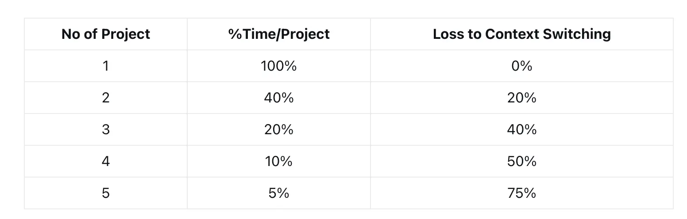

In software consulting, our goal is to deliver outstanding results for every client project. To achieve this, we carefully manage how our team members’ expertise is allocated, ensuring focus and efficiency. Dedicated team members are assigned to a single project, allowing them to immerse themselves fully in delivering exceptional outcomes. For fractional roles, where team members contribute specialized skills across projects, we limit assignments to a maximum of two projects at any given time.

Drawing on insights from _Quality Software Management_ by Gerald Weinberg, we understand the impact of context switching on productivity, as shown in the chart below:

The "Loss to Context Switching" column illustrates the importance of focused work. By capping fractional assignments at two projects and ensuring dedicated team members work on one project, we minimize distractions and maintain high productivity. We also ensure workloads remain sustainable, typically not exceeding 120% of standard hours (equivalent to 12 hours per day), to keep our team performing at their best.

Our resource management strategy is designed to:

- **Ensure top-quality deliverables**: Focused assignments enable our team to produce exceptional work tailored to each client’s needs.
- **Support team well-being**: Balanced workloads foster a healthy work environment, keeping our team motivated and creative.
- **Sustain long-term performance**: Thoughtful planning prevents burnout, ensuring consistent excellence for our clients.

By aligning our resources strategically, we deliver the results clients expect while maintaining a high-performing, engaged team they can rely on.
