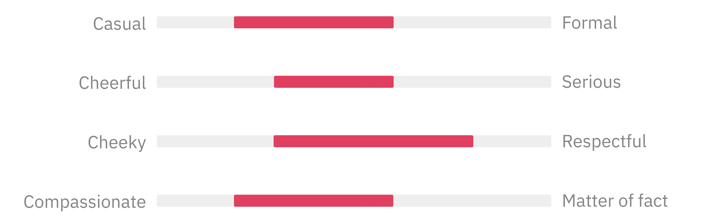

> “ It’s not that we need a unified language in all contexts; rather we just need enough context to get everyone on the same page." _Jake Albaugh, Developer Advocate, Figma_

At Dwarves, we believe in the power of communication. We understand that words have the ability to shape our brand, build connections with others, and share knowledge with the world.

To help all our Dwarves team members, create original, helpful, and consistent writing across various platforms, we've put together this content guideline as a reference whenever we're writing for Dwarves.

We won’t front. Here at Dwarves, we approach writing in the same way we create products: we write for people. In other words, we focus on the **quality** and **consistency** of the content before setting goals, defining the tone of voice, and the content production process.

## Setting writing goals

### Inform

Before we start writing anything, take a moment to ask ourselves this: "If Dwarves were a person, how would we want folks to see and think about us?" That's the secret sauce to nailing down our brand vibe, getting our message out there loud and clear, and making sure we show off our true personality.

### Connect

We're all about building and nurturing connections with folks. We want people to feel connected to Dwarves on an emotional level and have an impression on us.

So, before we start typing away, we ask: "What vibe do we want people to get when they think about Dwarves Design?"

### Educate

Knowledge sharing is at the core of what we do. We believe in growing together and sharing what we know. We strive to provide helpful information and offer opportunities for learning further (workshops, courses, learning materials..) even when those opportunities are not offered by us directly.

### Express

Express our viewpoint confidently. While it's crucial to connect emotionally with your audience, do not forget that you're the experts in your field. We encourage you to showcase your perspective, your learning, and your point of view as long as it remains objective and unbiased.

### Entertain

The best way to share tech stuff is to keep it clear, even for people who aren't techies. Whether it's hot industry news or some mind-bending tech concept, if we can explain it in a way that makes sense to anyone, then we know we’re doing it right. Try to make things easier for your audience. Learning should be fun and interesting, not like pulling teeth!

### Inspire

We've discovered that inspiring people to grow and thrive is most effective when we use language that uplifts and inspires. It's about fostering positivity and encouragement, creating a sense that we're all part of something bigger and better, moving forward together.

Writing is not just acknowledging the achievements of our audience, but also celebrating the successes of our clients and the remarkable advancements occurring in the tech and satellite industries.

### Learn

We're on a journey of learning alongside our audience. Every step helps us refine ourselves, and receive lessons learned in return. It's these insights that enable us to enhance the benefits we offer and deliver more value to our audience. Don't hesitate to ask questions along the way; they're key to our growth.

## Writing content instructions

### Active voice matters

**Active voice:** Dwarves built and delivered a dozen top-notch software products for tech-focused companies.

**Passive voice:** A dozen top-notch software products were built and delivered by Dwarves for tech-focused companies.

We often lean towards using active voice because it's straightforward, concise, and grabs attention more effectively. Passive voice, on the other hand, has the action done to the subject, lacking the sense of being in charge. If the subject of the sentence is doing the action, then voila, it's active voice.

Or you can use these questions tests, it's usually good to go and mostly it'll be in active voice.

- Did you write in a clear and straight-to-the-point manner?
- Did you explain things in the simplest way possible without losing any meaning?

### Add your point of view

Write as if it is a conversation. Use the second person (you) to address your audience and refer to yourself as (we).

Bring in other points of view when it’s fit. We want to celebrate and recognize other people on the team too.

### Keep it scannable

We all have different methods of reading. Some people read everything you write, while some scan through.

Break your content into small paragraphs, and form a hierarchy with levels of importance. Create and follow a content pattern to support scanning.

### Calls to action

Identifying your ideal audience before using calls to action is like turning on a spotlight in the dark. The step you customize the CTAs to match the audience’s interest at the right time, and right place can avoid a downgrade to our brand image.

Remember to double-check that your CTA writing fits with what's happening in the industry and that it's interesting and makes sense.

### Emojis are fine

With Dwarves’ brand personality, emojis could be of use as a way to familiarize people with us and add more interest to our writing. Use emojis where you see it’s fit, just don’t overuse them.

### Exclamation points & question marks

Avoid using multiple exclamation points and question marks. Although we aim to be friendly, we also want to maintain professionalism and seriousness when necessary. Instead of overusing "!!!", opt for expressive words to convey emotions.

### Technical terms

If there are technical terms in writing, define them in simple language so everyone can understand what we are writing about.

### Tags & hashtags

Use tags and hashtags accurately, according to the content. It will help increase its potential distribution and exposure to the targeted audience.

### Copyright

Never use content or images licensed as non-commercial without getting permission from the owners first. In case there’s non-commercial material, credit the owners and include words of thanks.

### Check and fix

Recheck each piece (content structure, grammar, and wording) before submitting the content for review and feedback. Then, we move to the final step of publishing and sharing the content.

If we find ourselves missing more than two points from this guideline, seek assistance from our line manager. And don't forget to credit your name at the end.

### Reflect & adapt

Allocate time for self-reflection and develop the habit of reviewing after our work is published:

- Track the work’s performance, get feedback from peers (both good and bad)
- Enhance self-awareness by identifying areas for improvement
- Go far and wide to search for new things related to your work
- Read more

## Voice & tone

### Authentic voice

The authentic voice is a consistent element - it’s how we describe our perspectives and reflect our personality.

At Dwarves, we speak as the **highly skilled partner** for our audience. It’s mean:

- We are experienced and skillful.
- We understand our audience and we think from their point of view.
- We think of ourselves as their partner, it’s a long-term relationship built upon trust, understanding, and mutual goals.
- We are passionate about sharing knowledge and growing alongside one another.

### Appropriate tone

Our tone varies to align with the circumstances - who we’re talking with (audience), what we’re talking about (topic) and where (channel) the conversation is taking place.

Most of the time, our tone is casual and sincere with a bit of subtle humor. However, it’s crucial to set the fine line between being casual and being offensive, make sure you never cross that line. No matter the circumstance, think about how people would perceive and feel about your content.

We expect you to be agile and responsive to the circumstances when writing. In some situations, humor or cheerfulness might not be appropriate. Work your way around it instead of forcing it into your content, in case it might backslash and harm the Dwarves brand name.

Here’s a simple chart to help you assess and generate the right tone in a certain situation.

## Overall

Remember, the goal is to write content that resonates with your audience. The more they can relate to what you're saying, the more likely they are to engage with your content.
